# Ecto-one

## Sumário

- [SPRINT 1](#sprint-1)
- [1. Análise do parceiro de projeto e Business Drivers](#1-análise-do-parceiro-de-projeto-e-business-drivers)
  - [1.1. Setor de aplicação](#11-setor-de-aplicação)
  - [1.2. Adição de Valor](#12-adição-de-valor)
  - [1.3. Processo de Negócio e Fluxos Críticos Suportados pelo Sistema](#13-processo-de-negócio-e-fluxos-críticos-suportados-pelo-sistema)
  - [1.4. Volumes](#14-volumes)
  - [1.5. Estatégias de Crescimento](#15-estatégias-de-crescimento)
- [2. Riscos e Oportunidades](#2-riscos-e-oportunidades)
  - [2.1. Riscos ligados ao Sistema](#21-riscos-ligados-ao-sistema)
  - [2.2. Oportunidades de Melhorias dos SLAs](#22-oportunidades-de-melhorias-dos-slas)
- [3. Arquitetura do Sistema Novo - Especificação de Requisitos](#3-arquitetura-do-sistema-novo---especificação-de-requisitos)
  - [3.1. Requisitos Não-Funcionais](#31-requisitos-não-funcionais)
- [4. Visão Modelo Comportamental (Simulação do Atual)](#4-visão-modelo-comportamental-simulação-do-atual)
  - [4.1. Estrutura Estática do Modelo](#41-estrutura-estática-do-modelo)
  - [4.2. Modelagem Comportamental e Simulação dos RNFs](#42-modelagem-comportamental-e-simulação-dos-rnfs)
  - [4.3 Simulações com RNFs](#43-simulações-com-rnfs)
---
- [SPRINT 2](#sprint-2)
- [5. Avaliação dos Mecanismos Utilizados no Sistema Atual (ATAM)](#5-avaliação-dos-mecanismos-utilizados-no-sistema-atual-atam)
  - [5.1 Revisão do Mapa de Requisitos Não-Funcionais e Respectivas Vulnerabilidades](#51-revisão-do-mapa-de-requisitos-não-funcionais-e-respectivas-vulnerabilidades)
  - [5.2 Táticas Arquiteturais e Componentes Adotados que Ajudam a Execução e o Controle dos RNFs do Sistema Atual](#52-táticas-arquiteturais-e-componentes-adotados-que-ajudam-a-execução-e-o-controle-dos-rnfs-do-sistema-atual)
- [6. Especificação da Solução Técnica do Sistema Novo](#6-especificação-da-solução-técnica-do-sistema-novo)
  - [6.1. Revisão do Mapa de Requisitos Não-Funcionais do Sistema Novo](#61-revisão-do-mapa-de-requisitos-não-funcionais-do-sistema-novo)
  - [6.2. Táticas Arquiteturais e Componentes Adotados que ajudam a Execução e o Controle dos RNFs do Sistema Novo](#62-táticas-arquiteturais-e-componentes-adotados-que-ajudam-a-execução-e-o-controle-dos-rnfs-do-sistema-novo)
- [7. Simulações](#7-simulações)
  - [7. Simulações do Sistema Atual](#71-simulações-do-sistema-atual)
  - [7.2. Simulações do Sistema Novo](#72-simulações-do-sistema-novo)
  - [7.3. Justificativa das Melhorias](#73-justificativa-das-melhorias)
---
- [SPRINT 3](#sprint-3)
- [8. Implementação dos Mecanismos Arquiteturais](#8-implementação-dos-mecanismos-arquiteturais)
  - [8.1. Especificação e Codificação dos Testes Não-Funcionais dos Componentes (TDD)](#81-especificação-e-codificação-dos-testes-não-funcionais-dos-componentes-tdd)
  - [8.2. Especificação e Codificação dos Componentes que Compõem os Mecanismos Indicados nas Táticas](#82-especificação-e-codificação-dos-componentes-que-compõem-os-mecanismos-indicados-nas-táticas)
- [9. Testes Automatizados Não-Funcionais](#9-testes-automatizados-não-funcionais)
  - [9.1. Mapa de Testes Automatizados](#91-mapa-de-testes-automatizados)
  - [9.2. Registros de Testes Automatizados](#92-registros-de-testes-automatizados)
  - [9.3. Avaliação dos Resultados e Limites do Sistema](#93-avaliação-dos-resultados-e-limites-do-sistema)
  - [9.4. Avaliação dos Riscos Resultantes](#94-avaliação-dos-riscos-resultantes)
- [10. Revisão do Modelo de Simulação do Sistema Novo](#10-revisão-do-modelo-de-simulação-do-sistema-novo)
  - [10.1. Simulação das Melhorias](#101-simulação-das-melhorias)
  - [10.2. Simulação das Condições de Exceção](#102-simulação-das-condições-de-exceção)
  - [10.3. Simulação das Condições Limites do Sistema com as Melhorias](#103-simulação-das-condições-limites-do-sistema-com-as-melhorias)
---
- [SPRINT 4](#sprint-4)
- [11. Identificação de Ajustes a serem Implementados](#11-identificação-de-ajustes-a-serem-implementados)
  - [11.1 Códigos dos Ajustes](#111-códigos-dos-ajustes)
- [12. Implementação dos Testes Automatizados](#12-implementação-dos-testes-automatizados)
  - [12.1 Análise dos Registros de Testes Automatizados](#121-análise-dos-registros-de-testes-automatizados)
- [13. Medir o Sistema Novo](#13-medir-o-sistema-novo)
  - [13.1. Modelo de Medição](#131-modelo-de-medição)
  - [13.2. Coleta dos Dados da Estrutura - Medição Estática](#132-coleta-dos-dados-da-estrutura---medição-estática)
  - [13.3. Coleta de Dados do Comportamento - Medição Dinâmica](#133-coleta-de-dados-do-comportamento---medição-dinâmica)
  - [13.4. Avaliação das Medições](#134-avaliação-das-medições)
- [14. Identificar os Tradeoffs Arquiteturais](#14-identificar-os-tradeoffs-arquiteturais)
  - [14.1. Mapeamento de Tradeoffs de Arquitetura de Acordo com Requisitos Conflitantes](#141-mapeamento-de-tradeoffs-de-arquitetura-de-acordo-com-requisitos-conflitantes)
  - [14.2. Evidência dos Tradeoffs com base em Medidas Realizadas](#142-evidência-dos-tradeoffs-com-base-em-medidas-realizadas)
---
- [SPRINT 5](#sprint-5)
- [15. Arquitetura do Sistema Novo (Storytelling de dados)](#15-arquitetura-do-sistema-novo-storytelling-de-dados)
  - [15.1. Descrição comentada da evolução arquitetural](#151-descrição-comentada-da-evolução-arquitetural)
---

# SPRINT 1

# 1. Análise do parceiro de projeto e Business Drivers

&emsp;&emsp; Essa seção trata da análise detalhada do parceiro de projeto e dos fatores que impulsionam o negócio (_Business Drivers_), com o objetivo de categorizar o sistema no seu estágio atual, evidenciando tanto seus pontos fortes quanto suas oportunidades de melhoria. Com base em uma visão orientada por dados, serão identificados os fluxos de negócios associados ao sistema, permitindo uma compreensão clara de como ele opera hoje e como pode ser aprimorado. Essa análise servirá de base para guiar decisões estratégicas sobre o desenvolvimento e a otimização do novo sistema, assegurando que as mudanças propostas agreguem valor e sustentem o crescimento futuro.

## 1.1. Setor de aplicação

&emsp;&emsp; O sistema atualmente utilizado pelo IPT para inspeções prediais e suporte técnico à construção civil está inserido em um setor de grande relevância industrial e social. De forma manual, o sistema se concentra na coleta e armazenamento de dados relacionados à manutenção e inspeção de edifícios, o que inclui um conjunto de atividades críticas para garantir a segurança, qualidade e conformidade das construções. A seguir, detalhamos os setores industriais que são diretamente atendidos e suportados pelo sistema:

### Construção Civil

&emsp;&emsp;O principal setor atendido pelo sistema é o da construção civil, especificamente em relação à inspeção técnica de edificações e à avaliação de suas condições estruturais e funcionais. A construção civil é um setor que abrange desde grandes obras de infraestrutura até pequenos edifícios, sendo responsável por um volume significativo de atividades econômicas e pela criação de espaços de trabalho e lazer. As inspeções prediais são essenciais para garantir que as construções estejam em conformidade com normas de segurança e regulamentações locais. O sistema utilizado atualmente apoia atividades como:

- Inspeções de edificações: Avaliação das condições gerais de segurança, instalações e acessibilidade;
- Manutenção preventiva e corretiva: Identificação de problemas como fissuras, infiltrações e desgaste de materiais;
- Avaliação estrutural e de sistemas complementares: Inspeção de elementos como sistemas elétricos, hidráulicos e de incêndio.

&emsp;&emsp;Esse conjunto de processos é vital para manter o bom funcionamento de edificações e prevenir riscos à segurança dos usuários. No entanto, por ser operado de forma manual, o sistema enfrenta desafios em termos de eficiência, rastreabilidade e integridade dos dados, o que limita a sua capacidade de escalar e de oferecer um suporte mais abrangente às diversas demandas do setor.

### Manutenção e Gestão Predial

&emsp;&emsp;Outro setor industrial atendido é o de manutenção e gestão predial, que envolve a gestão de edificações e seus sistemas internos ao longo do ciclo de vida do imóvel. A inspeção técnica e o acompanhamento contínuo do estado de conservação dos edifícios são atividades essenciais para os gestores prediais, que precisam garantir a segurança e o conforto dos ocupantes. Neste contexto, o sistema de inspeções atual permite que os gestores prediais:

- Monitorem o estado de conservação de componentes estruturais e sistemas técnicos (elétrico, hidráulico, climatização, etc.);
- Acompanhem manutenções periódicas com base nas inspeções realizadas;
- Documentem falhas e problemas recorrentes, facilitando o planejamento de intervenções corretivas.

&emsp;&emsp;A deficiência de uma plataforma digital mais completa e automatizada, porém, restringe a capacidade dos gestores prediais de acompanhar, de forma eficaz, grandes volumes de dados, identificar tendências e garantir o cumprimento de prazos e padrões de qualidade.

### Consultoria e Engenharia Especializada

&emsp;&emsp; A consultoria técnica e a engenharia especializada também são setores suportados pelo sistema, com foco na prestação de serviços de avaliação técnica e diagnósticos de edificações. Profissionais que atuam nesses campos frequentemente utilizam os relatórios de inspeção como base para emitir pareceres técnicos, propor intervenções de reforço estrutural ou recomendar substituições de sistemas obsoletos. Para esse setor, o sistema atual proporciona suporte em:

- Laudos técnicos com base em dados coletados durante as inspeções;
- Análise de manifestações patológicas em edificações, como fissuras e infiltrações;
- Identificação de falhas em sistemas estruturais ou complementares, como fiações elétricas ou tubulações.

&emsp;&emsp;Contudo, a natureza manual do sistema dificulta a análise em profundidade e a comparação de dados históricos, limitando a capacidade de gerar recomendações baseadas em grandes volumes de informações.

&emsp;&emsp;Embora o sistema manual tenha atendido as demandas desses setores, ele apresenta uma série de limitações que impedem sua eficiência e crescimento. Entre esses desafios, podemos citar por exemplo a baixa escalabilidade, pois a dependência de processos manuais limita o número de inspeções que podem ser realizadas e a velocidade de análise e emissão de relatórios. Podemos destacar também a falta de padronização e rastreabilidade, tendo em vista que, a coleta e o armazenamento dos dados são manuais, aumentando o risco de falhas ou inconsistências nos relatórios. Outra limitação é a falta de ferramentas de automação, como inteligência artificial e realidade aumentada, o que impede a melhoria dos fluxos de trabalho e a precisão das inspeções. Esses fatores destacam a necessidade de uma modernização do sistema, que poderá agregar valor significativamente maior a esses setores industriais com a adoção de uma plataforma digital centralizada.

## 1.2. Adição de Valor

&emsp;&emsp; A implementação de uma plataforma digital para inspeção predial, em substituição ao sistema manual atualmente utilizado pelo IPT, agrega valor ao negócio em diversos aspectos cruciais. A transformação digital traria benefícios substanciais em termos de eficiência operacional, qualidade dos dados, automação de processos e conformidade com regulamentações, gerando um impacto positivo na produtividade e na capacidade de gestão das inspeções.

&emsp;&emsp; **Automatização de Processos:** Com uma plataforma digital, a necessidade de registros manuais é eliminada, permitindo que as atividades de coleta de dados e geração de relatórios sejam feitas de maneira mais rápida e eficiente. Os técnicos de inspeção podem registrar informações diretamente em dispositivos móveis, incluindo evidências como fotos e vídeos, o que reduz o tempo total de execução de cada inspeção e minimiza o risco de erros humanos. Isso resulta em uma maior agilidade na execução das inspeções e na criação de relatórios, além de mitigar riscos relacionados ao processo manual, como perda de arquivos físicos.

&emsp;&emsp; **Padronização de Processos e Relatórios:** O sistema a ser desenvolvido garante que todas as etapas da inspeção sigam diretrizes estabelecidas, proporcionando consistência tanto no procedimento quanto na formatação dos relatórios. Com a padronização, as informações se tornam mais confiáveis e comparáveis entre diferentes inspeções. Além disso, a conformidade com normas e regulamentações é facilitada, aumentando a transparência e o controle sobre as atividades. Essa padronização simplifica a análise dos dados e facilita o acompanhamento das atividades por gestores e stakeholders, gerando uma maior segurança e previsibilidade nos processos.

&emsp;&emsp; **Rastreabilidade e Integridade dos Dados:** A plataforma também adiciona valor ao negócio ao garantir a rastreabilidade e a integridade dos dados coletados durante as inspeções. Cada ação realizada é registrada automaticamente, com dados sobre o horário, localização e responsável por cada entrada. Isso proporciona um controle completo das atividades, permitindo a realização de auditorias detalhadas e assegurando a autenticidade dos registros. Com esses mecanismos, a plataforma aumenta a confiabilidade das informações, e oferece uma base sólida para sustentar eventuais questionamentos legais ou disputas contratuais, elevando a segurança jurídica das operações.

&emsp;&emsp; **Agilidade na Tomada de Decisões:** Com a organização dos dados de forma digital e acessível em tempo real, a tomada de decisões também é acelerada. A plataforma facilita o processamento das informações coletadas, permitindo que identifiquem rapidamente problemas críticos e priorizem intervenções de maneira mais eficaz. A disponibilidade de ferramentas de análise e visualização de dados, oferece uma visão clara do status das inspeções e da condição geral das edificações. Isso torna o processo de decisão mais dinâmico, embasado em dados atualizados, otimizando a alocação de recursos e melhorando a eficiência operacional.

&emsp;&emsp; **Aumento da Escalabilidade e Eficiência Operacional:** A digitalização dos fluxos de trabalho permite que o IPT amplie suas operações sem aumentar proporcionalmente os recursos. Ao automatizar etapas manuais e integrar os processos em uma única plataforma, a capacidade de realizar mais inspeções e processar mais dados é significativamente ampliada. A escalabilidade do sistema garante que o IPT possa atender a um maior número de clientes e projetos, ao mesmo tempo em que reduz os custos operacionais por inspeção. A eficiência no gerenciamento de grandes volumes de dados se torna uma vantagem competitiva, uma vez que o sistema digital facilita o acompanhamento de múltiplas edificações simultaneamente.

&emsp;&emsp; **Integração com Tecnologias Avançadas:** A plataforma digital também possibilita a integração com tecnologias emergentes, como inteligência artificial, _IoT_, drones e _Building Information Modelling_ (BIM). Essas ferramentas podem ser utilizadas para aumentar a precisão das inspeções, automatizar a identificação de anomalias e fornecer relatórios mais detalhados e precisos. Sensores IoT permitem o monitoramento contínuo das condições das edificações, enquanto drones podem ser usados para inspeções em áreas de difícil acesso. A combinação de BIM e inteligência artificial permite a comparação de dados coletados durante as inspeções com modelos digitais da construção, facilitando a identificação de divergências estruturais e otimizando as intervenções corretivas.

---

&emsp;&emsp; Portanto, o sistema agrega valor ao negócio do IPT ao aumentar a eficiência, melhorar a qualidade dos dados, automatizar processos e permitir maior escalabilidade das operações. Com a transformação digital, o IPT poderá oferecer um serviço mais ágil, padronizado e seguro, além de expandir suas operações para atender um número maior de clientes e demandas, promovendo uma experiência superior tanto para técnicos quanto para gestores e clientes. A capacidade de integrar novas tecnologias e otimizar os fluxos de trabalho garante que a plataforma atenda às necessidades atuais e futuras do mercado de inspeção.

## 1.3. Processo de Negócio e Fluxos Críticos Suportados pelo Sistema

&emsp;&emsp;Atualmente, o processo de inspeção é realizado de forma manual, desde a coleta de dados até a geração do relatório final. Este fluxo envolve uma série de etapas sequenciais e atividades organizadas pelos inspetores técnicos, que atuam de maneira independente, utilizando diversos tipos de ferramentas e formatos de documentação. Apesar de atender às necessidades básicas de inspeção, o processo é altamente dependente de intervenções manuais, o que resulta em vulnerabilidades que impactam diretamente a eficiência e a confiabilidade do sistema. A seguir, é descrito o fluxo de trabalho atual, com destaque para os pontos críticos que representam limitações a serem aprimoradas.

<div align="center">
  <sub>Figura 1 - Fluxograma Do Processo de Inspeção</sub>
  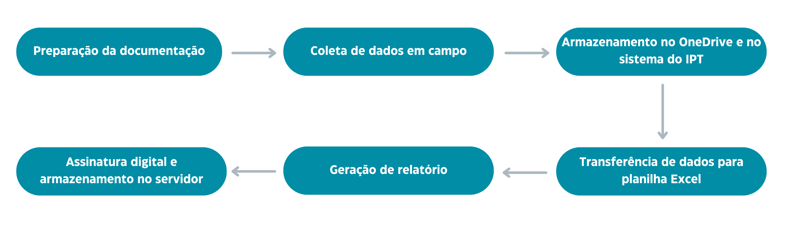
  <sup>Fonte: Desenvolvido pelos autores (2024)</sup>
</div>

&emsp;&emsp;**1. Preparação dos documentos:** o processo inicia com a preparação dos documentos que serão utilizados na inspeção. Embora exista um esforço para padronizar o relatório final conforme templates predefinidos, essa padronização é limitada ao documento final e não abrange os processos e documentos intermediários. Dessa forma, o inspetor precisa adaptar manualmente o conteúdo durante as etapas, o que é demorado e pode resultar em inconsistências. Uma padronização mais abrangente, incluindo automação e templates intermediários, poderia otimizar a coleta de dados e assegurar uniformidade ao longo de todo o processo de inspeção.

&emsp;&emsp;**2. Coleta de dados em campo:** na etapa de coleta, os inspetores vão a campo com câmeras digitais e equipamentos de medição. A coleta de dados é realizada de forma manual e armazenada em dispositivos físicos, como cartões de memória. Durante essa fase, são registradas informações sobre os problemas encontrados nas edificações e feitas anotações manuais em cadernos ou papéis. Esses registros incluem detalhes sobre as manifestações patológicas observadas. Entretanto, a dependência de equipamentos físicos e o registro manual de informações aumentam a possibilidade de erros e perdas de dados, além de tornar o processo mais lento e suscetível a falhas humanas.

&emsp;&emsp;**3. Transferência e organização dos dados:** após a coleta, os dados precisam ser transferidos dos dispositivos de armazenamento e anotações para o ambiente digital. As fotografias e vídeos capturados são baixados e organizados em pastas no _OneDrive_, através da plataforma _Microsoft Teams_, onde o IPT utiliza uma estrutura de permissões para garantir que apenas pessoal autorizado tenha acesso aos materiais sensíveis. Cada inspetor é responsável por organizar seu próprio material, associando as imagens com as anotações feitas em campo. O trabalho é, então, transferido para uma planilha eletrônica, onde as informações são cruzadas e relacionadas entre texto e imagens. Essa organização manual e individual dos dados em diferentes sistemas gera um risco de despadronização e perda de rastreabilidade, portanto, a falta de um sistema centralizado para integrar todos os dados automaticamente também dificulta a eficiência do processo e aumenta o tempo gasto com tarefas administrativas.

&emsp;&emsp;**4. Geração do relatório final:** com os dados organizados e transferidos para uma planilha, o próximo passo é a compilação do relatório final. O documento final é formatado manualmente, com a inserção de textos, fotografias e gráficos, que são relacionados às manifestações patológicas encontradas. Em muitos casos, o relatório também pode incluir a planta da edificação, que, quando inexistente, precisa ser criada pelos inspetores a partir das medições feitas durante a inspeção. A geração manual do relatório é uma etapa propensa a erros, especialmente durante a transcrição e associação de imagens e dados. Esse processo também consome muito tempo, uma vez que os inspetores precisam formatar o documento e garantir a consistência entre as informações, o que seria otimizado com a automação.

&emsp;&emsp;**5. Armazenamento e compartilhamento dos relatórios:** os relatórios, uma vez finalizados, são assinados digitalmente por meio da ferramenta da _Adobe_, respeitando os termos de confidencialidade acordados entre o IPT e os clientes. Esses documentos são então armazenados no servidor do IPT e no OneDrive, dentro do Teams, onde ficam acessíveis para as partes autorizadas, de acordo com as permissões configuradas. A gestão de permissões e o armazenamento descentralizado criam desafios de segurança e de controle de acessos, assim como a organização manual dos dados no OneDrive dificulta a manutenção da integridade e rastreabilidade dos documentos a longo prazo.

&emsp;&emsp; O sistema manual atualmente utilizado para inspeções, embora funcional, apresenta várias limitações e vulnerabilidades que afetam sua eficiência, segurança e capacidade de escalabilidade. A dependência de processos manuais, a falta de centralização de dados e a alta suscetibilidade a erros são os principais desafios identificados. Uma plataforma digital automatizada poderia resolver muitos desses problemas, otimizando o fluxo de trabalho, melhorando a precisão dos dados e garantindo uma gestão mais segura e eficiente dos relatórios e informações sensíveis.

## 1.4. Volumes

&emsp;&emsp;Atualmente, o sistema de inspeções utilizado pelo IPT não é uma solução integrada ou automatizada, mas sim uma combinação de ferramentas como One Drive, planilhas Excel e registros manuais em papel. O sistema de inspeção de obras do IPT, embora não lide com um número elevado de usuários, ainda enfrenta muitos desafios em relação ao sistema e aos dados gerados e processados. Abaixo estão os principais volumes associados ao sistema e suas vulnerabilidades:

### Clientes

- **Equipes operacionais**: O time de inspeção trabalha manualmente, e cada pessoa da equipe tem responsabilidades de organização individual dos dados (fotos, textos, plantas).
- **Usuários envolvidos**: Equipes de campo (para coleta de dados), equipes de revisão (pessoas que revisam e assinam os relatórios), clientes (externos que têm acesso aos dados, dependendo das permissões).
- **Vulnerabilidade**: A falta de padronização no armazenamento e organização dos dados cria vulnerabilidade na gestão de permissões e pode gerar confusão ou perda de dados.

### Transações

&emsp;&emsp;No sistema atual, para gerenciar inspeções de obras, são realizadas algumas operações pelos inspetores ao longo do processo de coleta e envio de informações, como: envio de imagens, vídeos, áudios, documentos de textos e planilhas para dentro de um repositório/pasta do One Drive.

- **Inspeções simultâneas**: São realizadas cerca de 2 inspeções por mês em paralelo.
- **Tempo de inspeção**: Cada inspeção de médio porte demora de 3 a 5 dias.
- **Volume de fotos**: Em torno de 600 a 800 fotos por inspeção de médio porte.
- **Vídeos**: Cada inspeção pode gerar 1 GB de vídeos com duração de 3 a 5 minutos.
- **Relatórios**: Cada laudo final é assinado por três pessoas e precisa ser submetido para aprovação.
- **Vulnerabilidade**: A falta de automação na coleta e organização dos dados aumenta o risco de erros, duplicações e perda de informações durante as transferências manuais.

### Registros

&emsp;&emsp;As inspeções de obras geram uma quantidade significativa de dados armazenados, incluindo relatórios, fotos, vídeos e planilhas Excel. Esses dados são cruciais para o monitoramento e acompanhamento das obras.

- **Fotos e vídeos**: O volume de dados é grande (600-800 fotos + vídeos de 1 GB por inspeção), sendo armazenados em cartões de memória, transferidos para planilhas eletrônicas, e posteriormente salvos no OneDrive.
- **Documentos**: Cada relatório final é digitalizado e armazenado no servidor, além de backups locais.
- **Vulnerabilidade**: A ausência de padronização para fotos e organização dos documentos pode gerar dificuldade de localização futura, além do risco de perda de dados devido à dependência de armazenamento local.

### Falhas

&emsp;&emsp;Durante o processo de inspeção predial, podem surgir diversas limitações que afetam as operações. Essas falhas, tanto tecnológicas quanto organizacionais, têm impacto direto na qualidade dos relatórios gerados e na proteção dos dados coletados.

- **Flexibilidade limitada**: As soluções atuais são inflexíveis, principalmente para a inclusão de plantas e mapas nos relatórios.
- **Processos manuais**: A falta de integração e automação aumenta a chance de erros manuais na coleta e transferência de dados.
- **Segurança e sigilo**: Os trabalhos são sigilosos, mas a segurança dos dados não é adequadamente garantida, especialmente pela ausência de um controle centralizado eficiente e a dependência de sistemas como OneDrive e Teams para armazenamento.
- **Backup local**: Há uma forte dependência de backup local na máquina, o que representa um grande risco de perda de dados em caso de falha do hardware.

### Incidentes

&emsp;&emsp;Os incidentes que ocorrem no processo atual de inspeção são muitas vezes resultados de práticas inadequadas de armazenamento e organização de dados. Essas falhas operacionais podem gerar impactos significativos na continuidade das inspeções e na integridade das informações coletadas.

- **Perda de dados**: O processo atual apresenta alto risco de perda de dados devido ao backup manual e armazenamento local, especialmente se ocorrer falha no drive ou no equipamento da equipe de campo.
- **Falta de padronização**: A ausência de um padrão de coleta de fotos e dados aumenta o risco de informações serem perdidas ou mal organizadas, o que pode comprometer a integridade dos relatórios finais.

### Quebras de contrato

&emsp;&emsp;A gestão de contratos e sua execução dependem diretamente da eficiência na comunicação entre as partes e da confiabilidade no registro e processamento das informações. A falta de clareza nos processos e atrasos no aceite podem comprometer a integridade das licitações e gerar quebras de contrato.

- **Dependência de aceite do cliente**: Todo o processo só pode começar após a confirmação de aceite do cliente, o que inclui propostas, negociações e ajustes. Qualquer falha no registro ou processamento dessas confirmações pode causar atrasos ou quebra de contrato, impactando diretamente licitações públicas.
- **Vulnerabilidade**: A gestão de documentos críticos e a falta de integração entre sistemas (ex.: aceite digital de contratos) aumenta o risco de falhas ou atrasos que podem levar à quebra de contratos ou não conformidade com os termos das licitações públicas.

## 1.5. Estatégias de Crescimento

&emsp;&emsp;Para otimizar o processo de inspeção predial, recomenda-se a implementação de uma plataforma digital automatizada que centralize a coleta, organização e armazenamento dos dados das inspeções. A seguir, estão descritas as estratégias de crescimento propostas para mitigar as vulnerabilidades e limitações dos processos atuais.

### Automação e Centralização dos Dados de Inspeção:

- **Meta**: Reduzir em 40% o tempo total de coleta e organização de dados ao implementar ferramentas automatizadas para o armazenamento e organização de fotos, vídeos e documentos diretamente na plataforma.
- **Impacto**: Esse processo reduzirá o tempo médio de inspeção de 3-5 dias para cerca de 2-3 dias, permitindo aumentar em 30% a quantidade de inspeções mensais sem sobrecarregar a equipe.

### Padronização dos Relatórios e Automação da Geração de Documentos:

- **Meta**: Aumentar a precisão e consistência dos relatórios em 50%, automatizando a formatação de documentos e integração de dados (imagens, textos e gráficos) coletados em campo. A padronização dos relatórios reduzirá significativamente o tempo gasto com formatação e revisão.
- **Impacto**: Com relatórios gerados automaticamente a partir dos dados coletados, o tempo de revisão e aprovação diminuirá de forma considerável, aumentando a capacidade de geração de relatórios em cerca de 40%.

### Segurança e Controle de Acessos Centralizados:

- **Meta**: Melhorar a segurança e a confidencialidade dos documentos através de uma plataforma com controle de permissões centralizado, eliminando o uso de armazenamentos locais e garantindo que apenas usuários autorizados tenham acesso a cada etapa.
- **Impacto**: A centralização reduzirá os riscos de vazamento de informações sensíveis em 60% e facilitará a conformidade com auditorias e normas de segurança de dados, reforçando a confiança dos clientes e aumentando as oportunidades de contratos.

### Implementação de Backup Automatizado em Nuvem:

- **Meta**: Eliminar a dependência de backups locais, reduzindo a vulnerabilidade de perda de dados para praticamente zero, ao utilizar um sistema de backup automático integrado à plataforma digital.
- **Impacto**: Essa melhoria aumentará a resiliência do sistema, permitindo recuperação rápida em caso de falhas e aumentando a confiança da equipe e clientes em até 30%.

### Escalabilidade e Integração com Outras Ferramentas:

- **Meta**: Desenvolver uma infraestrutura modular para que a plataforma possa integrar-se com outras ferramentas (ex.: softwares de planta e mapeamento) e atender a demandas futuras sem necessidade de reestruturação completa.
- **Impacto**: A escalabilidade da plataforma permitirá um crescimento de até 50% nas funcionalidades oferecidas, possibilitando novos contratos e atendendo melhor às exigências de licitações públicas.

&emsp;&emsp;Essas estratégias visam transformar o processo de inspeção predial em um fluxo de trabalho moderno, mais ágil, seguro e preparado para atender a um volume maior de operações.

# 2. Riscos e Oportunidades

&emsp;&emsp; Nesta seção, será apresentada uma análise detalhada dos riscos e oportunidades associados ao desenvolvimento da plataforma de inspeção predial. A identificação dos riscos permite antecipar possíveis vulnerabilidades técnicas, de negócios e de conformidade, abordando-as de maneira proativa para minimizar impactos no desempenho e segurança do sistema. Por outro lado, as oportunidades destacam como os SLAs (Service Level Agreements) podem ser aprimorados, aumentando a eficiência e a confiabilidade da plataforma. Essa análise é crucial para garantir um ambiente operacional mais seguro e eficiente, alinhado às melhores práticas de gestão de serviços.

## 2.1. Riscos ligados ao Sistema

&emsp;&emsp; Os riscos ligados ao sistema são subdivididos em riscos técnicos, de negócio e de compliance/lei. Eles representam fatores que podem comprometer a funcionalidade, segurança e conformidade legal da plataforma, impactando tanto a operação quanto a confiança dos usuários. A matriz de riscos a seguir categoriza esses elementos de acordo com sua probabilidade de ocorrência e impacto, permitindo uma priorização estratégica para a mitigação eficaz.

<div align="center">
  <sub>Figura 2 - Matriz de Riscos do projeto Ecto-one desenvolvido para o IPT</sub>
  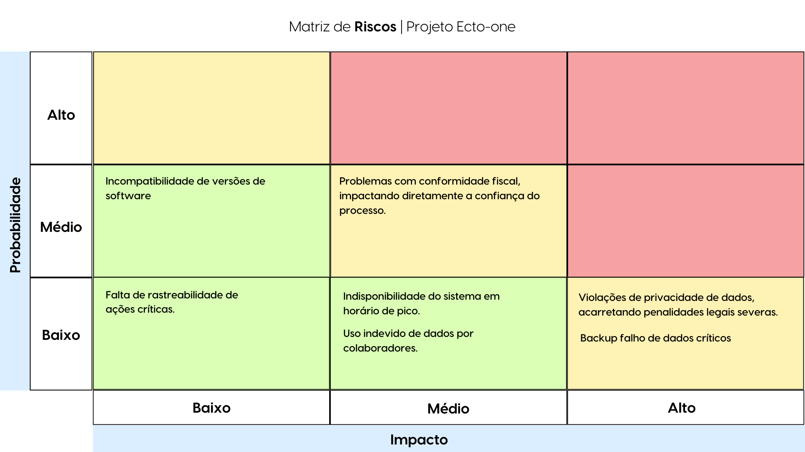
  <sup>Fonte: Desenvolvido pelos autores (2024)</sup>
</div>

&emsp;&emsp; A matriz de riscos permite identificar e priorizar os problemas mais críticos que a plataforma pode enfrentar. Riscos como incompatibilidade de versões de software e erro na emissão de Nota Fiscal apresentam maior probabilidade de impacto e, portanto, requerem atenção imediata. Já riscos de baixa probabilidade, como backup falho e indisponibilidade do sistema em horário de pico, devem ser monitorados, mas não necessariamente demandam ação urgente.

&emsp;&emsp; Portanto, a análise de riscos é um componente essencial para o planejamento e implementação segura da plataforma. Ao abordar os riscos de forma estratégica e proativa, é possível mitigar impactos negativos, assegurando maior integridade e confiabilidade do sistema, além de atender às regulamentações vigentes de segurança e compliance.

## 2.2. Oportunidades de Melhorias dos SLAs

&emsp;&emsp; A identificação de oportunidades de melhorias nos SLAs está focada em aspectos como segurança, desempenho, disponibilidade e tolerância a falhas do sistema. Essas melhorias são fundamentais para garantir um serviço eficiente, estável e seguro, alinhado com as expectativas dos usuários e os objetivos estratégicos do projeto. A matriz de oportunidades ajuda a visualizar o potencial de cada melhoria, permitindo priorizar ações que ofereçam maior retorno em termos de eficiência e confiabilidade.

<div align="center">
  <sub>Figura 3 - Matriz de Oportunidades do projeto Ecto-one desenvolvido para o IPT</sub>
  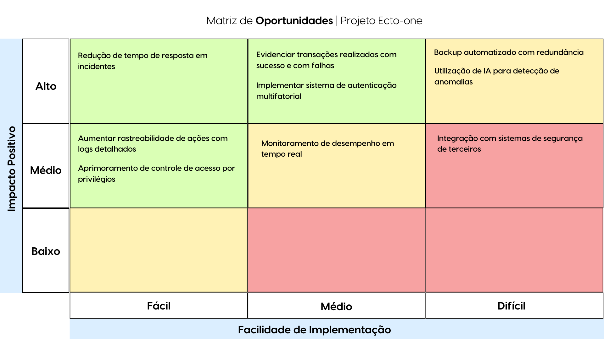
  <sup>Fonte: Desenvolvido pelos autores (2024)</sup>
</div>

&emsp;&emsp; As oportunidades de melhoria mapeadas na matriz têm potencial para elevar significativamente os SLAs da plataforma. Itens de fácil implementação com alto impacto positivo, como redução de tempo de resposta e controle de acesso aprimorado, devem ser priorizados. Já as implementações mais difíceis, como backup automatizado e integração com sistemas de terceiros, exigem mais recursos, mas proporcionam ganhos significativos em confiabilidade e segurança.

&emsp;&emsp; A identificação de oportunidades de melhoria nos SLAs é essencial para aumentar a eficiência e a qualidade do serviço oferecido pela plataforma. Priorizando as ações de acordo com seu impacto e facilidade de implementação, é possível otimizar o sistema de maneira estratégica, proporcionando uma experiência de usuário mais confiável e segura.

# 3. Arquitetura do Sistema Novo - Especificação de Requisitos

&emsp;&emsp; Nesta seção, será abordada a especificação de requisitos que guiará o desenvolvimento da arquitetura do sistema novo. Como parte do escopo, o grupo decidiu priorizar dois requisitos não funcionais críticos, que refletem as necessidades de segurança, desempenho e usabilidade da solução. A escolha destes requisitos visa garantir que a plataforma atenda aos desafios específicos do mercado de inspeções prediais, equilibrando flexibilidade, eficiência e conformidade regulatória.

## 3.2. Requisitos Não-Funcionais

&emsp;&emsp; Os requisitos não funcionais escolhidos são aspectos fundamentais para a confiabilidade e eficácia da plataforma. Eles estabelecem padrões de qualidade para o sistema, focando em propriedades como desempenho, segurança e privacidade. Nesta etapa, serão detalhados os dois requisitos selecionados: **Integridade** e **Disponibilidade**. Ambos foram selecionados considerando os desafios inerentes ao contexto de inspeções prediais e o impacto significativo que terão na experiência do usuário e na adoção da solução.

### RNF01 - Integridade

&emsp;&emsp;**Descrição:** O requisito da integridade diz respeito à garantia de que os dados contidos no sistema permaneçam confiáveis e inalterados. Isso significa que os documentos colocados no sistema devem estar protegidos de qualquer modificação não autorizada ou corrupção. Essa integridade é assegurada por meio de mecanismos de controle, como permissões de acesso e componentes de rastreabilidade, que limitam e rastreiam todas as ações realizadas no sistema.

&emsp;&emsp; Esse requisito será abordado no projeto devido ao relacionamento direto com a criticidade das operações do IPT. Isso porque qualquer falha na integridade poderia comprometer a análise técnica, causar erros de diagnóstico, prejuízos financeiros e até mesmo colocar em risco a segurança dos edifícios e usuários. Assim, a imutabilidade e rastreabilidade das informações coletadas são fundamentais para garantir que os documentos produzidos pelo IPT sejam válidos e que as decisões tomadas com base neles sejam seguras.

&emsp;&emsp; **Vunerabilidades Resolvidas:** O processo de inspeção predial atual realizado pelo parceiro é altamente manual e dependendo de ferramentas externas - Teams e Word - para o registro das informações que posteriormente são armazenadas no OneDrive. Esse método expõe diversas vulnerabilidades, como o risco de perda de informações, falta de controle sobre alterações e baixa rastreabilidade dos dados. Ao trabalhar com o requisito de integridade, é possível mitigar essas vulnerabilidades com mecanismos robustos, possibilitando a garantia de que todas as alterações sejam devidamente monitoradas. Além disso, será possível utilizar tecnologias para garantir a permanência segura dos dados, como criptografia e permissões de acesso.

&emsp;&emsp; **Critérios de Aceitação:** Na fase inicial do projeto os critérios de aceitação ainda não serão completamente metrificados, pois dependem da coleta de mais dados e informações ao longo do desenvolvimento. O objetivo, porém, é definir métricas robustas com o avanço do projeto, que permiam avaliar a eficiência dos mecanismos implementados. Espera-se que a nova arquitetura ofereça um desempenho superior em comparação com o sistema atual, proporcionando maior segurança e confiabilidade no controle das informações do IPT.

&emsp;&emsp; **Ganhos Esperados:** A implementação do requisito de integridade proporcionará um aumento significativo na segurança dos dados, garantindo que as informações coletadas sejam protegidas de alterações não autorizadas. Isso será alcançado por meio de mecanismos que asseguram a rastreabilidade de todas ações que ocorrem no sistema. Além disso, serão implementadas medidas de limitação de acesso, com permissões específicas, assegurando que apenas pessoas autorizadas possam visualizar ou modificar as informações.

### RNF02 - Disponibilidade

&emsp;&emsp;**Descrição:** O requisito de disponibilidade refere-se à capacidade de um sistema ou aplicação estar operacional e acessível aos usuários durante um determinado período de tempo, minimizando interrupções e falhas no serviço. Esse requisito define o tempo em que o sistema deve estar disponível, geralmente expresso como uma porcentagem de tempo de atividade em relação ao tempo total. Um sistema com alta disponibilidade deve estar disponível 24/7 ou próximo disso, garantindo o mínimo de _downtime_.

&emsp;&emsp;**Vunerabilidades Resolvidas:** O requisito não funcional de disponibilidade refere-se ao tempo em que o sistema está operacional e acessível ao usuário. O sistema atual utilizado pelo IPT depende do One Drive; ou seja, se o serviço externo ficar indisponível, o parceiro não conseguirá acessar os dados. Isso evidencia a necessidade de um sistema próprio para armazenamento de dados, de modo que, em caso de indisponibilidade, o IPT possa restaurá-lo rapidamente.

&emsp;&emsp;**Critérios de Aceitação:** O sistema deve estar disponível 24/7, com um tempo de inatividade máximo de 0,1% (8,76 horas por ano).

&emsp;&emsp;**Ganhos Esperados:** Com a implementação do requisito de disponibilidade, espera-se um aumento na confiabilidade e acessibilidade do sistema, proporcionando aos usuários acesso contínuo aos serviços e dados. A eliminação da dependência de um sistema externo, como o One Drive, permitirá um maior controle sobre o armazenamento e a recuperação dos dados das inspeções prediais, reduzindo o impacto de interrupções inesperadas. Além disso, o sistema estará preparado para lidar com falhas de forma eficiente, assegurando que o tempo de inatividade seja minimizado, o que resultará em maior produtividade, satisfação do usuário e continuidade das operações do IPT.

# 4. Visão Modelo Comportamental (Simulação do Atual)

&emsp;&emsp;A simulação do sistema atual é uma etapa fundamental para compreender o funcionamento do sistema em sua forma atual e identificar oportunidades de melhoria. Através da modelagem do sistema atual, é possível visualizar os processos, fluxos de dados e interações entre os componentes, permitindo uma análise detalhada dos pontos fortes e fracos do sistema.

## 4.1. Estrutura Estática do Modelo

&emsp;&emsp;A estrutura estática do modelo é composta por entidades que representam os principais elementos do sistema atual. Esses elementos incluem os atores envolvidos, como técnicos de inspeção e gestores prediais, bem como os artefatos produzidos, como relatórios de inspeção e laudos técnicos.

<div align="center">
  <sub>Figura 4 - Estrutura Estática</sub>
  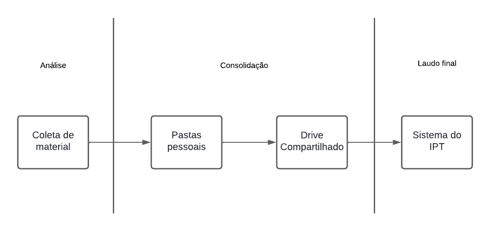
  <sup>Fonte: Desenvolvido pelos autores (2024)</sup>
</div>

&emsp;&emsp;O diagrama exibe a arquitetura atual em três fases principais: análise, consolidação e laudo final. Na fase de análise, pode ser construída uma planilha pelo coordenador do projeto, em que é descrito todas as informações necessárias para a inspeção. Nessa mesma fase, os técnicos de inspeção realizam a coleta de dados em campo, registrando informações sobre as condições estruturais das edificações. Esses dados podem ser registrados em formato de imagem, vídeo, texto ou áudio, e são armazenados em pastas no One Drive. No entanto, a falta de mecanismos de controle de versão e auditoria podem permitir que alterações não autorizadas passem despercebidas. Além disso, a dependência de um serviço externo para armazenamento de dados pode comprometer a disponibilidade dos dados em momentos críticos.

&emsp;&emsp;Na fase de consolidação, os dados coletados são então consolidados em um relatório de inspeção, que é revisado e validado pelo coordenador e superiores. Por fim, o laudo técnico é emitido com base nas informações coletadas, momento em que ocorre a assinatura do laudo, fornecendo recomendações e orientações para intervenções corretivas. Nessas fases, os dados ainda estão suscetíveis a alterações não rastreadas e, se tratando de um laudo assinado, a integridade dos dados é crucial para garantir a autenticidade e a confiabilidade do documento.

### Testes

&emsp;&emsp;O objetivo dos testes desta sprint foi identificar falhas no sistema que pudessem ser melhoradas. Com os resultados obtidos, aprimoramos a arquitetura, tornando-a mais completa e registrando todas as informações que ocorrem nela.

&emsp;&emsp;Nas três fases existe oportunidade para a implementação de controle de versões, auditorias e controle de permissões, que garantirão a integridade e a rastreabilidade dos dados. Além disso, a migração para um sistema próprio de armazenamento de dados, com redundância e backup, aumentará a disponibilidade e a segurança dos dados, reduzindo o risco de perda ou corrupção de informações.

## 4.2. Modelagem Comportamental e Simulação dos RNFs

&emsp;&emsp;Nesta seção, será apresentada a modelagem comportamental e a simulação dos requisitos não funcionais selecionados com base no sistema atual utilizado, o *OneDrive*. O objetivo é compreender como esses requisitos são implementados e operam na solução existente, fornecendo um referencial prático para o desenvolvimento da nova arquitetura da plataforma. Isso permitirá identificar boas práticas e possíveis limitações, contribuindo para a construção de uma solução mais alinhada às necessidades do projeto.

### Modelagem comportamental - Integridade

&emsp;&emsp;A simulação a seguir demonstra como o processo de armazenamento de documentos sobre as inspeções prediais é feito atualmente pelo IPT:

<div align="center">
  <sub>Figura 5 - Botão novo do drive</sub>
  
  <sup>Fonte: Desenvolvido pelos autores (2024)</sup>
</div>

<div align="center">
  <sub>Figura 6 - Upload do documento</sub>
  
  <sup>Fonte: Desenvolvido pelos autores (2024)</sup>
</div>

<div align="center">
  <sub>Figura 7 - Imagem armazenada</sub>
  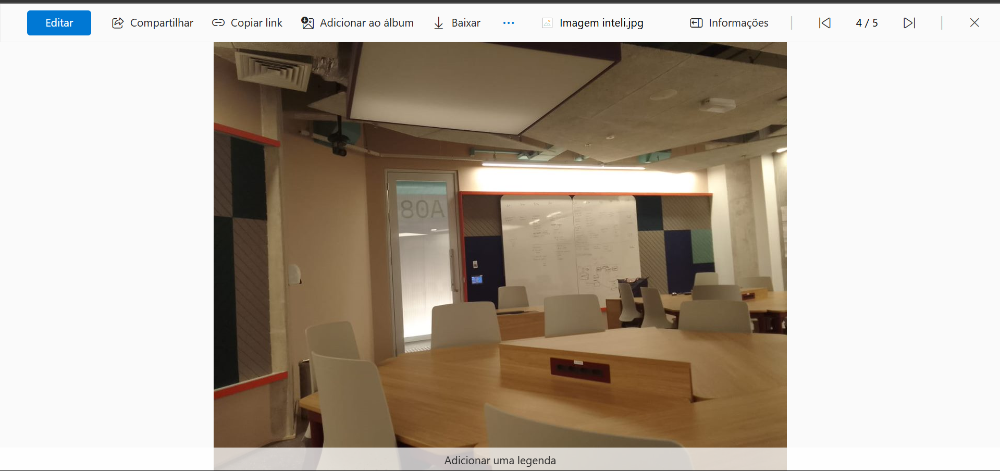
  <sup>Fonte: Desenvolvido pelos autores (2024)</sup>
</div>

### Modelagem comportamental - Disponibilidade

&emsp;&emsp; O requisito de disponibilidade não pode ser diretamente simulado, pois está vinculado a fatores externos que influenciam o funcionamento do serviço do *OneDrive*. A disponibilidade deste sistema depende de infraestrutura mantida pelo provedor do serviço, incluindo servidores, redes de comunicação e políticas de manutenção, que estão fora do controle do IPT. Casos como interrupções de serviço devido a falhas na infraestrutura da *Microsoft* podem impactar negativamente a disponibilidade. Isso demonstra a importância de planejar mecanismos complementares de contingência ou replicação no design da nova arquitetura para mitigar impactos semelhantes no sistema a ser desenvolvido.

## 4.3 Simulações com RNFs

&emsp;&emsp;Para garantir que o sistema atual utilizado pelo IPT atenda aos requisitos de **integridade** e **disponibilidade**, foram definidos quatro cenários de simulação. Esses cenários visam identificar vulnerabilidades específicas no fluxo de trabalho e propor melhorias para aumentar a confiabilidade e segurança dos dados. Cada cenário está detalhado com base em eventos comuns do processo de inspeção predial, destacando como os requisitos não funcionais (RNFs) são comprometidos no modelo atual.

| Cenário                                               | RNF             | Descrição                                                                                                  | Objetivo da Simulação                                                                                                     |
| ----------------------------------------------------- | --------------- | ---------------------------------------------------------------------------------------------------------- | ------------------------------------------------------------------------------------------------------------------------- |
| 1. Acesso aos Arquivos Compartilhados                 | Integridade     | Simulação de um colaborador acessando ou modificando um arquivo.                                           | Identificar falhas no controle de acesso e rastreabilidade para garantir que apenas pessoas autorizadas modifiquem dados. |
| 2. Monitoramento de Alterações e Histórico de Edições | Integridade     | Simulação de rastreabilidade de alterações nos documentos armazenados, monitorando o histórico de edições. | Verificar se o sistema registra e exibe corretamente todas as modificações feitas nos documentos.                         |
| 3. Operação do Sistema em Ambiente Offline            | Disponibilidade | Simulação de acesso aos dados do OneDrive em um ambiente offline, sem conexão de internet.                 | Avaliar o impacto da falta de conectividade no acesso aos dados e na continuidade do trabalho dos colaboradores.          |
| 4. Indisponibilidade no Serviço do OneDrive           | Disponibilidade | Simulação de uma queda do serviço do OneDrive, impossibilitando o acesso aos documentos.                   | Analisar a eficácia das soluções de backup e recuperação, assim como a continuidade do trabalho sem acesso ao OneDrive.   |

### Acesso aos Arquivos Compartilhados

&emsp;&emsp; Nesta simulação, um colaborador não autorizado acessa o *OneDrive* e realiza alterações indevidas nos dados compartilhados. O processo é detalhado a seguir:

**Upload de Arquivos**: O colaborador faz o upload de documentos que não deveriam ser inseridos, mostrando a capacidade de modificar o conteúdo disponível.

<div align="center">
  <sub>Figura 8 - Imagem armazenada</sub>
  
  <sup>Fonte: Desenvolvido pelos autores (2024)</sup>
</div>

**Compartilhamento de Arquivos**: Em seguida, o colaborador compartilha arquivos com outros usuários, aumentando o risco de acesso não autorizado.

<div align="center">
  <sub>Figura 9 - Imagem armazenada</sub>
  
  <sup>Fonte: Desenvolvido pelos autores (2024)</sup>
</div>

**Acesso de Outro Colaborador**: Um segundo colaborador entra no OneDrive, visualizando os arquivos compartilhados, indicando a falta de controle sobre as permissões.

<div align="center">
  <sub>Figura 10 - Imagem armazenada</sub>
  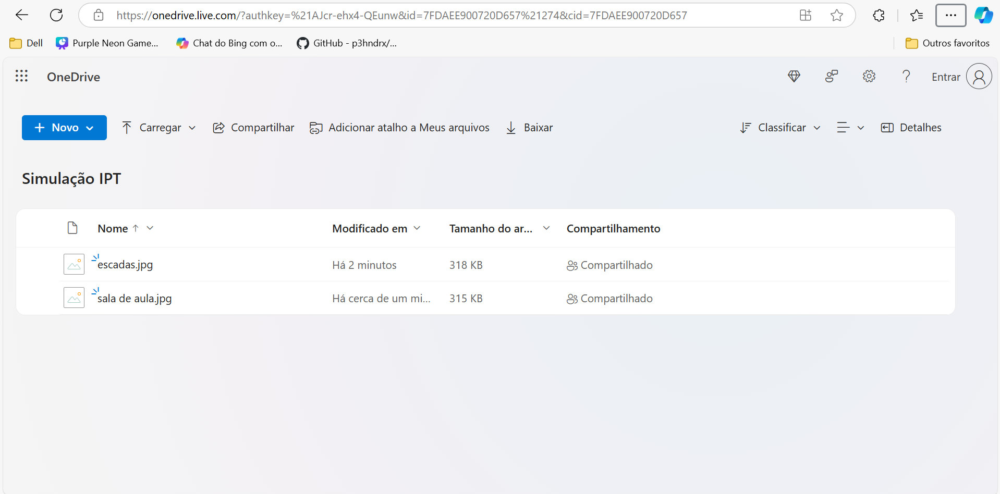
  <sup>Fonte: Desenvolvido pelos autores (2024)</sup>
</div>

**Alteração e Exclusão de Arquivo**: Por fim, o colaborador apaga um arquivo, evidenciando a vulnerabilidade na integridade dos dados.

<div align="center">
  <sub>Figura 11 - Imagem armazenada</sub>
  
  <sup>Fonte: Desenvolvido pelos autores (2024)</sup>
</div>

### Monitoramento de Alterações e Histórico de Edições

&emsp;&emsp;Nesta simulação, abordamos a capacidade de monitorar alterações e o histórico de edições em arquivos armazenados no OneDrive. O foco é na rastreabilidade das ações realizadas e na recuperação de arquivos.

**Visualização da Lixeira**: Na lixeira do OneDrive, mostra os os arquivos excluídos. É importante ressaltar que não há registro do usuário que realizou a exclusão, evidenciando uma falha na rastreabilidade das ações.

<div align="center">
  <sub>Figura 12 - Imagem armazenada</sub>
  
  <sup>Fonte: Desenvolvido pelos autores (2024)</sup>
</div>

&emsp;&emsp;Apenas o proprietário da pasta possui a permissão para restaurar os arquivos excluídos, o que limita a recuperação por outros colaboradores. Essa limitação pode dificultar a recuperação de informações importantes em caso de exclusões acidentais.

### Operação do Sistema em Ambiente Offline

&emsp;&emsp;Esta simulação explora a operação do sistema OneDrive em um ambiente offline, sem conectividade com a internet. O objetivo é avaliar como a falta de conexão afeta o acesso aos dados e a continuidade do trabalho.

**Conexão Wi-Fi Desligada**: O acesso à internet não está disponível. Essa situação representa um cenário realista em que colaboradores podem enfrentar dificuldades ao tentar enviar ou acessar informações.

<div align="center">
  <sub>Figura 13 - Imagem armazenada</sub>
  
  <sup>Fonte: Desenvolvido pelos autores (2024)</sup>
</div>

**Tentativa de Acesso ao OneDrive**: Tentativa de acessar o OneDrive enquanto a conexão está offline. A simulação revela que o acesso é impossível, o que indica uma dependência do sistema em relação à conectividade.

<div align="center">
  <sub>Figura 14 - Imagem armazenada</sub>
  
  <sup>Fonte: Desenvolvido pelos autores (2024)</sup>
</div>

### Indisponibilidade no Serviço do OneDrive

&emsp;&emsp;Neste cenário, é analisado a indisponibilidade do serviço OneDrive, que pode ocorrer devido a falhas no servidor.

**Indisponibilidade do OneDrive**: Interface do OneDrive durante uma queda de serviço. A imagem mostra a mensagem de erro ou a falta de acesso aos arquivos, indicando que os colaboradores não conseguem visualizar ou manipular os documentos armazenados.

<div align="center">
  <sub>Figura 15 - Imagem armazenada</sub>
  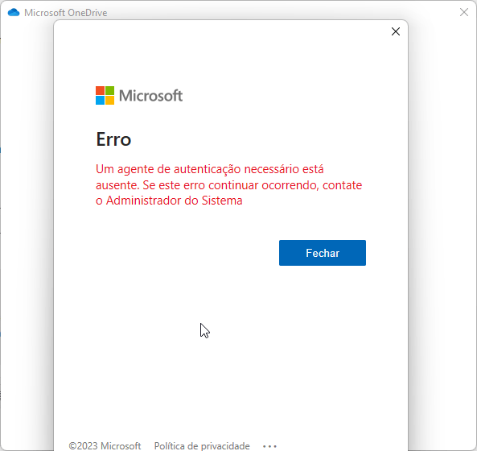
  <sup>Fonte: [Microsoft](https://answers.microsoft.com)</sup>
</div>

# SPRINT 2

# 5. Avaliação dos Mecanismos Utilizados no Sistema Atual (ATAM)

&emsp;&emsp; A avaliação dos mecanismos utilizados no sistema atual do IPT é fundamental para compreender as limitações relacionadas aos requisitos não-funcionais de integridade e disponibilidade. A ausência ou ineficácia de táticas arquiteturais apropriadas compromete a segurança e a confiabilidade dos dados, expondo o sistema a riscos significativos. Nesta seção, serão descritas as táticas arquiteturais e componentes existentes, destacando as falhas e vulnerabilidades, bem como a ausência de soluções automatizadas que poderiam melhorar o controle e a recuperação de dados em situações críticas.

## 5.1 Revisão do Mapa de Requisitos Não-Funcionais e Respectivas Vulnerabilidades

&emsp;&emsp; Nesta seção, será realizada uma análise dos requisitos não funcionais priorizados no projeto, destacando possíveis vulnerabilidades que podem comprometer sua implementação. O objetivo é identificar riscos associados aos aspectos de Integridade de Dados e Disponibilidade, com base nos cenários e sistemas analisados.

### RNF01 - Integridade

- **Entrada**: Dados e transações coletadas incluem informações estruturais detalhadas de inspeções prediais, como imagens, vídeos, texto e áudios. Esses dados são inicialmente registrados pelos técnicos de inspeção e armazenados em pastas pessoais antes de serem transferidos para um drive compartilhado.
- **Saída**: Registros e relatórios de inspeção são gerados com base nas informações coletadas. No entanto, devido à falta de controle de versão e auditoria, alterações não autorizadas podem ocorrer sem que sejam devidamente rastreadas. Exemplos incluem modificações ou exclusões de documentos no OneDrive sem registro adequado.
- **Controle do RNF**: Atualmente, o controle de integridade é feito de forma manual, dependendo da supervisão humana para monitorar as mudanças e validar os documentos. Isso expõe vulnerabilidades significativas, como a ausência de trilhas de auditoria e a incapacidade de identificar rapidamente alterações não autorizadas.

### RNF02 - Disponibilidade

- **Entrada**: O sistema depende de serviços externos, como o OneDrive, para o armazenamento de dados críticos. Isso inclui o upload e o compartilhamento de documentos necessários para a continuidade das operações de inspeção.
- **Saída**: O acesso contínuo aos dados armazenados é fundamental para a análise e emissão dos laudos técnicos. Entretanto, se o OneDrive se tornar indisponível, a continuidade das operações é diretamente impactada, resultando em atrasos e possíveis falhas operacionais.
- **Controle do RNF**: O controle de disponibilidade é inadequado, pois o sistema não possui backups locais ou redundâncias que garantam o acesso contínuo aos dados. Quando o OneDrive está indisponível, não há mecanismos automatizados para assegurar a continuidade das operações.

## 5.2 Táticas Arquiteturais e Componentes Adotados que Ajudam a Execução e o Controle dos RNFs do Sistema Atual

&emsp;&emsp; Nesta seção, serão apresentadas as principais táticas arquiteturais e componentes do sistema atual, *OneDrive*, que auxiliam na execução e controle dos requisitos. A análise destaca soluções práticas que podem servir de referência para a construção da nova arquitetura, garantindo eficiência na implementação dos requisitos não funcionais priorizados.

### RNF01 - Integridade

#### A. Monitoramento do RNF

- **Componentes**: O sistema atual utiliza monitoramento manual para rastrear alterações nos documentos. Não há um componente automatizado ou eficiente para esse fim, o que significa que a rastreabilidade é limitada.
- **Tática Arquitetural Ausente**: **Rastreabilidade**. A falta de uma trilha de auditoria automática compromete a capacidade de monitorar alterações em tempo real, deixando o sistema vulnerável a modificações não autorizadas.

#### B. Resolução do RNF (Preventivo e Reativo)

- **Componentes**: As permissões de acesso são configuradas manualmente, e não há medidas preventivas como criptografia ou autenticação multifator. A resolução de problemas é principalmente reativa, dependendo de intervenção humana.
- **Táticas Arquiteturais Ausentes/Ineficazes**:
  - **Acesso**: Implementado de forma manual e ineficaz, sem autenticação forte ou controles avançados.
  - **Atomicidade**: Ausente. As transações não são indivisíveis, o que significa que uma falha pode deixar os dados em um estado inconsistente.

#### C. Recuperação e Tratamento de Impactos

- **Componentes**: Backups são feitos de maneira esporádica e não automatizada, o que torna a recuperação de dados ineficiente. Não há um sistema de restauração robusto.
- **Táticas Arquiteturais Ineficazes**:
  - **Backup**: Realizado sem automação, aumentando o risco de perda de dados.
  - **Auditoria**: Ausente. Não há uma forma eficaz de identificar alterações e restaurar os dados a um estado anterior.

### RNF02 - Disponibilidade

#### A. Monitoramento do RNF

- **Componentes**: Não há mecanismos sistemáticos para monitorar a disponibilidade. Quando o OneDrive falha, os técnicos não recebem alertas automáticos ou informações em tempo real.
- **Tática Arquitetural Ausente**: **Heartbeat**. Sem este componente, o sistema não pode verificar a disponibilidade e alertar sobre falhas de maneira eficaz.

#### B. Resolução do RNF (Preventivo e Reativo)

- **Componentes**: O sistema depende inteiramente do OneDrive e não possui medidas preventivas para evitar interrupções. As reações são manuais, e não há redundância implementada.
- **Táticas Arquiteturais Ausentes**:
  - **Tendência**: Não há análise de tendências ou previsões para identificar possíveis falhas.
  - **Redundância**: Ausente. Não existem cópias de segurança ou sistemas redundantes que garantam a continuidade das operações.
  - **SOA (Arquitetura Orientada a Serviços)**: Ausente. O sistema atual não é estruturado para escalar ou recuperar-se rapidamente de falhas.

#### C. Recuperação e Tratamento de Impactos

- **Componentes**: O processo de recuperação depende do restabelecimento do OneDrive. Não há soluções automatizadas de backup ou recuperação.
- **Táticas Arquiteturais Ausentes/Ineficazes**:
  - **Redundância**: Ausente. Não há mecanismos de failover para continuar as operações em caso de falha.
  - **Modelo Tendência**: Ausente. Não há ferramentas para prever falhas e preparar o sistema para reagir de forma antecipada.

# 6. Especificação da Solução Técnica do Sistema Novo

&emsp;&emsp; Esta seção detalha a solução técnica desenvolvida para o novo sistema de inspeção predial, projetado para garantir elevados níveis de **integridade** e **disponibilidade**, eliminando as vulnerabilidades encontradas na versão atual. A nova arquitetura foi concebida com base em requisitos não funcionais que buscam fortalecer a segurança, a rastreabilidade e a resiliência do sistema, empregando táticas arquiteturais que previnem, detectam e corrigem falhas de maneira proativa e eficaz. Além disso, foram integrados componentes que aprimoram o monitoramento, o controle de acessos e a recuperação de dados, assegurando que o sistema permaneça operacional e confiável diante de diferentes cenários de uso e eventuais falhas. Com esses aprimoramentos, a solução técnica do sistema novo oferece uma plataforma eficiente e adaptada às necessidades do IPT, promovendo uma operação contínua e segura.

## 6.1. Revisão do Mapa de Requisitos Não-Funcionais do Sistema Novo

### RNF01 - Integridade

- **Entrada:** Dados coletados durante as inspeções prediais incluem informações sensíveis, como imagens de estruturas, vídeos e descrições que documentam o estado dos componentes do edifício. Para reduzir a exposição a acessos não autorizados, a arquitetura incorpora autenticação de dois fatores (_2FA_), controle de acesso por perfis de usuários e restrições de exposição, assegurando que cada usuário acesse apenas as informações essenciais para sua função.

- **Saída:** A partir das informações de entrada, é possível gerar relatórios de inspeção completos com descrições de anomalias, imagens e recomendações de reparo. A integridade desses relatórios é garantida por uma política de atomicidade, que assegura a conclusão completa ou reversão de alterações em caso de erro, preservando o estado seguro anterior. Cada acesso e modificação no documento de inspeção é registrado, possibilitando a rastreabilidade total, enquanto auditorias frequentes revisam o uso e identificam acessos fora dos padrões estabelecidos.

- **Controle do RNF:** O controle de integridade é automatizado e contínuo, apoiado por táticas que asseguram a proteção e consistência dos dados de inspeção. As auditorias periódicas e backups automáticos preservam a integridade e confiabilidade das informações, monitorando qualquer acesso e modificação fora dos padrões estabelecidos. Em casos de incidentes, os registros de rastreabilidade permitem a recuperação e identificação rápida de problemas, mantendo os dados seguros e consistentes ao longo do processo.

### RNF02 - Disponibilidade

- **Entrada:** O sistema é projetado para acessar e armazenar dados críticos de inspeção continuamente, atendendo às necessidades de verificação e análise técnica em tempo real. Para garantir a continuidade operacional, um monitoramento constante (_heartbeat_) verifica a disponibilidade dos serviços de armazenamento e processamento, avaliando o padrão de uso para detectar desvios que possam indicar falhas iminentes.

- **Saída:** O acesso estável aos dados é fundamental para a geração de laudos técnicos e documentos finais. Em situações de falhas ou interrupções, a arquitetura do sistema conta com redundância de componentes e uma estrutura orientada a serviços (_SOA_), além de backups automáticos, para manter a continuidade das operações. Em eventos críticos, um mecanismo de _rollback_ permite restaurar o sistema ao último estado íntegro, evitando perda de dados.

- **Controle do RNF:** A disponibilidade do sistema é monitorada e mantida de maneira proativa por meio do _heartbeat_ e de componentes redundantes. O monitoramento de tendência e _voting_ permite identificar e antecipar falhas, acionando o uso de recursos redundantes para garantir a continuidade das operações. Esse conjunto de táticas de controle e recuperação assegura que, em caso de interrupções, o sistema restaure rapidamente suas funções, atendendo às necessidades dos inspetores sem comprometer os prazos de análise e entrega dos relatórios.

## 6.2. Táticas Arquiteturais e Componentes Adotados que ajudam a Execução e o Controle dos RNFs do Sistema Novo

### RNF01 - Integridade

#### A. Monitoramento do RNF

- **Componentes:** O sistema novo conta com monitoramento automatizado de alterações por meio de logs de auditoria e rastreabilidade detalhada, além de ferramentas de monitoramento contínuo de atividades de usuários. Esses componentes garantem uma trilha de auditoria em tempo real, permitindo que qualquer alteração feita nos documentos de inspeção seja registrada com precisão.

- **Tática Arquitetural Implementada:** Rastreabilidade e Monitoramento. Ao automatizar o processo de rastreamento e auditar todas as ações de usuários, o sistema elimina a vulnerabilidade do monitoramento manual e passa a detectar rapidamente alterações não autorizadas, minimizando o risco de modificações indevidas sem identificação. Isso assegura que o nível de integridade dos dados seja mantido de maneira confiável.

#### B. Resolução do RNF (Preventivo e Reativo)

- **Componentes:** Para a resolução proativa das vulnerabilidades de integridade, o sistema adota autenticação de dois fatores (2FA), controle de acesso segmentado por perfil de usuário e limitação de exposição de dados, além de atomicidade nas transações. Essas medidas preventivas limitam o acesso apenas a usuários autorizados e garantem que transações sejam indivisíveis, evitando inconsistências.

- **Táticas Arquiteturais Implementadas:**

1. **Acesso:** Com autenticação multifator e acesso segmentado, o sistema protege contra acessos indevidos, resolvendo as limitações do sistema anterior, onde os controles eram manuais e inseguros.

2. **Atomicidade:** Ao garantir que qualquer transação seja completa ou revertida, o sistema evita estados de dados inconsistentes, suplantando a ausência de atomicidade no sistema antigo.

3. **Limitação de Exposição:** Apenas os dados necessários são acessados pelos usuários, reduzindo a chance de manipulação indevida e melhorando a segurança dos dados sensíveis.

#### C. Recuperação e Tratamento de Impactos

- **Componentes:** O sistema novo utiliza backups automáticos e rotinas de auditoria frequentes para assegurar a recuperação dos dados em caso de falhas. As auditorias verificam periodicamente a consistência e a integridade dos dados, enquanto os backups automáticos permitem restaurar rapidamente o estado dos dados em caso de incidentes.

- **Táticas Arquiteturais Implementadas:**

1. **Backup:** Com backups programados e automáticos, a recuperação de dados é rápida e eficiente, eliminando o risco de perda de dados devido a falhas na manualidade.

2. **Auditoria:** Com auditorias regulares, o sistema mantém a integridade e permite uma revisão constante dos dados, identificando modificações fora do padrão e facilitando a recuperação para estados anteriores. Isso trata os impactos de forma controlada e mantém a segurança dos dados.

### RNF02 - Disponibilidade

#### A. Monitoramento do RNF

- **Componentes:** A disponibilidade do sistema é monitorada automaticamente por meio de um mecanismo de _heartbeat_, que realiza verificações contínuas dos serviços essenciais. Em paralelo, o sistema utiliza análises de tendência para prever e identificar padrões que possam indicar falhas futuras, além de _voting_, que valida a integridade dos serviços antes de apontar qualquer problema.

- **Tática Arquitetural Implementada:** _Heartbeat_ e Tendência. O monitoramento constante do _heartbeat_ permite que falhas sejam detectadas e registradas imediatamente, com alertas automáticos para a equipe. A análise de tendência antecipa problemas antes que eles impactem o funcionamento do sistema, evitando indisponibilidades prolongadas. Esse nível de monitoração aprimorada suprime a limitação do sistema antigo, onde não havia controle sobre a disponibilidade do serviço.

#### B. Resolução do RNF (Preventivo e Reativo)

- **Componentes:** Para assegurar a continuidade dos serviços e evitar interrupções, a arquitetura incorpora redundância de componentes críticos e segue o modelo de Arquitetura Orientada a Serviços (SOA). Essa abordagem modulariza e distribui as funções do sistema, reduzindo o impacto de falhas em um único serviço. Em casos de interrupção, o sistema automaticamente direciona a carga para os componentes redundantes, assegurando uma recuperação reativa rápida.

- **Táticas Arquiteturais Implementadas:**

1. **Redundância:** Componentes críticos são duplicados para que, caso um falhe, o sistema continue funcionando, assegurando um nível de disponibilidade constante e estável.

2. **SOA:** Ao estruturar o sistema em uma arquitetura orientada a serviços, ele se torna mais resiliente e escalável, com recuperação mais rápida em caso de falhas. Esse design preventivo e reativo corrige a falta de redundância e a dependência monolítica do sistema anterior.

#### C. Recuperação e Tratamento de Impactos

- **Componentes:** Em casos de falha crítica, o sistema implementa mecanismos de _rollback_, restaurando automaticamente o último estado íntegro para evitar perda de dados ou interrupções prolongadas. O modelo de tendência permite que o sistema se prepare para a recuperação antecipada em caso de falhas previstas.

- **Táticas Arquiteturais Implementadas:**

1. **_Rollback_:** Com a capacidade de restaurar o sistema ao último estado íntegro, o impacto de falhas é minimizado e a continuidade do serviço é mantida.

2. **Modelo de Tendência:** Antecipando possíveis falhas, o sistema se prepara para agir de forma preventiva ou reativa conforme as condições detectadas, mitigando o impacto sobre a disponibilidade. Isso dá ao sistema uma capacidade robusta de recuperação e evita as vulnerabilidades do sistema anterior, que dependia unicamente de reestabelecimento externo para a continuidade.

# 7. Simulações

&emsp;&emsp; Nesta seção, serão abordadas as simulações do sistema atual e do sistema novo, com foco nos requisitos selecionados, bem como a justificativa das melhorias propostas. A análise comparativa entre os dois sistemas permitirá avaliar a eficácia das soluções implementadas e identificar oportunidades de otimização na nova arquitetura.

## 7.1. Simulações do Sistema Atual

&emsp;&emsp; Este tópico apresenta a simulação realizada sobre o sistema atual do Instituto de Pesquisas Tecnológicas (IPT), focando nos requisitos não funcionais de disponibilidade e integridade. Esses requisitos são críticos para assegurar que o sistema opere de forma confiável e consistente ao longo do tempo. Para essa análise, utilizamos um modelo de cadeia de Markov, que permitiu representar os possíveis estados operacionais do sistema e a probabilidade de transição entre eles. Esse método é particularmente eficaz para avaliar sistemas complexos, pois oferece uma visão detalhada das condições que podem levar o sistema a estados de falha ou degradação.

&emsp;&emsp;A simulação com cadeias de Markov possibilitou a identificação de pontos vulneráveis no sistema, onde a disponibilidade e a integridade estão suscetíveis a riscos crescentes. Com base nesses resultados, é possível entender melhor as limitações do sistema atual e explorar melhorias para garantir a continuidade dos serviços oferecidos pelo IPT com maior segurança e robustez.

### 7.1.1. Modelo de Simulação do Sistema Atual

### Disponibilidade

&emsp;&emsp;Os estados escolhidos para representar o sistema atual em termos de disponibilidade são: Solicitação de Acesso, Serviço de Acesso e Incidente.
Solicitação de Acesso representa o momento em que o usuário solicita acesso ao OneDrive, onde os documentos são armazenados. Serviço de Acesso representa quando o usuário está dentro do sistema. Por último, Incidente indica quando o OneDrive está lento devido à quantidade de documentos.

<div align="center">
  <sub>Figura 16 - Modelagem disponibilidade atual</sub>
  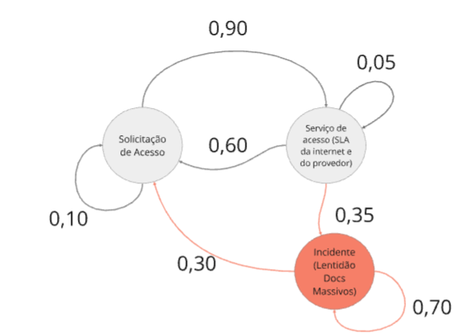
  <sup>Fonte: Desenvolvido pelos autores (2024)</sup>
</div>

&emsp;&emsp;O gráfico abaixo descreve as probabilidades de transição entre os estados quando estas se tornam estacionárias.

<div align="center">
  <sub>Figura 17 - Gráfico de linha da disponibilidade atual</sub>
  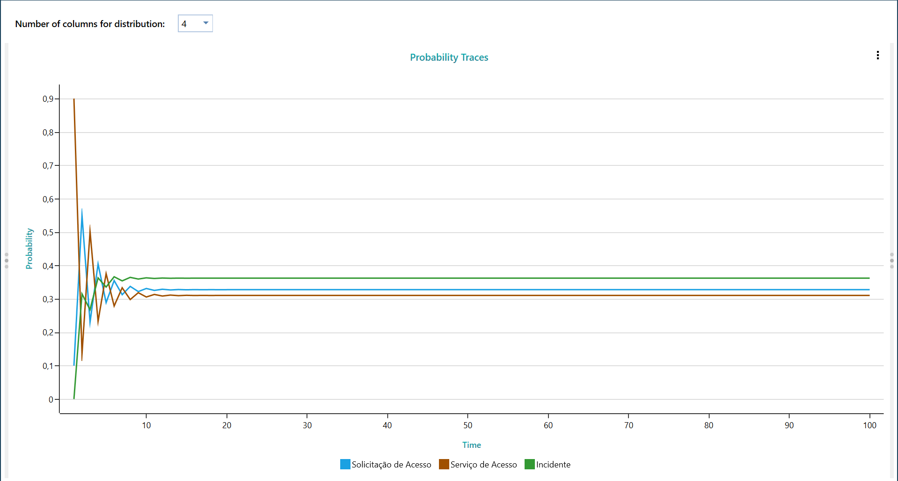
  <sup>Fonte: Desenvolvido pelos autores (2024)</sup>
</div>

&emsp;&emsp;Nesse gráfico, observamos que, quando as probabilidades se estabilizam, a porcentagem de o sistema atual cair no estado de Incidente é a maior, como também comprova o gráfico de barras abaixo.

<div align="center">
  <sub>Figura 18 - Gráfico de barra da disponibilidade atual</sub>
  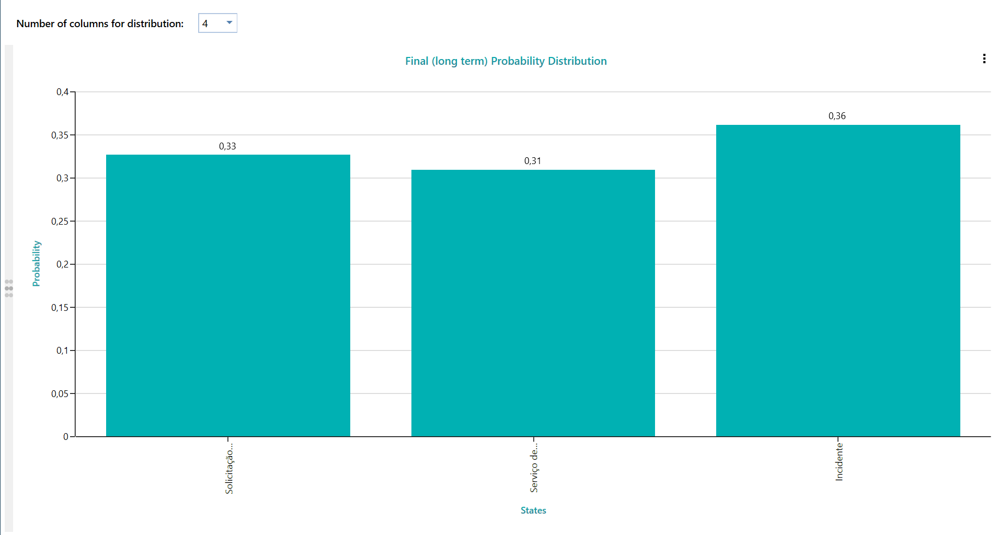
  <sup>Fonte: Desenvolvido pelos autores (2024)</sup>
</div>

### Integridade

&emsp;&emsp;Com o objetivo de simular o requisito não funcional de integridade do sistema atual, foram definidos os estados: Íntegro, Alteração e Inconsistente. Esses três representam os possíveis estados dos documentos armazenados no OneDrive.

<div align="center">
  <sub>Figura 19 - Gráfico de linha da integridade atual</sub>
  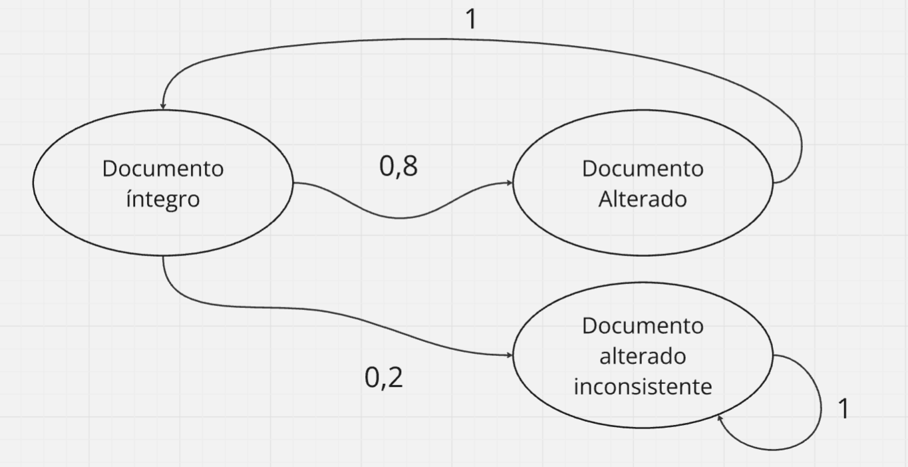
  <sup>Fonte: Desenvolvido pelos autores (2024)</sup>
</div>

&emsp;&emsp;Os gráficos abaixo descrevem as probabilidades de transição entre os estados.

<div align="center">
  <sub>Figura 20 - Gráfico de linha da integridade atual</sub>
  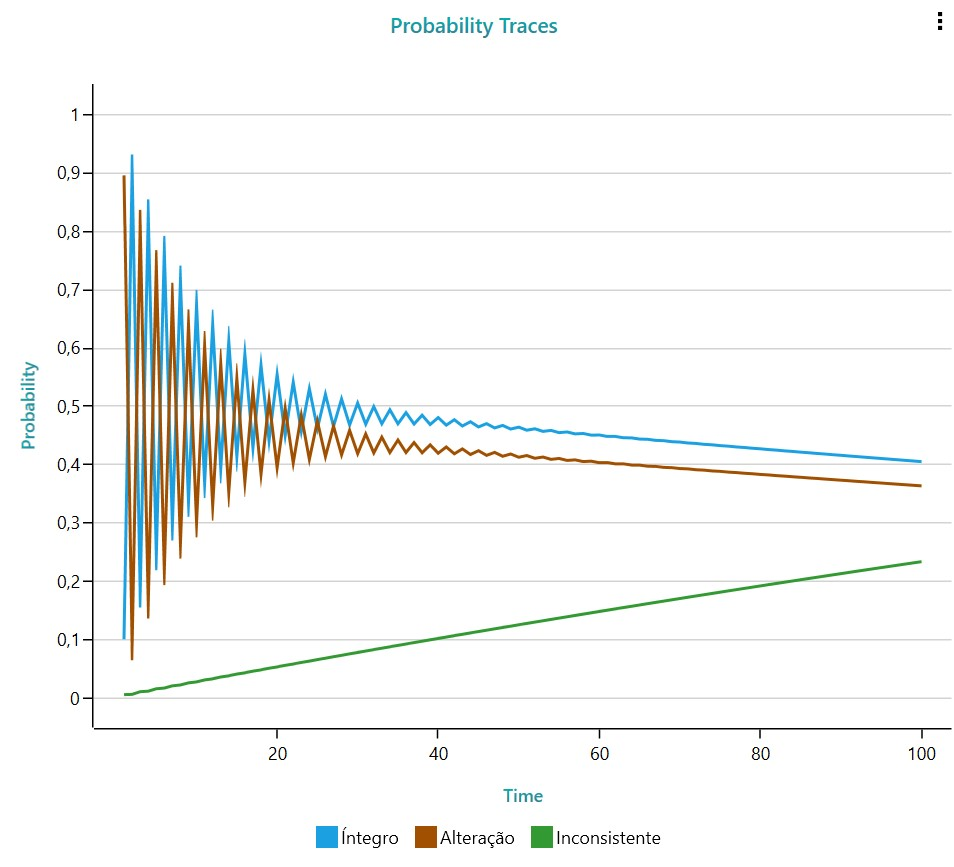
  <sup>Fonte: Desenvolvido pelos autores (2024)</sup>
</div>

&emsp;&emsp;Observa-se que a probabilidade de o documento entrar no estado de Inconsistente aumenta com o passar do tempo e a probabilidade dos outros estados diminui.

<div align="center">
  <sub>Figura 21 - Gráfico de barra da integridade atual</sub>
  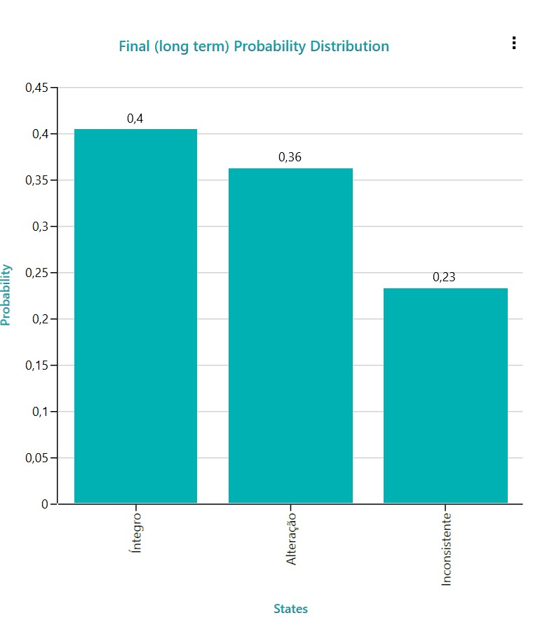
  <sup>Fonte: Desenvolvido pelos autores (2024)</sup>
</div>

### 7.1.2. Avaliação dos Resultados

&emsp;&emsp;Ao analisar os resultados das simulações aplicadas ao sistema atual, constatamos que a disponibilidade e a integridade do sistema podem sofrer comprometimento ao longo do tempo. Esse risco é principalmente resultado de uma alta probabilidade de o software entrar em um estado de incidente, o que aumenta a possibilidade de lentidão e inacessibilidade dos documentos.

&emsp;&emsp;Para conduzir essa análise, utilizamos uma modelagem baseada em cadeias de Markov, que permitiu simular diferentes estados operacionais do sistema e calcular as probabilidades associadas a cada estado ao longo do tempo. Através dessa abordagem, conseguimos identificar pontos críticos onde o sistema é suscetível a falhas ou degradação de desempenho. Os estados de incidente e inconsistente mapeados pela simulação indicam cenários em que a funcionalidade principal do sistema é prejudicada, seja por erros nos processos internos ou falhas nos dados armazenados. Com a recorrência dessas falhas, o sistema demonstra não apenas vulnerabilidades imediatas, mas também uma tendência de perda de consistência nos dados ao longo do tempo, o que compromete a confiança nas informações geradas e armazenadas.

&emsp;&emsp;Esses resultados reforçam a necessidade de um sistema novo que seja capaz de garantir maior confiabilidade, através de mecanismos de controle e recuperação de dados mais robustos e eficientes. Esse sistema deve incluir medidas preventivas para minimizar a probabilidade de incidentes, bem como estratégias de recuperação rápida e segura caso ocorram falhas. Implementar técnicas de monitoramento contínuo, redundância de dados e verificação de consistência são essenciais para melhorar a resiliência do sistema e assegurar sua integridade a longo prazo.

&emsp;&emsp;Com essas melhorias, espera-se reduzir significativamente os riscos de indisponibilidade e inconsistência de dados, aumentando a segurança e eficiência do sistema para os usuários e garantindo a sustentabilidade operacional frente às exigências de um ambiente de produção.

## 7.2. Simulações do Sistema Novo

&emsp;&emsp;No novo sistema, serão implementados processos adicionais para garantir um desempenho aprimorado em relação aos requisitos não-funcionais de disponibilidade e integridade. Para demonstrar essa melhoria, foram realizadas simulações utilizando a cadeia de Markov, incorporando novos estados e processos ao sistema.

### 7.2.1. Modelo de Simulação do Sistema Novo

### Disponibilidade

&emsp;&emsp;Para a modelagem da disponibilidade do novo sistema, foram definidos quatro estados:

1. **Disponível (serviço principal)**: sistema funcionando normalmente, com os usuários acessando os serviços sem interrupções;
2. **Falha**: indica uma indisponibilidade do sistema.
3. **Manutenção**: estado em que estão sendo realizadas ações corretivas para garantir a continuidade do serviço;
4. **Redundância**: indica que o sistema está utilizando um serviço adicional que assume a operação do principal em caso de falha;

<div align="center">
  <sub>Figura 22 - Modelagem de disponibilidade do novo sistema</sub>
  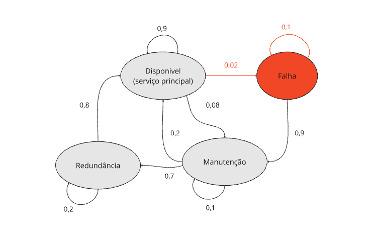
  <sup>Fonte: Desenvolvido pelos autores (2024)</sup>
</div>

&emsp;&emsp;Este modelo mostra que o serviço principal não só apresenta menos falhas devido a várias táticas empregadas, mas também permite a realização de manutenção preventiva sem a necessidade de esperar por falhas. Uma das táticas de recuperação utilizadas é a redundância, o que significa que, em caso de falha de um serviço, um serviço redundante é ativado para assumir a operação, evitando assim que o sistema fique indisponível. Dessa forma, o serviço principal pode ser reativado posteriormente.

&emsp;&emsp;O gráfico abaixo ilustra as probabilidades de transição entre os estados na modelagem de disponibilidade do novo sistema, quando as probabilidades se tornam estacionárias.

<div align="center">
  <sub>Figura 23 - Gráfico de linha da disponibilidade do novo sistema</sub>
  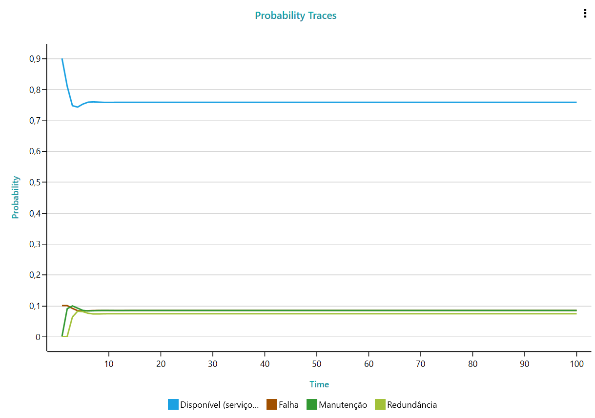
  <sup>Fonte: Desenvolvido pelos autores (2024)</sup>
</div>

&emsp;&emsp;No novo sistema, observa-se uma redução significativa na probabilidade de transição para o estado de Falha, que foi ajustada para 0,02, evidenciando uma maior robustez em comparação com o sistema atual. Além disso, o sistema possui uma alta probabilidade de recuperação (0,9) para o estado Disponível, o que demonstra a capacidade de autorrecuperação e a resiliência operacional, minimizando os impactos de uma eventual indisponibilidade.

<div align="center">
  <sub>Figura 24 - Gráfico de barra da disponibilidade do novo sistema</sub>
  
  <sup>Fonte: Desenvolvido pelos autores (2024)</sup>
</div>

### Integridade

&emsp;&emsp;Para a modelagem da integridade do novo sistema, foram definidos quatro estados:

1. **Documento Íntegro**: O documento está em conformidade.
2. **Documento Alterado Íntegro**: O documento foi alterado mas está em conformidade com o banco de dados.
3. **Documento Alterado Não Íntegro**: O documento foi alterado indevidamente.
4. **Documento Alterado Indevidamente e Indetectável**: O documento foi alterado indevidamente, mas o sistema não consegue identificar a alteração.
5. **Documento Não Íntegro Detectado**: O documento foi alterado indevidamente e a alteração foi identificada pelo sistema.
6. **Documento em Recuperação**: O documento está em processo de recuperação e voltará a ser íntegro em breve.

<div align="center">
  <sub>Figura 25 - Modelagem de integridade do novo sistema</sub>
  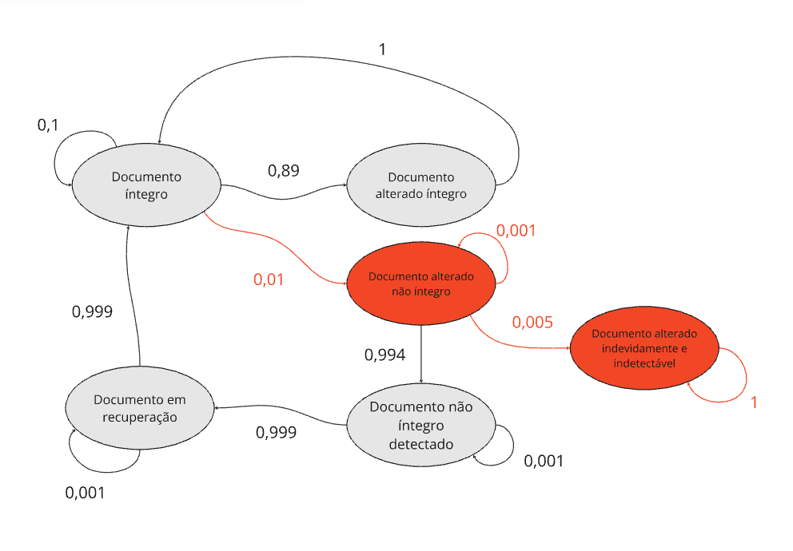 <sup>Fonte: Desenvolvido pelos autores (2024)</sup>
</div>

&emsp;&emsp;Em comparação com o modelo do sistema atual, este novo sistema pode detectar documentos que não são íntegros. Com as táticas de segurança implementadas, apenas usuários autorizados podem modificar os documentos. Essa autorização é concedida após várias confirmações, garantindo a identidade do usuário. Mesmo que ocorra uma falha e um usuário não autorizado ou hacker consiga alterar um documento, a alteração será identificada através de procedimentos que verificam a modificação e a autenticidade do documento. Assim, o documento entra em processo de recuperação devido ao histórico mantido, e volta a ser íntegro.

<div align="center">
  <sub>Figura 26 - Gráfico de linha da integridade do novo sistema</sub>
  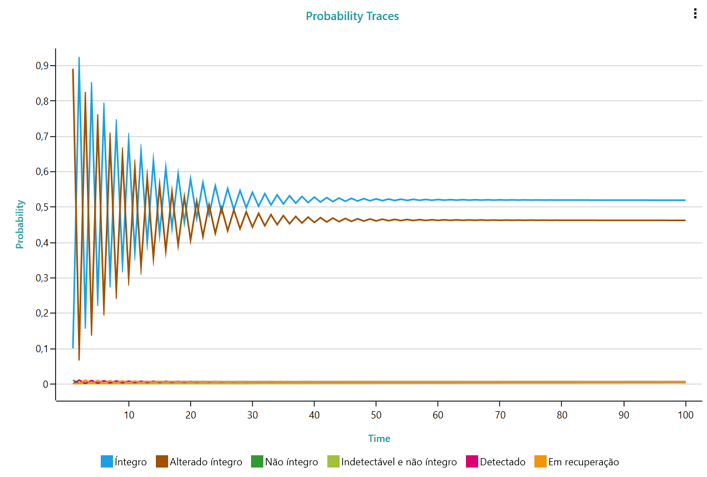
  <sup>Fonte: Desenvolvido pelos autores (2024)</sup>
</div>

&emsp;&emsp;Com a nova modelagem, pode-se observar que a probabilidade de os documentos permanecerem íntegros é alta, e a chance de transitar para estados de risco é baixa (0,1%). A taxa de detecção e recuperação é elevada em relação às alterações indevidas (0,01%), garantindo que documentos comprometidos possam ser restaurados adequadamente.

<div align="center">
  <sub>Figura 27 - Gráfico de barra da integridade do novo sistema</sub>
  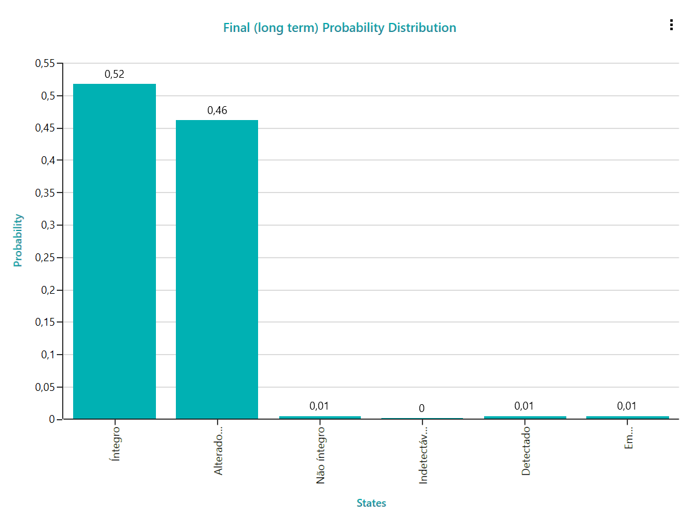
  <sup>Fonte: Desenvolvido pelos autores (2024)</sup>
</div>

### 7.2.2. Avaliação dos Resultados

&emsp;&emsp;Nas simulações do sistema, as **zonas vermelhas** referem-se aos estados em que a integridade ou a disponibilidade do sistema estão comprometidas. Em outras palavras, são estados em que o sistema ou os documentos estão em risco devido a falhas ou alterações indevidas.

&emsp;&emsp;A modelagem visou **minimizar a frequência** em que o sistema ou os documentos permanecem nessas zonas vermelhas. Estratégias como redundância, altas taxas de recuperação e mecanismos de detecção de alterações ajudam a reduzir a probabilidade de que essas condições ocorram, mantendo o sistema mais estável e seguro.

&emsp;&emsp;Os resultados das novas modelagens do sistema, **utilizando processos das táticas arquiteturais** baseadas nos requisitos não-funcionais, indicam que as probabilidades de ocorrência nas zonas vermelhas são muito pequenas. Eles demonstram que o sistema tem uma baixa probabilidade de falhas, alta capacidade de recuperação e menores chances de ações indevidas. Os gráficos confirmam a efetividade dessas estratégias, destacando a constante disponibilidade e integridade do sistema.

&emsp;&emsp;

## 7.3. Justificativa das Melhorias

&emsp;&emsp;As melhorias implementadas no novo sistema visam reduzir significativamente as falhas e inconsistências observadas no sistema atual, atendendo aos requisitos de disponibilidade e integridade. O sistema atual apresentou vulnerabilidades, principalmente nas áreas de indisponibilidades frequentes e alta probabilidade de inconsistência de dados devido à falta de redundância e controle efetivo de permissões.

&emsp;&emsp;Com a implementação de um sistema de redundância para a disponibilidade, o novo modelo minimiza a probabilidade do sistema estar indisponível, garantindo que o serviço continue em operação, mesmo em situações de falha. Esse mecanismo, somado ao estado de manutenção proativa, permite que o sistema realize ajustes necessários sem interromper o serviço. Além disso, as manutenções preventivas assegura as melhorias contínuas para evitar falhas futuras. Essas táticas de controle e recuperação de falhas, combinadas com técnicas específicas que serão aplicadas como o heartbeat e monitoramnto de tendências, contribuiram para a redução de 94% na probabilidade do sistema entrar em estado de falha na simulação.

&emsp;&emsp;Para assegurar a integridade, o novo sistema conta com controle de acesso e verificação constante da conformidade dos documentos. Para isso, mecanismos de permissões, atomicidade, ratreabilidade e backup foram considerados na modelagem da arquitetura. Diferente do sistema atual, é possível inferir quando um documento foi alterado, realizando uma auditoria para verificar a autenticidade da alteração. Caso a alteração seja indevida, o sistema entra em processo de recuperação, garantindo que o documento volte ao estado íntegro com eficiência. A adição dessas táticas contribuiu para a redução de 95% na probabilidade de um documento estar em estado de inconsistência na simulação e de 98,8% de não ser detectado.

&emsp;&emsp;Essas melhorias oferecem um sistema confiável e disponível, capaz de suportar as demandas do IPT sem comprometer a integridade dos dados ou a disponibilidade do serviço, proporcionando uma solução mais segura e eficiente para o parceiro.

# SPRINT 3

# 8. Implementação dos Mecanismos Arquiteturais

&emsp;&emsp; Nesta seção, serão abordados os principais aspectos relacionados à implementação dos mecanismos arquiteturais projetados para atender os requisitos. Serão apresentados os testes e componentes essenciais que garantirão a eficiência e confiabilidade do sistema, alinhando o desenvolvimento às táticas propostas na arquitetura.

## 8.1. Especificação e Codificação dos Testes Não-Funcionais dos Componentes (TDD)

### Mecanismo de Heartbeat

#### Teste 001 - Detecção de Falha em Tempo Real

&emsp;&emsp;Este teste foi desenvolvido para validar a capacidade do sistema de detectar falhas em tempo real em serviços críticos, garantindo que ações corretivas sejam tomadas rapidamente para minimizar interrupções. O mecanismo de heartbeat assegura a conectividade e funcionalidade contínua dos serviços por meio de monitoramento periódico.

**Objetivo:** Verificar se o sistema detecta a falha de um serviço crítico dentro do tempo estipulado.

**Cenário de Teste:** Interrupção do heartbeat emitido por um serviço crítico.

**Procedimento:**

- Monitorar a emissão regular de heartbeats pelo serviço escolhido.
- Simular a interrupção ou desligamento do serviço para cessar o envio de heartbeats.
- Validar o registro e a resposta do sistema à falha detectada.

**Critérios de Aceitação:**

- A falha deve ser detectada em até 5 segundos, após 3 tentativas consecutivas sem resposta do heartbeat.
- O sistema deve gerar logs com detalhes sobre:
  - Serviço afetado.
  - Hora da falha.
  - Status da conexão.

#### Teste 002 - Resposta à Falha de Heartbeat

&emsp;&emsp;Este teste foi desenvolvido para validar a resposta do sistema à falha de um heartbeat, assegurando que a redundância seja acionada dentro do prazo estipulado, garantindo a continuidade dos serviços.

**Objetivo:** Verificar se o sistema realiza o failover adequadamente após a falha de um heartbeat.

**Cenário de Teste:** Simulação de falha no serviço crítico para ativar o failover.

**Procedimento:**

- Monitorar o envio regular de heartbeats pelo serviço principal.
- Simular a interrupção do serviço para interromper o envio do heartbeat.
- Avaliar se o sistema inicia o failover dentro do tempo estipulado.

**Critérios de Aceitação:**

- O sistema deve iniciar o failover automaticamente em até 30 segundos após a falha detectada.
- O serviço redundante deve assumir as operações sem interrupções significativas.

### Mecanismo de Rastreabilidade

#### Teste 009 - Rastreabilidade

&emsp;&emsp; Este teste foi desenvolvido para validar a geração de logs de auditoria, assegurando que todas as ações importantes no sistema, como o login de usuários, sejam registradas corretamente. A rastreabilidade é fundamental para garantir que, em caso de auditoria ou necessidade de diagnóstico, seja possível verificar com precisão as ações realizadas por cada usuário no sistema.

**Objetivo:** Verificar se o sistema está registrando adequadamente as ações dos usuários nos logs.

**Cenário de Teste:** O teste foi realizado simulando um login de um usuário no sistema, tanto em casos de sucesso quanto de falha. Para cada cenário, foi verificado se o log de auditoria foi gerado corretamente, contendo as informações necessárias, como:

- Identificação do usuário
- Hora da ação
- Tipo de ação
- Resultado da ação
- Mensagem associada

**Procedimento:**

**Login bem-sucedido**

1. Foi executada uma tentativa de login com credenciais válidas.
2. O log gerado foi verificado para garantir que ele contém as informações corretas.

**Login com falha**

1. Foi executada uma tentativa de login com credenciais inválidas.
2. O log gerado foi verificado para garantir que ele contém as informações corretas, incluindo a razão da falha.

**Critérios de aceitação:**

- O sistema deve registrar as tentativas de login de forma clara e detalhada, incluindo informações sobre o sucesso ou falha da tentativa.
- Os logs de auditoria devem conter dados como o nome do usuário, a hora da tentativa de login, o tipo de ação executada e a resposta do sistema (sucesso ou falha).
- Os logs devem ser gerados em conformidade com a política de rotação e backup de logs, garantindo que não haja perda de dados de auditoria.

### Mecanismo de autenticação

&emsp;&emsp; Para validar a implementação do mecanismo de autenticação, foram desenvolvidos testes automatizados que verificam se o sistema está autenticando corretamente os usuários e permitindo o acesso apenas a usuários autorizados. Os testes foram realizados utilizando a técnica de Desenvolvimento Orientado a Testes (TDD), garantindo que o mecanismo de autenticação funcione conforme o esperado.

### Mecanismo de hashing

#### Teste 001 - Geração de Hash para Arquivo Existente

&emsp;&emsp; Este teste foi desenvolvido para validar a capacidade do sistema de gerar um hash correto para um arquivo existente no banco de dados, garantindo a integridade e rastreabilidade do arquivo.

**Objetivo:** Verificar se o sistema atualiza o hash de um arquivo existente corretamente no banco de dados.

**Cenário de Teste:** Arquivo válido presente no banco de dados.

**Procedimento:**

1. Configurar um mock para o banco de dados contendo um arquivo válido.
2. Chamar o método hash_file com o ID do arquivo.
3. Validar se o hash do arquivo foi gerado e salvo corretamente no banco de dados.

**Critérios de Aceitação:**

- O hash gerado deve corresponder ao valor esperado.

#### Teste 002 - Geração de Hash para Arquivo Inexistente

&emsp;&emsp; Este teste foi desenvolvido para validar a resposta do sistema ao tentar gerar um hash para um arquivo que não existe no banco de dados.

**Objetivo:** Verificar se o sistema lança uma exceção apropriada quando o arquivo não é encontrado.

**Cenário de Teste:** Arquivo inexistente no banco de dados.

**Procedimento:**

1. Configurar um mock para o banco de dados que retorna None ao consultar o ID do arquivo.
2. Chamar o método hash_file com o ID do arquivo inexistente.
3. Validar se o sistema lança uma HTTPException com o código de status correto e a mensagem apropriada.

**Critérios de Aceitação:**

- O sistema deve lançar uma HTTPException com código 404.
- A mensagem de erro deve ser "File not found."

#### Teste 003 - Geração de Checksum para Arquivo Existente

&emsp;&emsp; Este teste foi desenvolvido para validar a capacidade do sistema de gerar um checksum correto para um arquivo existente no banco de dados.

**Objetivo:** Verificar se o sistema atualiza o checksum de um arquivo existente corretamente no banco de dados.

**Cenário de Teste:** Arquivo válido presente no banco de dados.

**Procedimento:**

1. Configurar um mock para o banco de dados contendo um arquivo válido.
2. Chamar o método checksum_file com o ID do arquivo.
3. Validar se o checksum do arquivo foi gerado e salvo corretamente no banco de dados.

**Critérios de Aceitação:**

- O checksum gerado deve corresponder ao valor esperado.

#### Teste 004 - Geração de Checksum para Arquivo Inexistente

&emsp;&emsp; Este teste foi desenvolvido para validar a resposta do sistema ao tentar gerar um checksum para um arquivo que não existe no banco de dados.

**Objetivo:** Verificar se o sistema lança uma exceção apropriada quando o arquivo não é encontrado.

**Cenário de Teste:** Arquivo inexistente no banco de dados.

**Procedimento:**

1. Configurar um mock para o banco de dados que retorna None ao consultar o ID do arquivo.
2. Chamar o método checksum_file com o ID do arquivo inexistente.
3. Validar se o sistema lança uma HTTPException com o código de status correto e a mensagem apropriada.

**Critérios de Aceitação:**

- O sistema deve lançar uma HTTPException com código 404.
- A mensagem de erro deve ser "File not found."

## 8.2. Especificação e Codificação dos Componentes que Compõem os Mecanismos Indicados nas Táticas

### Mecanismo de Heartbeat

&emsp;&emsp; O mecanismo de Heartbeat foi projetado para monitorar continuamente a disponibilidade e o desempenho de serviços críticos no sistema. Ele realiza a medição de latência e o registro do status do serviço em um banco de dados, garantindo que falhas sejam detectadas em tempo real e que ações corretivas possam ser tomadas de forma eficiente.

**Características Principais**

1. **Monitoramento Contínuo:**

   - Emissão e verificação periódica de sinais ("heartbeats") para medir a conectividade e desempenho dos serviços.
   - A latência das respostas é calculada em milissegundos para análise de desempenho.

2. **Registro de Histórico:**

   - Todos os dados relacionados à latência e ao status do serviço são armazenados no banco de dados para auditoria e análise de tendências.

3. **Falhas Detectadas Automaticamente:**
   - Qualquer falha na comunicação com o serviço é registrada com detalhes como hora do evento e status.

**Estrutura do Mecanismo**

1. **Tabela de Histórico de Disponibilidade:**
   O mecanismo utiliza uma tabela no banco de dados chamada `history_availability` para armazenar os registros de latência e status do serviço.

   - **Campos da tabela:**
     - `history_id`: Identificador único de cada entrada.
     - `timestamp`: Registro da data e hora da medição.
     - `status`: Status do serviço (ativo/inativo).
     - `latency`: Tempo de resposta do serviço em milissegundos.

```python
class HistoryAvailable(Base):
    __tablename__ = "history_availability"

    history_id = Column(Integer, primary_key=True, index=True)
    timestamp = Column(TIMESTAMP, default=func.now(), nullable=False)
    status = Column(Boolean, nullable=False)
    latency = Column(Float, nullable=False)
```

&emsp;&emsp; **Medição de Latência:** A função measure_latency realiza uma requisição HTTP para o endpoint de heartbeat (/users/heart) do serviço monitorado. Ela retorna a latência e o status do serviço.

```python
# Função para medir a latência
def measure_latency():
    url = f"{USER_HOST}/users/heart"
    try:
        response = requests.get(url)
        response.raise_for_status()
        latency = response.elapsed.total_seconds() * 1000
        return latency, True
    except requests.RequestException as e:
        return None, False
```

&emsp;&emsp; **Registro no Banco de Dados:** A função save_history_to_db insere os dados de latência e status no banco de dados, criando um histórico de disponibilidade.

```python
# Função para salvar a latência e o status no banco de dados
def save_history_to_db(db: Session, latency: float, status: bool):
    history_entry = HistoryAvailable(latency=latency, status=status)
    db.add(history_entry)
    db.commit()
    db.refresh(history_entry)
```

&emsp;&emsp; **Execução Principal:** A função main coordena o processo de medição e registro, garantindo que o monitoramento seja contínuo e automático.

```python
# Função principal
def main():
    # Medir latência e status
    latency, status = measure_latency()
    # Salvar no banco de dados
    with next(get_db()) as db:
        save_history_to_db(db, latency, status)

    return latency, status

if __name__ == "__main__":
    main()
```

#### Funcionamento do Mecanismo

**1. Medição de Latência e Status:**
O mecanismo realiza requisições periódicas ao endpoint do serviço monitorado.
Retorna a latência em milissegundos e o status (ativo ou inativo).

**2.Registro no Banco de Dados:**
Registra todos os dados em uma tabela de histórico para permitir auditoria e análise posterior.

**3.Execução Contínua:**
Automatiza o monitoramento para garantir que falhas sejam detectadas em tempo real.

#### Benefícios do Mecanismo

**1.Confiabilidade:**
Permite a detecção rápida de falhas, reduzindo o tempo de inatividade do sistema.

**2.Rastreabilidade:**
Gera um histórico detalhado da disponibilidade e desempenho do serviço, útil para auditorias e análises.

**3.Flexibilidade:**
Pode ser integrado a múltiplos serviços, permitindo o monitoramento de diferentes partes do sistema.

&emsp;&emsp; Este mecanismo pode ser estendido para incluir notificações em caso de falha, integrando-se com sistemas de alerta como PagerDuty ou Slack para comunicação em tempo real.

### Mecanismo de Rastreabilidade

&emsp;&emsp; Este mecanismo foi projetado para padronizar e simplificar a implementação de logs em diferentes serviços da aplicação. Ele utiliza o módulo nativo logging do Python, complementado por uma estrutura de classes reutilizáveis que são copiadas para todos os serviços. O objetivo é garantir rastreabilidade, consistência e gerenciamento eficiente dos arquivos de log.

**Características Principais**

1. **Padronização:**

- Uso de classes reutilizáveis para simplificar a configuração de logs e garantir uniformidade em todos os serviços.

2. **Rotação de Logs:**

- Implementação de rotação automática de logs com o handler RotatingFileHandler.
- Cada arquivo de log tem um tamanho máximo de 2MB.
- Quando o tamanho é excedido, um novo arquivo é criado, e o antigo é armazenado como backup.
- Limite de 5 backups armazenados. Após atingir o limite, o log mais antigo é excluído automaticamente.

3. **Flexibilidade:**

- Suporte para diferentes níveis de log (DEBUG, INFO, WARNING, ERROR, CRITICAL).
- Configuração de formato e destino de logs, podendo incluir logs no console e em arquivos.

**Estrutura das Classes**

1. **Classe Base para Logs:**

- Centraliza a configuração do logger.
- Define o formato padrão para as mensagens de log.
- Configura os handlers (arquivo com rotação e console).

```
class Logger:
    def __init__(
        self,
        max_bytes=2000000,
        log_dir='logs',
        log_filename='app.log',
        formatter='%(asctime)s - %(levelname)s - %(message)s'
    ):
        # Ensure the log directory exists
        if not os.path.exists(log_dir):
            os.makedirs(log_dir)

        # Initialize logger
        self._logger = logging.getLogger('app')

        if not self._logger.hasHandlers():  # Só adiciona handler se não houver nenhum
            self._logger.setLevel(logging.DEBUG)

            # Set up the log file handler
            log_path = os.path.join(log_dir, log_filename)
            file_handler = RotatingFileHandler(log_path, maxBytes=max_bytes, backupCount=5)
            file_handler.setLevel(logging.INFO)

            # Set up the formatter
            file_handler.setFormatter(logging.Formatter(formatter))

            # Add handler to logger
            self._logger.addHandler(file_handler)
```

2. **Classe Específica por Serviço:**
   Essas classes são extensões da **Classe Base para Logs** que permite configurar o sistema de logs com detalhes específicos para cada serviço. Ajuda a associar os logs diretamente ao contexto do serviço, tornando mais fácil identificar a origem de mensagens de log em um ambiente com múltiplos serviços.

```
class UserLogger(Logger):
    def __init__(self,):
        super().__init__(log_filename='user.log')

    def __log_info(self, user_id, action, message):
        """Logs a specific user action."""
        log_message = f"User ID: {user_id} - Action: {action} - {message}"
        self._logger.info(log_message)

    def log_error(self, user_id, error_message):
        """Logs a user error."""
        log_message = f"User ID: {user_id} - ERROR: {error_message}"
        self._logger.error(log_message)

    def user_login(self, user_id):
        """Logs user login action."""
        self.__log_info(user_id, "LOGIN", "User logged in successfully.")

    def user_logout(self, user_id):
        """Logs user logout action."""
        self.__log_info(user_id, "LOGOUT", "User logged out successfully.")

    def user_login_failed(self, email):
        """Logs user login fail."""
        self._logger.info(f"User email: {email} - Action: LOGIN_FAILED - Invalid email or password")
```

#### Uso nos Serviços

&emsp;&emsp; A implementação do logger em um serviço requer apenas a instância da classe de log correspondente.

```
def login(self, email: str, password: str):
    user = self.db.query(User).filter(User.email == email, User.password == password).first()
    if user:
        self.logger.user_login(user_id=user.id)
        return user
    else:
        self.logger.user_login_failed(email)
        raise HTTPException(status_code=401, detail="Invalid email or password")
```

&emsp;&emsp; Este mecanismo pode ser estendido com integrações para sistemas de observabilidade, como Elasticsearch, Logstash e Kibana (ELK Stack), ou soluções de monitoramento como Datadog e Prometheus.

### Mecanismo de Autenticação

&emsp;&emsp; Este mecânismo foi implementado para garantir a autenticação segura dos usuários no sistema, utilizando tokens JWT (JSON Web Tokens) para gerenciar as sessões de login. O mecanismo de autenticação é composto por um conjunto de classes e funções que validam as credenciais dos usuários, geram tokens de acesso e verificam a autenticidade dos tokens recebidos.

**Características Principais**

1. **Segurança:**

- Utilização de tokens JWT para autenticação, que são assinados digitalmente e podem conter informações específicas do usuário.

2. **Gerenciamento de Sessões:**

- Geração de tokens de acesso com base nas credenciais do usuário.

3. **Validação de Tokens:**

- Verificação da autenticidade dos tokens recebidos para garantir a segurança da sessão.

**Estrutura das Classes**

1. **Classe de Casos de Uso:**

- Define os casos de uso do usuário, como login e registro.

```
class UserUseCases:
    def __init__(self, db_session: Session):
        self.db_session = db_session

    def user_register(self, user: User):
        user_model = UserModel(
            name = user.name,
            email = user.email,
            password = crypt_context.hash(user.password),
            created_at = datetime.utcnow(),
            last_access = datetime.utcnow()
        )
        try:
            self.db_session.add(user_model)
            self.db_session.commit()
        except IntegrityError:
            raise HTTPException(
                status_code=status.HTTP_400_BAD_REQUEST,
                detail='email already exists'
            )

    def user_login(self, user: User, expires_in: int = 30):
        user_on_db = self.db_session.query(UserModel).filter_by(email=user.email).first()

        if user_on_db is None:
            raise HTTPException(
                status_code=status.HTTP_401_UNAUTHORIZED,
                detail='Invalid email or passsword'
            )

        if not crypt_context.verify(user.password, user_on_db.password):
            raise HTTPException(
                status_code=status.HTTP_401_UNAUTHORIZED,
                detail='Invalid email or password'
            )

        exp = datetime.utcnow() + timedelta(minutes=expires_in)

        payload = {
            'sub': user.email,
            'exp': exp
        }

        acess_token = jwt.encode(payload, SECRET_KEY, algorithm=ALGORITHM)

        return {
            'access_token': acess_token,
            'exp': exp.isoformat()
        }
```

2. **Classe de Autenticação:**

- Valida o formato das informações para cadastro e login de usuários.

```
class User(BaseModel):
    email: str
    password: str
    name: Optional[str] = None

    @field_validator('email')
    def validate_email(cls, value):
        # Regex para validação de email
        email_regex = r'^[a-zA-Z0-9._%+-]+@[a-zA-Z0-9.-]+\.[a-zA-Z]{2,}$'
        if not re.match(email_regex, value):
            raise ValueError("Invalid email format")
        return value

```

&emsp;&emsp; Esse mecanismo permite que apenas os usuários autorizados tenham acesso ao sistema, garantindo a segurança e a integridade dos dados.

### Mecanismo de Hashing

&emsp;&emsp; Este mecanismo foi projetado para garantir a integridade e a segurança de arquivos armazenados na aplicação. Ele utiliza algoritmos de hashing robustos, como SHA-256, para gerar e validar hashes únicos para cada arquivo. Ambos processam arquivos recuperados a partir de URLs armazenadas no banco de dados, atualizando os registros correspondentes com os resultados. A implementação também inclui verificações de checksum para garantir a consistência dos arquivos ao longo do tempo.

**Características Principais**

**Segurança:**

- Utilização de algoritmos de hashing criptográficos confiáveis, como SHA-256.
- Os hashes gerados são armazenados no banco de dados para validações futuras.

**Integridade:**

- Suporte a checksums para verificar se os arquivos não foram corrompidos durante a transferência ou armazenamento.

**Função de para gerar o hash**

```
# Function to generate the SHA-256 hash of a file
def generate_sha256_hash_from_url(url: str):
    sha256_hash = hashlib.sha256()

    try:
        response = requests.get(url, stream=True)
        response.raise_for_status()

        for block in response.iter_content(4096):
            sha256_hash.update(block)
        
        return sha256_hash.hexdigest()
    
    except requests.RequestException as e:
        raise RuntimeError(f"Erro ao acessar a URL: {e}")

```

**Função de para gerar o checksum**

```
# Function to calculate the CRC32 checksum from a URL
def generate_crc32_checksum_from_url(url: str) -> str:
    checksum = 0

    try:
        response = requests.get(url, stream=True)
        response.raise_for_status()  # Check for any HTTP request errors

        # Read the content in chunks
        for block in response.iter_content(4096):
            checksum = zlib.crc32(block, checksum)
        
        # Return the checksum in hexadecimal format
        return format(checksum & 0xFFFFFFFF, "08x")
    
    except requests.RequestException as e:
        raise RuntimeError(f"Error accessing the URL: {e}")
```

# 9. Testes Automatizados Não-Funcionais

&emsp;&emsp; Nesta seção, serão apresentados os testes automatizados que validam os requisitos. Serão explorados o planejamento dos testes, os registros das execuções e a avaliação dos resultados obtidos, destacando os limites identificados no sistema e suas implicações para o desenvolvimento da solução final.

## 9.1. Mapa de Testes Automatizados

### 9.1.1. Testes de Disponibilidade

&emsp;&emsp; Os testes que tangem o requisito não funcional de disponibilidade são realizados para verificar se o sistema está disponível para os usuários. Para isso, são realizados os testes nas táticas implementadas, garantindo que elas estejam funcionando corretamente.

#### Teste 001 - Heartbeat

**Objetivo:** Validar a detecção de falhas em tempo real para garantir a velocidade de identificação e tratamento do erro  
**Tipo de teste:** Teste de Falha Simulada  
**Cenário de teste:** Interromper o heartbeat de um serviço crítico

**Procedimento:**

1. Verificar a implementação do heartbeat no serviço escolhido, garantindo que ele esteja emitindo heartbeats regulares;
2. Simular um desligamento ou interrupção do serviço.

**Critério de Aceitação:** A falha deve ser detectada em até 5 segundos, com 3 tentativas do heartbeat, após a interrupção.

#### Teste 002 - Heartbeat

**Objetivo:** Validar a resposta do sistema à falha de um heartbeat  
**Tipo de teste:** Teste de Resposta  
**Cenário de teste:** O sistema deve iniciar o processo de ligar a redundância após a falha do heartbeat

**Procedimento:**

1. Verificar a implementação do heartbeat no serviço escolhido, garantindo que ele esteja emitindo heartbeats regulares;
2. Provocar o desligamento do serviço escolhido, que interromperá a emissão do heartbeat.

**Critério de Aceitação:** O sistema deve realizar a ação de failover dentro de 30 segundos da falha detectada.

#### Teste 003 - Monitoramento de Tendências

**Objetivo:** Validar a capacidade do sistema de executar medidas preventivas  
**Tipo de teste:** Teste de Manutenção Preventiva  
**Cenário de teste:** O sistema deve prever falhas com base nas tendências históricas e acionar o desligamento preventivo e a ativação do sistema redundante

**Procedimento:**

1. Verificar a configuração do sistema para monitorar os períodos anteriores entre quedas;
2. Simular a queda do servidor relacionada a uma tendência de falha com pelo menos 30 minutos de antecedência;
3. Verificar se o sistema inicia o processo de manutenção preventiva:
   - Desliga o sistema principal;
   - Ativa o sistema redundante.

**Critério de Aceitação:**  
O sistema deve:

- Desligar o sistema principal e ativar o redundante pelo menos 30 minutos antes da falha prevista;
- Concluir o processo de transição com sucesso em até 30 segundos.

#### Teste 004 - Monitoramento de Tendências

**Objetivo:** Verificar se o sistema gera alertas de tendências anômalas baseadas na latência registrada  
**Tipo de teste:** Teste de resposta  
**Cenário de teste:** Introdução de carga crescente no sistema para aumentar a latência

**Procedimento:**

1. Verificar a implementação do monitoramento da latência do sistema
2. Introduzir uma carga crescente para aumentar a latência
3. Verificar se o sistema gera alertas quando a latência começa a aumentar

**Critério de Aceitação:** O alerta deve ser gerado assim que a latência apresentar um aumento consistente

#### Teste 005 - Redundância

**Objetivo:** Verificar se o failover funciona corretamente  
**Tipo de teste:** Teste de Failover  
**Cenário de teste:** Falha do servidor principal e ativação do servidor redundante

**Procedimento:**

1. Verificar a configuração do sistema para failover
2. Simular a falha do servidor principal
3. Verificar se o servidor redundante assume as operações em até 30 segundos

**Critério de Aceitação:** O failover deve ocorrer automaticamente, e o sistema deve continuar operando com uma interrupção máxima de 30 segundos.

#### Teste 006 - SOA (Arquitetura Orientada a Serviços)

**Objetivo:** Validar que falhas em um serviço não impactem os demais serviços do sistema  
**Tipo de teste:** Teste de Falha  
**Cenário de teste:** Falha isolada em um serviço

**Procedimento:**

1. Verificar a implementação da arquitetura orientada a serviços (SOA) no sistema;
2. Simular uma falha em um serviço específico;
3. Verificar se a falha é isolada e não afeta os outros serviços.

**Critério de Aceitação:** Os outros serviços devem continuar operando sem falhas ou interrupções.

### 9.1.2. Testes de Integridade

&emsp;&emsp; Os testes que tangem o requisito não funcional de integridade são realizados para verificar se os documentos armazenados no sistema estão íntegros e seguros. Para isso, são realizados os testes nas táticas implementadas, garantindo que elas estejam funcionando corretamente.

#### Teste 007 - Acesso Válido

**Objetivo:** Validar o registro de usuário e sua autenticação para garantir a segurança de acesso  
**Tipo de teste:** Teste de Acesso  
**Cenário de teste:** Cadastro de um novo usuário e autenticação

**Procedimento:**

1. Realizar o cadastro de um novo usuário no sistema;
2. Realizar o login com as credenciais do usuário cadastrado.

**Critério de Aceitação:** O usuário deve ser cadastrado com sucesso e conseguir realizar o login no sistema.

#### Teste 008 - Acesso Inválido

**Objetivo:** Verificar se o sistema impede o acesso de usuários não autorizados  
**Tipo de teste:** Teste de Acesso  
**Cenário de teste:** Tentativa de login com credenciais inválidas

**Procedimento:**

1. Tentar realizar o login com credenciais inválidas;
2. Verificar se o sistema impede o acesso.

**Critério de Aceitação:** O sistema deve bloquear o acesso de usuários com credenciais inválidas.

#### Teste 009 - Rastreabilidade

**Objetivo:** Validar a geração de logs de auditoria para rastrear as ações dos usuários  
**Tipo de teste:** Teste de Auditoria  
**Cenário de teste:** Realização de ações no sistema e verificação dos logs

**Procedimento:**

1. Realizar ações no sistema, como login;
2. Verificar se os logs de auditoria são gerados e contêm as informações corretas.

**Critério de Aceitação:** Os logs de auditoria devem ser gerados corretamente e conter as informações relevantes sobre as ações realizadas.

#### Teste 010 - Atomicidade

**Objetivo:** Validar a atomicidade das operações para garantir a consistência dos dados  
**Tipo de teste:** Teste de Rever

**Procedimento:**

1. Realizar uma operação que envolva múltiplas etapas;
2. Verificar se a operação é realizada de forma completa ou revertida em caso de falha.

**Critério de Aceitação:** A operação deve ser realizada de forma completa ou revertida em caso de falha, garantindo a consistência dos dados.

#### Teste 011 - Hashing

**Objetivo:** Validar a capacidade do sistema de gerar e atualizar o hash de um arquivo existente, garantindo sua integridade.

**Tipo de teste:** Teste de Consistência

**Cenário de teste:** Arquivo válido presente no banco de dados.

**Procedimento:**

1. Configurar um banco de dados com um arquivo válido utilizando mocks.
2. Chamar o método hash_file com o ID do arquivo existente.
3. Validar se o hash gerado corresponde ao valor esperado.

**Critério de Aceitação:**

- O hash gerado deve ser consistente com o conteúdo do arquivo.
- A transação para salvar o hash deve ser concluída com sucesso, garantindo que os dados sejam persistidos.

#### Teste 012 - Hashing

**Objetivo:** Garantir que o sistema responda corretamente ao tentar gerar um hash para um arquivo inexistente, protegendo contra operações inválidas.

**Tipo de teste:** Teste de Exceção

**Cenário de teste:** Arquivo inexistente no banco de dados.

**Procedimento:**

1. Configurar o banco de dados para retornar None ao consultar o ID de um arquivo inexistente.
2. Chamar o método hash_file com o ID do arquivo.
3. Validar se o sistema lança uma exceção apropriada (HTTPException) com a mensagem e código de status corretos.

**Critério de Aceitação:**

- A exceção gerada deve ter o código de status 404 e a mensagem "File not found".
- Nenhuma operação de escrita deve ser realizada no banco de dados.

#### Teste 013 - Hashing

**Objetivo:** Validar a capacidade do sistema de gerar e salvar corretamente o checksum de um arquivo existente.

**Tipo de teste:** Teste de Consistência

**Cenário de teste:** Arquivo válido presente no banco de dados.

**Procedimento:**

1. Configurar um banco de dados com um arquivo válido utilizando mocks.
2. Chamar o método checksum_file com o ID do arquivo existente.
3. Verificar se o checksum gerado corresponde ao esperado.

**Critério de Aceitação:**

- O checksum gerado deve ser consistente com o conteúdo do arquivo.

#### Teste 014 - Hashing

**Objetivo:** Garantir que o sistema responda adequadamente ao tentar gerar um checksum para um arquivo inexistente.

**Tipo de teste:** Teste de Exceção

**Cenário de teste:** Arquivo inexistente no banco de dados.

**Procedimento:**

1. Configurar o banco de dados para retornar None ao consultar o ID de um arquivo inexistente.
2. Chamar o método checksum_file com o ID do arquivo.
3. Validar se o sistema lança uma exceção apropriada (HTTPException) com a mensagem e código de status corretos.

**Critério de Aceitação:**

- A exceção gerada deve ter o código de status 404 e a mensagem "File not found".
- Nenhuma operação de escrita deve ser realizada no banco de dados.

## 9.2. Registros de Testes Automatizados

### 9.2.1. Testes de Disponibilidade

#### Teste 001 - Heartbeat (sucesso)

&emsp;&emsp; Este teste verifica se o endpoint de heartbeat está funcionando corretamente, confirmando a conectividade com o servidor. Ele simula uma requisição bem-sucedida, validando o status de atividade do sistema.

<div align="center">
  <sub>Figura 28 - Resultado do teste de heartbeat</sub>
  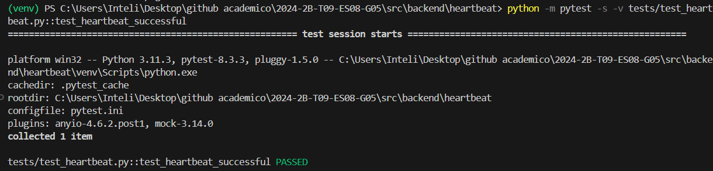
  <sup>Fonte: Desenvolvido pelos autores (2024)</sup>
</div>

&emsp;&emsp; **Resultado:** Heartbeat identificou que o servidor está em funcionamento.

#### Teste 002 - Heartbeat (falha)

&emsp;&emsp; Este teste simula uma falha no endpoint de heartbeat, avaliando a resposta do sistema diante de uma indisponibilidade do servidor. O objetivo é garantir que o sistema registre corretamente o erro e retorne o status esperado.

<div align="center"> 
  <sub>Figura 29 - Resultado do teste de heartbeat com falha</sub> 
  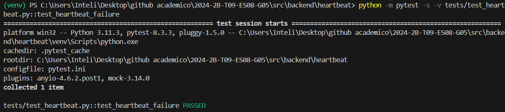 
  <sup>Fonte: Desenvolvido pelos autores (2024)</sup> </div>

&emsp;&emsp; **Resultado:** Heartbeat identificou que o servidor está fora de funcionamento.

### 9.2.2. Testes de Integridade

#### Teste 007 - Acesso Válido

&emsp;&emsp; Conforme a imagem abaixo, o teste de acesso válido foi realizado com sucesso, com a criação de um novo usuário e a autenticação no sistema. Garantindo assim que o sistema está permitindo o acesso de usuários autorizados.

<div align="center">
  <sub>Figura 30 - Resultado do teste de login</sub>
  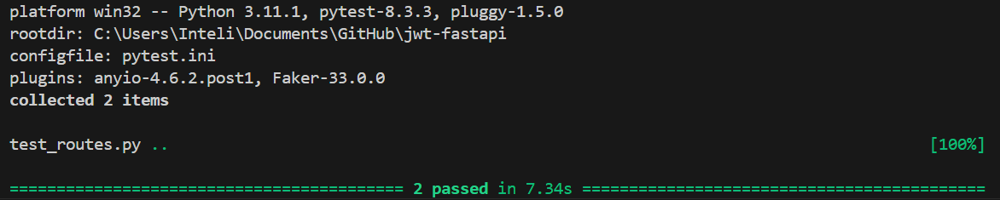
  <sup>Fonte: Desenvolvido pelos autores (2024)</sup>
</div>

&emsp;&emsp; **Resultado:** Usuario criado com sucesso e autenticado no sistema.

#### Teste 008 - Acesso Inválido

&emsp;&emsp; O teste de acesso inválido foi realizado com sucesso, com a tentativa de login com credenciais inválidas. O sistema bloqueou o acesso, conforme esperado.

<div align="center">
  <sub>Figura 31 - Resultado do teste de login inválido</sub>
  
  <sup>Fonte: Desenvolvido pelos autores (2024)</sup>
</div>

&emsp;&emsp; **Resultado:** O sistema bloqueou o acesso de usuários com credenciais inválidas.

#### Teste 009 - Rastreabilidade

&emsp;&emsp; O teste de rastreabilidade foi realizado com sucesso, com a geração de logs de auditoria contendo as informações corretas sobre as ações realizadas no sistema. Na imagem abaixo, vemos os logs de um usuário realizando login.

<div align="center">
  <sub>Figura 32 - Logs de login</sub>
  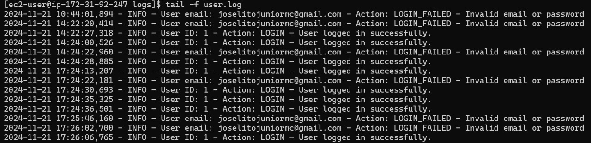
  <sup>Fonte: Desenvolvido pelos autores (2024)</sup>
</div>

<div align="center">
  <sub>Figura 33 - Teste de log com login bem-sucedido</sub>
  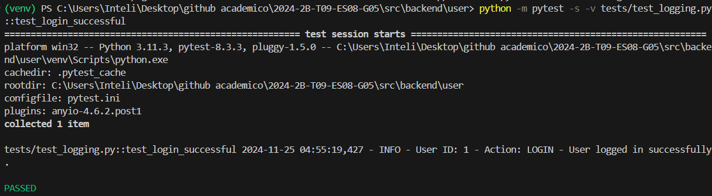
  <sup>Fonte: Desenvolvido pelos autores (2024)</sup>
</div>

<div align="center">
  <sub>Figura 34 - Teste de log com falha no login</sub>
  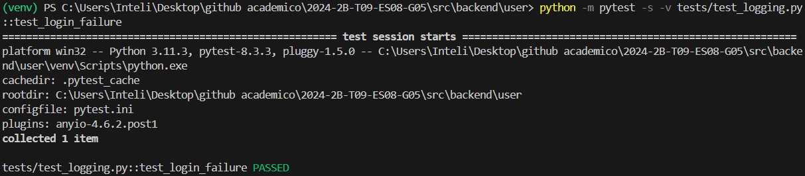
  <sup>Fonte: Desenvolvido pelos autores (2024)</sup>
</div>

&emsp;&emsp; **Resultado:** Os logs de auditoria foram gerados corretamente e contêm as informações relevantes sobre as ações realizadas.

#### Teste 011 - Geração de Hash para Arquivo Existente (sucesso)

&emsp;&emsp; Este teste verifica a geração de hash para um arquivo existente no sistema. O objetivo é garantir que o hash gerado seja consistente com o conteúdo do arquivo e que ele seja salvo corretamente no banco de dados. A imagem abaixo ilustra o resultado positivo da operação.

<div align="center"> 
  <sub>Figura 35 - Resultado da geração de hash para arquivo existente</sub> 
  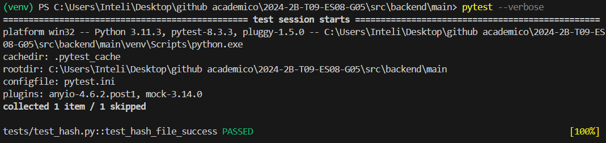 
  <sup>Fonte: Desenvolvido pelos autores (2024)</sup> 
</div>

&emsp;&emsp; **Resultado:** Hash gerado e salvo com sucesso no banco de dados, garantindo a integridade do arquivo.

#### Teste 012 - Geração de Hash para Arquivo Inexistente (falha)

&emsp;&emsp; Este teste verifica o comportamento do sistema ao tentar gerar um hash para um arquivo que não existe. O sistema lança uma exceção apropriada, protegendo contra operações inválidas. A imagem abaixo mostra o retorno esperado da API.

<div align="center"> 
  <sub>Figura 36 - Resultado da tentativa de geração de hash para arquivo inexistente</sub> 
  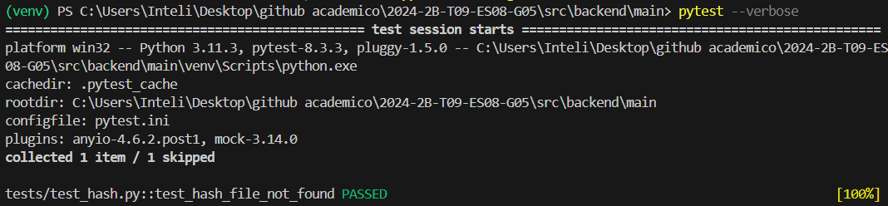 
  <sup>Fonte: Desenvolvido pelos autores (2024)</sup> 
</div>

&emsp;&emsp; **Resultado:** O sistema retornou corretamente a exceção "File not found" com status 404, sem realizar operações adicionais.

#### Teste 013 - Geração de Checksum para Arquivo Existente (sucesso)

&emsp;&emsp; Este teste valida a geração e o salvamento do checksum para um arquivo existente. A imagem abaixo demonstra a conclusão bem-sucedida da operação, garantindo a consistência dos dados.

<div align="center"> 
  <sub>Figura 37 - Resultado da geração de checksum para arquivo existente</sub> 
  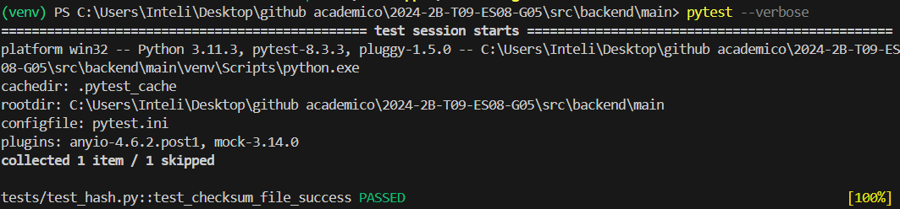 
  <sup>Fonte: Desenvolvido pelos autores (2024)</sup> 
</div>

&emsp;&emsp; **Resultado:** Checksum gerado e salvo corretamente no banco de dados, garantindo a integridade do arquivo.

#### Teste 014 - Geração de Checksum para Arquivo Inexistente (falha)

&emsp;&emsp; Este teste verifica a resposta do sistema ao tentar gerar um checksum para um arquivo inexistente. O sistema responde com uma exceção apropriada. A imagem abaixo ilustra o comportamento esperado.

<div align="center"> 
  <sub>Figura 38 - Resultado da tentativa de geração de checksum para arquivo inexistente</sub> 
  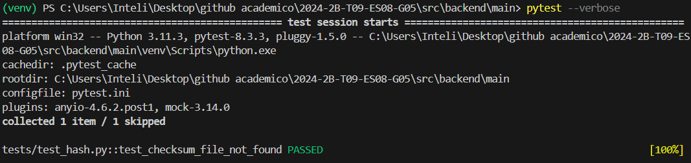 
  <sup>Fonte: Desenvolvido pelos autores (2024)</sup> 
</div>

&emsp;&emsp; **Resultado:** O sistema retornou corretamente a exceção "File not found" com status 404, sem realizar operações adicionais.

## 9.3. Avaliação dos Resultados e Limites do Sistema

&emsp;&emsp; Com base nos testes realizados e nos resultados observados, a avaliação do sistema revelou que ele atende adequadamente aos requisitos não funcionais de disponibilidade e integridade. Entretanto, algumas limitações foram identificadas e documentadas para referência futura.

&emsp;&emsp;Os testes realizados demonstraram resultados **positivos** em vários aspectos do sistema. A disponibilidade foi garantida pelos testes de _heartbeat_, que confirmaram a capacidade do sistema de detectar falhas em tempo real e responder rapidamente, registrando corretamente a indisponibilidade. O controle de acesso mostrou-se eficaz, com os testes de autenticação validando que o sistema aceita apenas credenciais válidas e bloqueia tentativas de acesso com informações incorretas, fortalecendo a segurança geral. Além disso, a rastreabilidade foi comprovada pela geração de logs detalhados durante ações de login e falhas, incluindo informações como ID do usuário, e-mail e data/hora, sendo os registros claros e úteis para auditorias. Por fim, a arquitetura apresentou um desempenho satisfatório, com serviços críticos como _failover_ e _heartbeat_ operando de forma isolada, assegurando resiliência a falhas pontuais sem impactar outras operações.

&emsp;&emsp; Os testes também permitiram identificar algumas **limitações** no sistema que podem ser abordadas em futuras iterações. Durante cenários de alta carga, foi observado que a transição para redundância (_failover_) pode atingir o limite superior do intervalo esperado de 30 segundos, indicando a necessidade de otimizações para lidar com condições críticas de estresse. Além disso, a capacidade de previsão de falhas demonstrou limitações em cenários que envolvem padrões não repetitivos ou falhas aleatórias, apontando para a necessidade de adoção de algoritmos de análise mais avançados. Outro ponto identificado foi a cobertura parcial dos logs, que atualmente se restringem a ações principais, como login e falhas, deixando de contemplar operações críticas que podem ser essenciais para auditorias mais complexas. Apesar dessas limitações, as áreas identificadas apresentam oportunidades claras de aprimoramento, que, se implementadas, podem fortalecer ainda mais a eficiência, a rastreabilidade e a confiabilidade do sistema.

## 9.4. Avaliação dos Riscos Resultantes

&emsp;&emsp; A análise dos riscos resultantes dos testes realizados revelou **vulnerabilidades operacionais** que podem impactar o desempenho e a confiabilidade do sistema em cenários críticos. Um dos principais riscos identificados é a possibilidade de sobrecarga durante situações de alta carga, onde a transição para servidores redundantes pode atingir o limite superior de tempo aceitável, aumentando a probabilidade de interrupções perceptíveis para os usuários. Essa limitação ressalta a necessidade de maior complexidade no gerenciamento de _failover_ em condições extremas.

&emsp;&emsp; Outra vulnerabilidade observada está relacionada à falta de previsibilidade em falhas aleatórias. Sem algoritmos mais sofisticados para antecipar eventos não baseados em padrões históricos, o sistema pode ter dificuldades em lidar com situações imprevistas, comprometendo a capacidade de prevenção. Além disso, a dependência da infraestrutura redundante representa um ponto crítico, já que qualquer falha nessa camada pode comprometer a alta disponibilidade do sistema e afetar sua operação global.

&emsp;&emsp; A rastreabilidade também apresenta limitações, uma vez que os logs atuais cobrem apenas ações principais, como login e autenticação, deixando lacunas na capacidade de auditar operações mais complexas, como ações administrativas ou investigação de falhas internas. Por fim, o isolamento de serviços demonstrou eficácia em falhas únicas, mas múltiplas falhas simultâneas em componentes críticos podem resultar em degradação de desempenho significativa ou até interrupções sistêmicas. Esses riscos destacam áreas que demandam atenção prioritária para garantir uma operação ainda mais confiável e resiliente.

&emsp;&emsp; Entre os **riscos estratégicos** identificados, a possibilidade de atualizações nas regulamentações de segurança e privacidade de dados se destaca como um dos principais desafios. Mudanças futuras nesse contexto podem exigir adaptações significativas na arquitetura e nas funcionalidades do sistema, elevando os custos de conformidade e potencialmente impactando os cronogramas de desenvolvimento e operação.

&emsp;&emsp; Outro risco estratégico relevante é a adoção da plataforma pelos usuários finais. Equipes acostumadas a processos manuais podem demonstrar resistência à mudança, especialmente se não houver treinamentos contínuos e suporte adequado. Isso pode limitar o impacto positivo da plataforma e comprometer o retorno sobre o investimento. Um plano abrangente de capacitação e comunicação será essencial para mitigar esse risco e garantir uma transição suave.

&emsp;&emsp; Por fim, ataques cibernéticos sofisticados representam uma ameaça constante, mesmo com a implementação de controles de acesso eficazes. A evolução de técnicas de ataque, como força bruta, exploração de vulnerabilidades ou engenharia social, pode expor o sistema a riscos não previstos inicialmente. Isso reforça a necessidade de auditorias regulares de segurança, atualizações constantes e adoção de melhores práticas em cibersegurança para proteger o sistema contra novas ameaças.

### Medidas de Mitigação

- Teste de carga ampliado: Implementar simulações de carga em cenários extremos para avaliar a robustez do failover e de outros serviços críticos.
- Adaptação de algoritmos avançados: Incorporar aprendizado de máquina para melhorar a previsão de falhas não lineares ou imprevisíveis.
- Auditorias frequentes: Ampliar a cobertura de logs para incluir operações administrativas e falhas internas, garantindo rastreabilidade total.
- Planos de contingência: Desenvolver estratégias que assegurem operação mínima, mesmo em casos de falha completa de servidores redundantes.
- Treinamento e suporte: Oferecer suporte técnico contínuo e treinamentos para reduzir resistências à adoção e aumentar a eficácia do uso do sistema.

&emsp;&emsp; Essas medidas ajudam a mitigar riscos e a garantir a evolução sustentável da plataforma para atender às necessidades dos usuários e reguladores.

# 10. Revisão do Modelo de Simulação do Sistema Novo

&emsp;&emsp;A revisão do modelo de simulação do sistema novo visa avaliar a adequação das melhorias implementadas em relação aos requisitos não funcionais de integridade e disponibilidade. Este processo é fundamental para garantir que as alterações arquiteturais propostas tenham sido refletidas corretamente nas simulações, validando assim o desempenho, a eficiência e a robustez do sistema em diversos cenários.

&emsp;&emsp;As simulações desempenham um papel crucial na identificação de áreas de melhoria e na validação das decisões tomadas durante o desenvolvimento. Para isso, serão analisados os resultados das simulações realizadas, comparando o comportamento do sistema novo em condições normais, de exceção e limites.

## 10.1. Simulação das Melhorias

&emsp;&emsp;A simulação das melhorias se concentra em revisar como as mudanças implementadas no sistema novo influenciam os requisitos não funcionais, assegurando que as táticas arquiteturais adotadas foram efetivamente modeladas.

### 10.1.1. Revisão do Modelo de Simulação em Relação à Implementação

&emsp;&emsp;Nesta etapa, será feita a verificação do alinhamento entre as melhorias implementadas e o modelo de simulação. Isso inclui:

- **Alterações Arquiteturais Consideradas**:  
  Garantir que as táticas de redundância, rollback, monitoramento contínuo e controle de acesso estejam refletidas nos modelos de simulação. Essas mudanças foram projetadas para superar as vulnerabilidades identificadas no sistema atual.

- **Coerência dos Estados Modelados**:  
  Verificar se os estados definidos nas simulações (ex.: "Disponível", "Falha", "Íntegro", "Alterado Indevidamente") abrangem todos os aspectos das melhorias descritas.

- **Identificação de Lacunas**:  
  Avaliar se o modelo cobre adequadamente cenários como detecção de falhas, recuperação automática e manutenção preventiva, evitando inconsistências entre as decisões de arquitetura e o modelo.

### 10.1.2. Simulação dos Cenários Normais

&emsp;&emsp;A simulação dos cenários normais busca demonstrar o comportamento esperado do sistema em condições usuais de operação. Os pontos principais incluem:

- **Resultados Esperados**:  
  O sistema deve apresentar alta disponibilidade e integridade em situações de uso cotidiano. Isso inclui uma menor probabilidade de estados de falha e inconsistência, em comparação ao sistema atual.

- **Comparação com o Sistema Atual**:  
  Evidenciar a melhoria em termos de tempo de resposta, redução de falhas e aumento da confiabilidade dos dados. Por exemplo, a maior probabilidade de permanência no estado "Disponível" e a menor chance de transições para "Falha" ou "Inconsistente".

- **Validação das Melhorias**:  
  Confirmar que as táticas arquiteturais, como redundância, atomicidade e monitoramento contínuo, resultaram em ganhos significativos no desempenho.

**Próximos Passos**: A revisão das simulações continuará com a análise dos cenários de exceção e limites do sistema, complementando a validação das melhorias implementadas. Esses itens serão abordados nos tópicos 10.2 e 10.3 da documentação.

## 10.2. Simulação das Condições de Exceção

&emsp;&emsp; Nesta seção, são descritas as condições anômalas que podem impactar o funcionamento do sistema, com foco em situações que comprometem a segurança, a rastreabilidade e a disponibilidade. A simulação dessas condições tem como objetivo identificar possíveis vulnerabilidades, avaliar a resiliência da plataforma e validar as táticas arquiteturais implementadas nesta sprint: acesso, rastreabilidade e _heartbeat_.

### 10.2.1. Cenários de Exceção

&emsp;&emsp; Cenários de exceção são situações anormais ou falhas que desviam o funcionamento do sistema do esperado. Esses cenários podem incluir interrupções de serviços críticos, falhas de autenticação ou perda de rastreabilidade. Identificar e lidar com esses cenários é essencial para garantir que o sistema opere de forma segura, confiável e resiliente.

### Heartbeat

&emsp;&emsp;**Cenário 1.** Interrupção do heartbeat de um serviço crítico: Simulação de falha no serviço que emite heartbeats para verificar o tempo de detecção da interrupção.  
&emsp;&emsp;**Cenário 2.** Resposta do sistema à falha de heartbeat: Simulação de failover para um sistema redundante após a interrupção do heartbeat.

### Acesso

&emsp;&emsp;**Cenário 3.** Tentativa de acesso inválido ao sistema: Verificação do comportamento ao tentar autenticar com credenciais inválidas repetidas.

### Rastreabilidade

&emsp;&emsp;**Cenário 4.** Falha na geração de logs de auditoria: Simulação de ações de usuários para verificar se todas as atividades são registradas adequadamente.

### 10.2.2. Simulação dos Cenários de Exceção

&emsp;&emsp;A simulação dos cenários de exceção é uma prática que visa avaliar o comportamento do sistema diante de falhas e situações anômalas. Durante os testes, as táticas arquiteturais implementadas serão submetidas a condições controladas de exceção para validar os critérios de aceitação definidos e identificar oportunidades de melhoria.

#### Cenário 1. Interrupção do Heartbeat

- **Objetivo:** Verificar a capacidade do sistema de detectar a interrupção do heartbeat de um serviço crítico e gerar um alerta em tempo hábil. Essa simulação é essencial para validar a confiabilidade do monitoramento contínuo.

- **Descrição da Simulação:** A simulação modela a emissão de heartbeats regulares por um serviço monitorado. Durante os primeiros 15 segundos, o serviço funciona normalmente, enviando heartbeats ao sistema de monitoramento. A partir de 15 segundos, ocorre uma falha no serviço, e os heartbeats deixam de ser emitidos. O sistema deve detectar a falha rapidamente e emitir um alerta.

- **Critérios de Aceitação:** O sistema deve identificar a interrupção do heartbeat em até 5 segundos após a falha inicial; um alerta deve ser gerado para notificar a indisponibilidade do serviço; a falha deve ser registrada nos logs do sistema.

- **Metodologia Utilizada:** O Google Colab foi usado para modelar e visualizar o comportamento do heartbeat. Um gráfico de linha temporal foi gerado para demonstrar o envio contínuo de heartbeats até a falha e o momento em que o alerta seria acionado. O eixo X representa o tempo em segundos e o eixo Y indica o status do serviço.

<div align="center">
  <sub>Figura 39 - Gráfico de falha do Heartbeat</sub>
  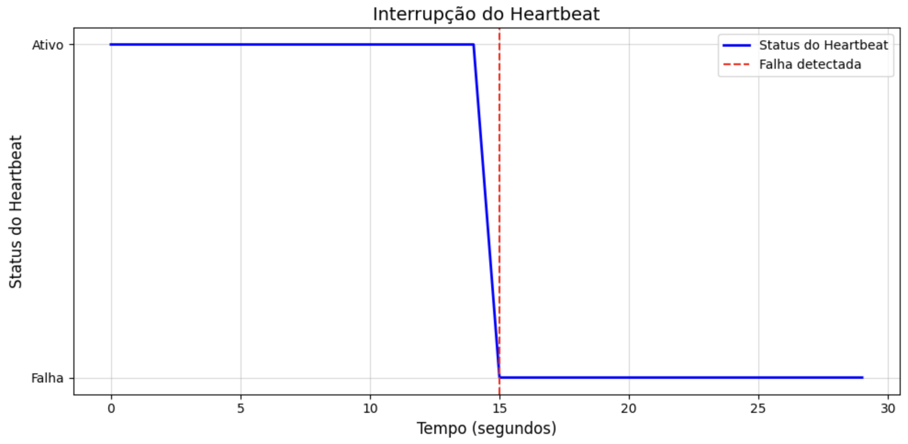
  <sup>Fonte: Desenvolvido pelos autores (2024)</sup>
</div>

- **Resultado da Simulação:** De 0 a 15 segundos, o serviço envia heartbeats regularmente (status "Ativo"). Aos 15 segundos, ocorre uma falha no serviço, representada pela queda no gráfico para o status "Falha". Uma linha vermelha pontilhada marca o momento em que o sistema detecta a falha e gera o alerta.

- **Fluxo Esperado:** O serviço envia heartbeats regulares. O sistema monitora os heartbeats. A interrupção é detectada após três tentativas falhas consecutivas (aproximadamente 5 segundos). Um alerta é gerado automaticamente. A falha é registrada nos logs do sistema para auditoria futura.

#### Cenário 2. Resposta à Falha de Heartbeat

- **Objetivo:** Verificar a capacidade do sistema de executar um failover automático, ativando um serviço redundante após detectar a falha de heartbeat de um serviço principal. Essa simulação é essencial para validar a resiliência do sistema e garantir continuidade operacional.

- **Descrição da Simulação:** A simulação modela o processo de detecção de falha em um serviço monitorado por heartbeat e a ativação de um serviço redundante. O serviço principal envia heartbeats regularmente. Quando ocorre uma falha, o sistema realiza três tentativas consecutivas de verificar o heartbeat. Após as tentativas falharem, o sistema considera o serviço indisponível, gera um alerta e ativa automaticamente um serviço redundante. Todo o evento é registrado nos logs para auditoria.

- **Critérios de Aceitação:**

  1. O sistema deve detectar a falha do serviço principal após **3 tentativas falhas consecutivas** (em até 5 segundos).
  2. O sistema deve ativar o serviço redundante em até **30 segundos** após a detecção da falha.
  3. Um alerta deve ser gerado informando a falha.
  4. A transição para o serviço redundante deve ser registrada nos logs.

- **Metodologia Utilizada:** A simulação foi representada por meio de um **fluxograma** que detalha o comportamento esperado do sistema em cada etapa: desde a detecção da falha até a ativação do serviço redundante. O fluxo contempla o monitoramento contínuo do serviço principal, a falha detectada após três tentativas sem sucesso, a geração de um alerta, a ativação do serviço redundante e o registro do evento nos logs. Cada etapa foi analisada para garantir que os tempos de resposta fossem compatíveis com os critérios de aceitação.

<div align="center">
  <sub>Figura 40 - Fluxograma de Resposta à Falha de Heartbeat</sub>
  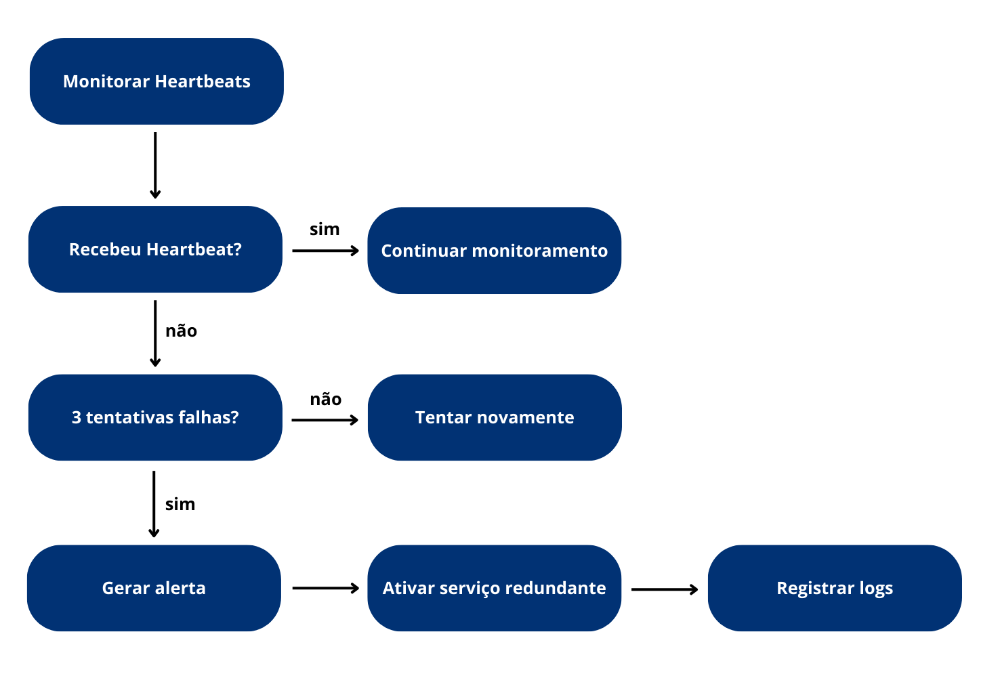
  <sup>Fonte: Desenvolvido pelos autores (2024)</sup>
</div>

- **Resultado da Simulação:** O sistema realizou o monitoramento contínuo dos heartbeats. Após três tentativas falhas consecutivas (5 segundos), a falha do serviço principal foi detectada. Um alerta foi gerado imediatamente para notificar a equipe responsável. Em seguida, o sistema ativou o serviço redundante em 30 segundos, garantindo continuidade operacional. Todos os eventos foram registrados nos logs do sistema para rastreabilidade.

- **Fluxo Esperado:**
  1. O sistema monitora o serviço principal, recebendo heartbeats regularmente.
  2. O serviço principal para de enviar heartbeats, iniciando o processo de tentativa de reconexão.
  3. Após 3 tentativas falhas, o sistema gera um alerta informando a indisponibilidade do serviço principal.
  4. O sistema ativa o serviço redundante automaticamente.
  5. O evento é registrado nos logs com informações detalhadas, como:
     - Hora da falha.
     - Hora da ativação do serviço redundante.
     - Status do serviço redundante após ativação.

#### Cenário 3. Tentativa de Acesso Inválido ao Sistema

- **Objetivo:** Validar a capacidade do sistema de identificar e bloquear tentativas repetidas de login com credenciais inválidas, protegendo contra ataques de força bruta e garantindo a segurança da aplicação.

- **Descrição da Simulação:** A simulação modela o comportamento do sistema quando um usuário ou IP realiza múltiplas tentativas consecutivas de login inválido. Inicialmente, as credenciais são verificadas, e, a cada tentativa inválida, o contador de falhas é incrementado. Quando o limite de 5 tentativas consecutivas é atingido, o sistema bloqueia temporariamente o IP ou a conta associada e retorna o código **429 (_Too Many Requests_)**. Todos os eventos (tentativas de login, falhas e bloqueios) são registrados nos logs do sistema.

- **Critérios de Aceitação:**

  1. Após **5 tentativas consecutivas de login inválido**, o sistema deve bloquear temporariamente o acesso por **1 minuto**.
  2. Durante o período de bloqueio, novas tentativas devem retornar o código de erro **429 (Too Many Requests)**.
  3. As tentativas válidas (antes do bloqueio) devem retornar o código **401 (Unauthorized)**.
  4. Todos os eventos devem ser registrados nos logs, incluindo hora da tentativa, endereço IP de origem e status da tentativa (válida/inválida/bloqueada).

- **Metodologia Utilizada:**  
  A simulação foi representada por meio de um fluxograma que detalha o comportamento esperado do sistema para diferentes condições:
  - Se as credenciais forem válidas, o acesso é concedido.
  - Para credenciais inválidas, o contador de falhas é incrementado, e o sistema verifica se o limite de tentativas foi atingido.
  - Caso o limite seja atingido, o acesso é bloqueado e um alerta é registrado nos logs.
  - Para cada tentativa, os eventos são registrados, garantindo a rastreabilidade do processo.

<div align="center">
  <sub>Figura 41 - Fluxograma de Acesso Inválido</sub>
  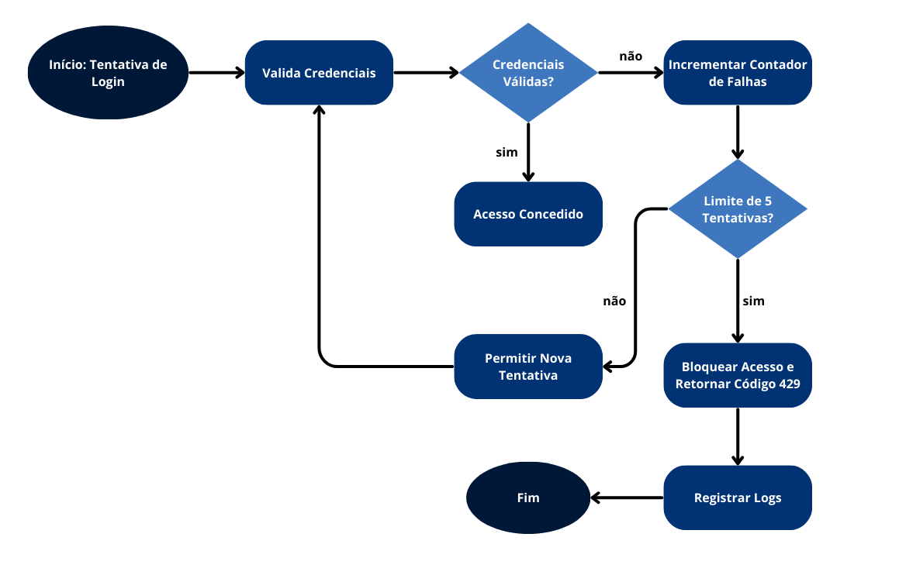
  <sup>Fonte: Desenvolvido pelos autores (2024)</sup>
</div>

- **Resultado da Simulação:**

  - Primeiras 5 tentativas: O sistema retornou o código **401 (_Unauthorized_)** para cada tentativa inválida, sem bloqueio.
  - 6ª tentativa: Após atingir o limite de tentativas, o sistema retornou o código **429 (_Too Many Requests_)** e bloqueou temporariamente o acesso.
  - Durante o bloqueio, novas tentativas falharam com o mesmo código **429**, indicando que o sistema estava protegendo contra abuso.
  - Todos os eventos foram registrados nos logs.

- **Fluxo Esperado:**
  1. O sistema recebe uma tentativa de login.
  2. As credenciais são validadas, se válidas, o acesso é concedido, se inválidas, o contador de falhas é incrementado.
  3. Após cada tentativa inválida, o sistema verifica se o limite de 5 falhas consecutivas foi atingido:
     - Se não: Permite uma nova tentativa.
     - Se sim: Bloqueia temporariamente o acesso.
  4. Todos os eventos são registrados para auditoria.

#### Cenário 4. Falha na Geração de Logs

- **Objetivo:** Verificar se o sistema detecta falhas no mecanismo de geração de logs de auditoria e emite alertas apropriados, além de registrar as ações em um log temporário para posterior recuperação.

- **Descrição da Simulação:** Durante a simulação, foram realizadas diversas ações de usuários (ex.: login, criação de dados, consulta), com falhas simuladas no momento de registro dos logs (ex.: interrupção do repositório de logs ou falta de espaço em disco). O sistema deveria detectar a falha e gerar um alerta e registrar as ações realizadas em um log temporário até que o problema fosse resolvido. Abaixo, uma tabela com os eventos simulados e o status de registro dos logs.

- **Critérios de Aceitação:**

  1. O sistema deve detectar a falha na geração de logs em até **3 segundos** após a ocorrência.
  2. Um alerta deve ser gerado imediatamente para notificar os administradores.
  3. Ações realizadas durante a falha devem ser registradas em um log temporário.
  4. Após a resolução do problema, os logs temporários devem ser sincronizados com o repositório principal.

- **Metodologia Utilizada:** Os eventos foram simulados e registrados em uma tabela para ilustrar o comportamento do sistema durante a falha. A tabela inclui o tempo em que cada evento ocorreu, o status do log correspondente e o comportamento esperado do sistema.

| Tempo (segundos) | Ação Realizada          | Status do Log                      | Comportamento Esperado                                      |
| ---------------- | ----------------------- | ---------------------------------- | ----------------------------------------------------------- |
| 0 - 5            | Login do usuário        | Registrado com sucesso             | Sistema opera normalmente                                   |
| 6 - 10           | Criação de um novo item | Falha no registro (log temporário) | Falha detectada; alerta gerado                              |
| 11 - 15          | Consulta de dados       | Falha no registro (log temporário) | Sistema mantém registro temporário para auditoria posterior |
| 16 - 20          | Atualização de dados    | Falha no registro (log temporário) | Registro temporário; sistema aguarda resolução do problema  |
| 21 - 25          | Resolução do problema   | Logs recuperados                   | Logs temporários sincronizados com o repositório principal  |

- **Resultado da Simulação:**

  - A falha na geração de logs foi detectada e um alerta foi emitido imediatamente.
  - Durante o período de falha, as ações foram registradas em um log temporário.
  - Após a resolução do problema, os logs temporários foram sincronizados com o repositório principal, garantindo rastreabilidade completa.

- **Fluxo Esperado:**
  1. O sistema monitora continuamente o mecanismo de geração de logs.
  2. Ações dos usuários são realizadas e registradas normalmente.
  3. Ao detectar a falha, o sistema gera um alerta e utiliza um log temporário.
  4. Após a resolução, os logs temporários são transferidos para o repositório principal.

## 10.3. Simulação das Condições Limites do Sistema com as Melhorias

&emsp;&emsp; Nesta seção, são analisados cenários extremos de uso do sistema, testando sua resiliência, desempenho e capacidade de resposta. As condições limites representam momentos críticos em que o sistema é levado ao máximo de sua carga ou complexidade operacional, permitindo identificar gargalos e validar a eficácia das melhorias implementadas. Este exercício é essencial para garantir a estabilidade e confiabilidade da plataforma mesmo em situações desafiadoras.

### 10.3.1. Cenários Limites de Utilização

&emsp;&emsp; Cenários limites de utilização simulam situações em que o sistema opera próximo ou além de sua capacidade máxima planejada. Esses cenários incluem altos volumes de acessos simultâneos, processamento intenso de dados ou operações de longa duração, visando expor pontos fracos na arquitetura. A análise desses limites ajuda a identificar riscos como degradação de desempenho, falhas de disponibilidade e impactos na experiência do usuário.

### Heartbeat

&emsp;&emsp;**Cenário 5.** Sobrecarga de monitoramento: Simulação de múltiplos serviços emitindo heartbeats simultaneamente para verificar a capacidade de gerenciamento de falhas.

### Acesso

&emsp;&emsp;**Cenário 6.** Picos de autenticações simultâneas: Simulação de uma alta quantidade de tentativas de login em curto intervalo de tempo.

### Rastreabilidade

&emsp;&emsp;**Cenário 7.** Geração massiva de logs: Simulação de ações intensivas de usuários gerando grandes volumes de logs em um curto período.

### 10.3.2. Simulação dos Cenários Limites

&emsp;&emsp;A simulação dos cenários limites é realizada para avaliar a capacidade do sistema em condições extremas. Os testes simulados permitem identificar potenciais gargalos, comportamento em situações críticas e verificar se as melhorias aplicadas na arquitetura são eficazes. Cada cenário foi selecionado com base nos riscos mais críticos associados ao uso da plataforma.

#### Cenário 5. Sobrecarga de Monitoramento

- **Objetivo:** Verificar a capacidade do sistema de monitorar múltiplos serviços simultaneamente, avaliando o tempo de processamento necessário para lidar com heartbeats de até 100 serviços. Essa simulação é essencial para validar a escalabilidade do sistema e garantir que o tempo de resposta permaneça dentro do limite aceitável de 2 segundos.

- **Descrição da Simulação:** A simulação modela o comportamento do sistema conforme o número de serviços monitorados aumenta. Foram simulados cenários com 10, 20, 50 e 100 serviços enviando heartbeats simultaneamente. O tempo total de processamento de cada lote de heartbeats foi medido e comparado a um limite aceitável de 2 segundos por lote. O eixo X do gráfico representa o número de serviços monitorados, enquanto o eixo Y indica o tempo total de processamento (em segundos). Uma linha pontilhada vermelha foi adicionada ao gráfico para destacar o limite aceitável de tempo de resposta.

- **Critérios de Aceitação:**

  1. O sistema deve processar heartbeats de até 50 serviços simultaneamente dentro do limite aceitável de 2 segundos.
  2. Para mais de 50 serviços, atrasos podem ser permitidos, mas sem perda de heartbeats ou impacto na confiabilidade do sistema.
  3. A relação entre o número de serviços e o tempo de processamento deve ser linear ou próxima disso, evitando gargalos exponenciais.

- **Metodologia Utilizada:** O **Google Colab** foi utilizado para simular o envio e processamento de heartbeats por lotes de serviços, medindo os tempos de resposta para diferentes cargas.

<div align="center">
  <sub>Figura 42 - Gráfico de Desempenho do Sistema</sub>
  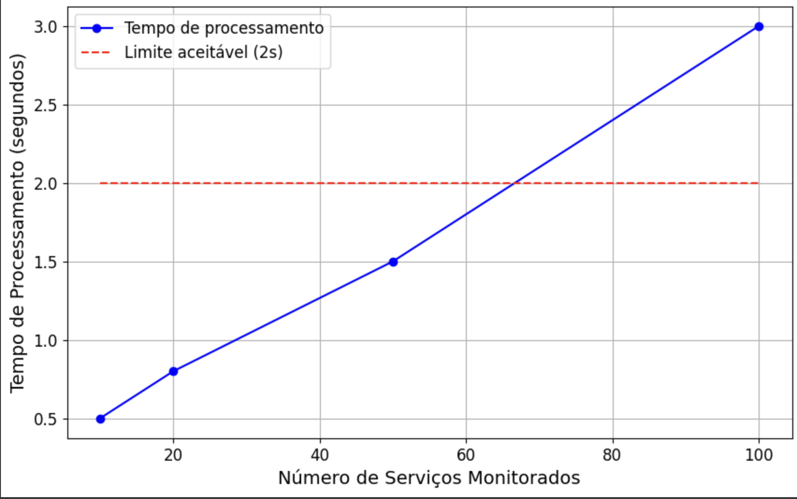
  <sup>Fonte: Desenvolvido pelos autores (2024)</sup>
</div>

- **Resultado da Simulação:**

  1. Para até **50 serviços monitorados**, o sistema processou os heartbeats dentro do tempo limite de 2 segundos.
  2. Para **100 serviços monitorados**, o tempo de processamento chegou a **3 segundos**, ultrapassando o limite aceitável.
  3. Embora o tempo tenha aumentado linearmente com o número de serviços, foi observada a necessidade de otimização para grandes cargas.

- **Fluxo Esperado:**
  1. Os serviços monitorados enviam heartbeats simultaneamente.
  2. O sistema processa os heartbeats em lotes.
  3. O tempo de processamento é medido e comparado ao limite de 2 segundos.
  4. Se o tempo ultrapassar o limite, o sistema deve registrar um alerta, mas não pode perder heartbeats.

#### Cenário 6. Picos de Autenticações Simultâneas

- **Objetivo:** Validar a capacidade do sistema de processar um pico de autenticações simultâneas, garantindo tempos de resposta aceitáveis para grandes volumes de requisições. Essa simulação ajuda a identificar possíveis gargalos e limitações em cenários de alta carga.

- **Descrição da Simulação:** O sistema foi submetido a um cenário onde até 500 requisições de login simultâneas foram simuladas, divididas em lotes crescentes. Para cada lote, foi medido o tempo total de processamento, com um limite aceitável estabelecido em 2 segundos. O desempenho foi representado em um gráfico de linha, indicando o impacto do número de requisições no tempo de resposta.

- **Critérios de Aceitação:**

  1. Até 200 requisições simultâneas: o tempo de processamento deve permanecer dentro do limite aceitável de **2 segundos**.
  2. Para mais de 200 requisições: atrasos são permitidos, mas não pode haver falha ou perda de requisições.
  3. Resultados claros: os tempos de processamento devem ser registrados de forma linear, sem comportamentos inesperados ou não escaláveis.

- **Metodologia:** A simulação foi realizada no Google Colab, utilizando dados fictícios para modelar o número de requisições e os tempos de processamento correspondentes. Um gráfico de linha foi gerado para representar:
  - **Eixo X:** Número de requisições simultâneas.
  - **Eixo Y:** Tempo total de processamento (em segundos).
  - **Linha Azul:** Tempos reais de processamento.
  - **Linha Vermelha Pontilhada:** Limite aceitável de 2 segundos.

<div align="center">
  <sub>Figura 43 - Gráfico de Desempenho em Picos de Autenticações Simultâneas</sub>
  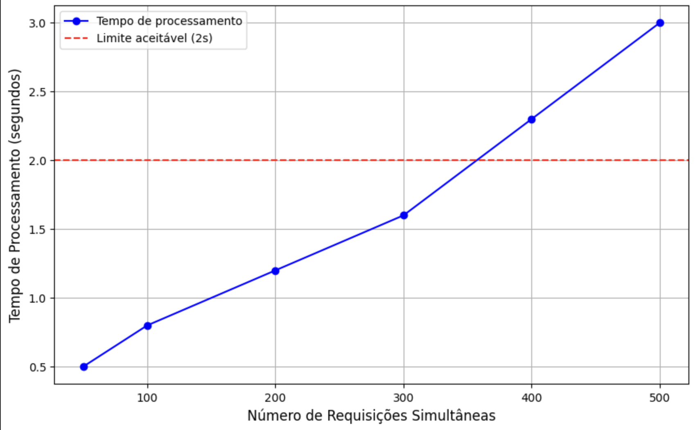
  <sup>Fonte: Desenvolvido pelos autores (2024)</sup>
</div>

- **Resultados da Simulação:**

  - Até 200 requisições: o sistema operou dentro do limite aceitável de 2 segundos.
  - Para mais de 200 requisições: o sistema ultrapassou o limite, atingindo 3 segundos para 500 requisições, mas manteve todas as requisições processadas corretamente.
  - O comportamento do sistema permaneceu linear, sem sinais de falha ou perda de requisições, indicando que o sistema é escalável, embora precise de otimizações para cargas maiores.

- **Fluxo Esperado:**
  1. O sistema processa as requisições simultâneas por lotes.
  2. Todas as requisições válidas são autenticadas corretamente.
  3. Requisições inválidas retornam o código de erro **401 (_Unauthorized_)**.
  4. O tempo total é comparado ao limite aceitável de 2 segundos.

#### Cenário 7. Geração Massiva de Logs

- **Objetivo:** Avaliar a capacidade do sistema de processar e armazenar grandes volumes de logs gerados por ações intensivas de usuários em um curto período de tempo. Este cenário valida a escalabilidade e eficiência do mecanismo de rastreamento.

- **Descrição da Simulação:** A simulação foi realizada com números crescentes de ações simultâneas. Para cada caso, o tempo total necessário para processar os logs foi calculado com base em um tempo médio de **0,005 segundos (500ms)** por log. Um gráfico foi gerado para ilustrar o desempenho do sistema.

- **Critérios de Aceitação:**

  1. O sistema deve armazenar logs para **1.000 ações simultâneas** em menos de **10 segundos**.
  2. Nenhum log pode ser perdido durante o processo.
  3. O tempo médio de processamento por log deve permanecer em torno de **500 ms**.

- **Metodologia Utilizada:** O código foi implementado no Google Colab para simular o comportamento do sistema. Um gráfico de desempenho foi gerado, mostrando o tempo total de processamento em função do número de ações simultâneas. O eixo X representa o número de ações realizadas, enquanto o eixo Y indica o tempo total de processamento (em segundos). Uma linha pontilhada vermelha foi adicionada ao gráfico para destacar o limite aceitável de 10 segundos.

<div align="center">
  <sub>Figura 44 - Gráfico de Desempenho em Picos de Autenticações Simultâneas</sub>
  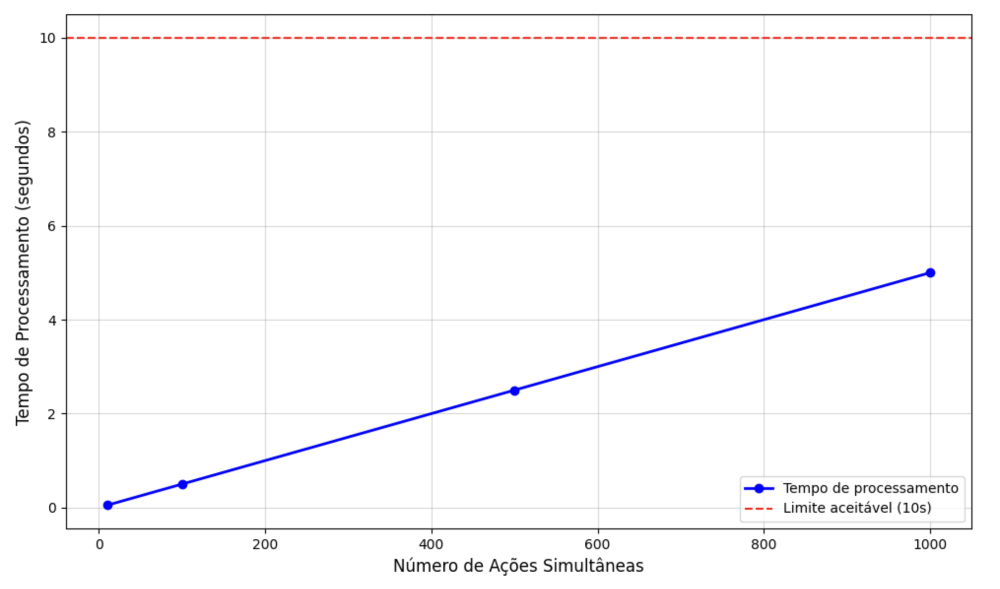
  <sup>Fonte: Desenvolvido pelos autores (2024)</sup>
</div>

- **Resultado da Simulação:**
  - Para até **1.000 ações simultâneas**, o sistema processou os logs dentro do limite aceitável de 10 segundos com facilidade.
  - O sistema é escalável e pode lidar com até 1.000 ações simultâneas sem comprometer o desempenho.
  - Não foram identificados gargalos significativos na geração massiva de logs.

# SPRINT 4

## 11. Identificação de Ajustes a serem Implementados

&emsp;&emsp; Nesta seção, serão analisados os resultados obtidos durante as simulações, implementações e testes, identificando os ajustes necessários para otimizar o atendimento aos requisitos. Serão destacadas possíveis melhorias na arquitetura e nos mecanismos implementados, garantindo a evolução contínua do sistema.

### Modelo de Tendência

&emsp;&emsp; O **Modelo de Tendência** foi implementado nesta sprint com o objetivo de prever as próximas falhas do sistema com base em dados históricos fornecidos pelo serviço de heartbeat. A seguir, detalhamos o funcionamento, os componentes principais e as sugestões de melhorias futuras para o modelo:

#### Funcionamento do Modelo

- **Base de Dados Integrada**:  
  O modelo utiliza uma consulta SQL para acessar os registros de falhas da tabela `history_availability`, armazenada pelo serviço de heartbeat. Esses dados incluem timestamps das falhas e o status das verificações realizadas.

- **Cálculo de Intervalos entre Falhas**:  
  A diferença entre os timestamps consecutivos é calculada em minutos, resultando em um conjunto de intervalos temporais que representam o comportamento do sistema ao longo do tempo.

- **Previsão por Média Móvel**:

  - A **média móvel** é utilizada para calcular os intervalos previstos com base nos últimos `window_size` valores de intervalos entre falhas.
  - Esse método suaviza variações abruptas nos dados e cria uma previsão baseada em tendências recentes.
  - A próxima falha é prevista ao somar o último timestamp registrado com o valor médio dos intervalos calculados.

- **Automatização e Periodicidade**:  
  O modelo está configurado em um script principal (`run_model.py`) que executa periodicamente (a cada 1 hora), garantindo que previsões atualizadas estejam sempre disponíveis.

#### Sugestões de Melhorias Futuras

1. **Aprimoramento da Precisão das Previsões**:

   - Implementar um mecanismo para ajustar dinamicamente o valor de `window_size` com base na variabilidade dos intervalos.
   - Utilizar modelos estatísticos ou de aprendizado de máquina mais avançados (como ARIMA ou LSTM) para capturar padrões mais complexos nos dados históricos.

2. **Análise do Comportamento a Longo Prazo**:

   - Introduzir uma análise comparativa entre os intervalos previstos e os reais para verificar a confiabilidade do modelo ao longo do tempo.
   - Implementar gráficos de erro para acompanhar a evolução da precisão do modelo.

3. **Integração com o Mecanismo de Redundância**:

   - Uma integração com o **Mecanismo de Redundância** pode ser desenvolvida, permitindo que, ao prever uma falha, o modelo acione automaticamente a ativação de uma base de dados secundária. Essa ação mitigaria possíveis indisponibilidades do sistema, aumentando a resiliência geral.

4. **Notificação e Monitoramento**:

   - Configurar notificações automáticas para alertar quando previsões de falhas estiverem próximas, possibilitando ações preventivas.
   - Adicionar logs detalhados para registrar:
     - Previsões realizadas.
     - Diferenças entre previsões e dados reais (erro).
     - Anomalias ou comportamento inesperado nos intervalos.

5. **Suporte a Cenários em Tempo Real**:

   - Implementar um pipeline de dados em tempo real para integrar diretamente as previsões com o sistema de monitoramento, reduzindo a dependência de execução periódica.

6. **Visualização Dinâmica**:
   - Desenvolver dashboards que permitam a análise visual das tendências de falhas e a comparação entre os dados históricos e as previsões em tempo real.

### Redundância de banco de dados

&emsp; &emsp; A redundância de banco de dados foi implementada nessa sprint para garantir a disponibilidade contínua dos dados mesmo em caso de falha do banco de dados principal. É possível conferir aqui os ajustes realizados e as sugestões de melhorias futuras para a arquitetura:

#### Implementação da Redundância

&emsp;&emsp; Foi desenvolvido um sistema de redundância para garantir a alta disponibilidade e integridade dos dados, agnóstico à tecnologia de banco de dados utilizada. Esse sistema utiliza funções no banco de dados, acionadas por triggers, que replicam todas as alterações realizadas no banco de dados primário para o secundário. Essa abordagem assegura que ambos os bancos permaneçam sincronizados durante o funcionamento normal.

&emsp;&emsp; Para operacionalizar esse mecanismo de maneira eficiente, foi necessário criar um serviço intermediário que atua entre o banco de dados e os demais serviços. Esse serviço é responsável por verificar a disponibilidade do banco de dados primário. Quando o banco primário está online, ele direciona todas as operações para ele, caso contrário, redireciona automaticamente as operações para o banco secundário.

&emsp;&emsp; Nos momentos em que o banco primário retorna ao estado ativo, o serviço identifica as discrepâncias entre os bancos e realiza a sincronização das informações, transferindo as alterações feitas no banco secundário para o banco primário, garantindo assim a consistência dos dados.

&emsp;&emsp; Embora soluções automatizadas, como as oferecidas pela AWS ou Oracle Cloud, pudessem simplificar e acelerar a implementação, optou-se por uma abordagem manual devido a limitações da AWS Academy e para promover um aprendizado mais aprofundado sobre os conceitos e práticas envolvidas.

### 11.1 Códigos dos Ajustes

#### Redundância de Banco de Dados

1. **Arquitetura e Organização:**

   - A redundância de banco de dados foi implementada primeiramente em um arquivo, para posteriormente ser modularizada:
     - `manager.py`: Configura a conexão com o banco de dados primário e contém as funções para replicar as alterações no banco secundário.

2. **Funções e triggers**
   Abaixo, um exemplo de função utilizada para a replicação das modificações:

   - Função para a tabela `users`:

   ```sql
   DECLARE
     query TEXT;

   BEGIN
       -- Operação: INSERT
     IF (TG_OP = 'INSERT') THEN
         query := format(
             'INSERT INTO users (user_id, name, email, password, created_at, last_access, role)
             VALUES (%L, %L, %L, %L, %L, %L, %L)',
             NEW.user_id,
             NEW.name,
             NEW.email,
             NEW.password,
             NEW.created_at,
             NEW.last_access,
             NEW.role
         );

     -- Operação: UPDATE
     ELSIF (TG_OP = 'UPDATE') THEN
         query := format(
             'UPDATE users
             SET name = %L, email = %L, password = %L, created_at = %L, last_access = %L, role = %L
             WHERE user_id = %L',
             NEW.name,
             NEW.email,
             NEW.password,
             NEW.created_at,
             NEW.last_access,
             NEW.role,
             OLD.user_id
         );

     -- Operação: DELETE
     ELSIF (TG_OP = 'DELETE') THEN
         query := format(
             'DELETE FROM users WHERE user_id = %L',
             OLD.user_id
         );
     END IF;

     -- Executar a query no banco remoto
     PERFORM dblink_exec(
         <string connection>,
         query
     );

     RETURN NULL;
   END;
   ```

3. **Como Executar a Redundância:**

   - É necessário instalar as dependências do projeto. Para isso, utilize o comando:
     ```bash
     pip install -r requirements.txt
     ```
   - Execute o serviço principal:
     ```bash
     - uvicorn manager:app --reload
     ```

4. **Exemplo de código**

   - Identificação do banco disponível e necessidade de sincronização:

     ```python
     # Rota para obter a URL do banco de dados
     @app.get("/get_database_url", response_model=DatabaseResponse)
     async def get_database_url():
         global current_primary, primary_down

         primary_db = DATABASES[0]
         secondary_db = DATABASES[1]

         # Verificar a disponibilidade do banco de dados primário
         if check_connection(primary_db["url"]):

             # Se o primário estava offline, sincronizar os bancos
             if primary_down:
                 sync_databases(secondary_db["url"], primary_db["url"])
                 primary_down = False

             current_primary = primary_db

         # Se o primário estiver offline, usar o secundário
         else:
             primary_down = True
             current_primary = secondary_db

         # Retornar a URL do banco de dados criptografada
         encrypted_url = fernet.encrypt(current_primary["url"].encode())
         return DatabaseResponse(database_name=current_primary["name"], connection_url=encrypted_url)
     ```

#### Modelo de Tendência

1. **Arquitetura e organização:**

   - O modelo foi dividido em dois arquivos principais:
     - `database.py`: Responsável por configurar a conexão com o banco de dados.
     - `trend_model.py`: Contém as funções para gerar a série temporal e prever falhas.
   - Adicionalmente, um script `run_model.py` foi implementado para executar o modelo periodicamente.

2. **Como executar o modelo:**

   - Certifique-se de que todas as dependências estejam instaladas. Para isso, use:
     ```bash
     pip install -r requirements.txt
     ```
   - Execute o script principal:
     ```bash
     python -m backend.trend_model.run_model
     ```

3. **Exemplo de código:**

   - Prever a próxima falha:

     ```python
     from trend_model import create_time_series, predict_next_failure

     df = create_time_series()
     next_failure = predict_next_failure(df, window_size=5)
     print(f"Próxima falha prevista: {next_failure}")
     ```

## 12. Implementação dos Testes Automatizados

&emsp;&emsp; Nesta seção, será descrita a execução dos testes automatizados desenvolvidos. A implementação abrange a configuração, execução e análise dos testes, assegurando que o sistema atenda aos critérios estabelecidos com eficiência e confiabilidade.

### Modelo de Tendência

1. **Testes Implementados:**

   - Foram desenvolvidos três testes principais para o modelo:
     - **Teste básico:** Valida a execução mínima do sistema.
     - **Teste de criação do DataFrame:** Garante que a série temporal seja criada corretamente.
     - **Teste de previsão:** Avalia a funcionalidade de previsão do modelo.
     - **Teste de previsão múltipla:** Valida a capacidade do modelo de prever múltiplas falhas consecutivas.

2. **Como rodar os testes:**

   - Execute o seguinte comando na raiz do projeto:
     ```bash
     python -m unittest discover backend/trend_model/tests
     ```

3. **Print dos testes bem-sucedidos:**
   - Os resultados dos testes podem ser visualizados abaixo:

<div align="center">
  <sub>Figura x - Teste Modelo de Tendência</sub>
  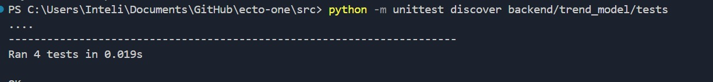
  <sup>Fonte: Desenvolvido pelos autores (2024)</sup>
</div>

#### Evidência de Previsão do Modelo de Tendência

&emsp;&emsp;Abaixo está um exemplo dos resultados obtidos ao executar o modelo de tendência com os ajustes implementados. O modelo processa os dados históricos de falhas e prevê as próximas 10 falhas com base em uma média móvel dos intervalos.

<div align="center">
  <sub>Figura 45 - Modelo de Tendência</sub>
  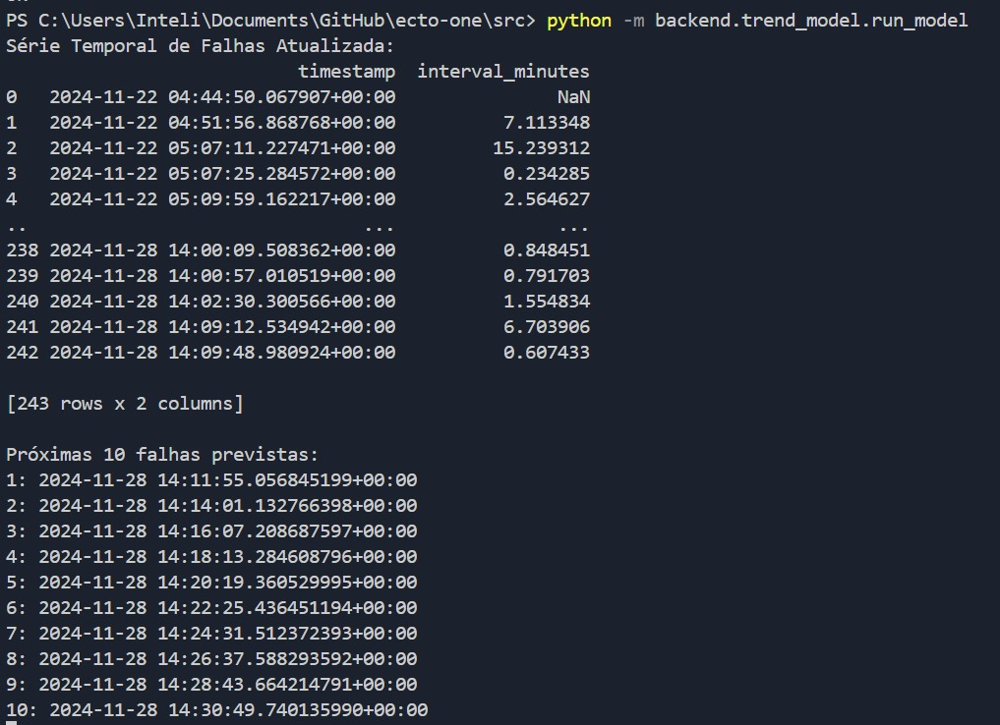
  <sup>Fonte: Desenvolvido pelos autores (2024)</sup>
</div>

4. **Localização dos testes:**
   - Os testes estão na pasta `backend/trend_model/tests`.

### Redundância de Banco de Dados

&emsp;&emsp; Para garantir a integridade e a disponibilidade dos dados, foram implementados testes automatizados para validar o funcionamento da redundância de banco de dados.

&emsp;&emsp; É necessário executar o comando abaixo dentro do diretório `\database_manager\tests` para rodar os testes:

```bash
pytest test_app.py
```

#### Teste #01

**Objetivo:**  
Verificar se a aplicação retorna o banco de dados primário corretamente quando ele está disponível.

**Pré-condição:**

- A chave de criptografia (`ENCRYPTION_KEY`) deve estar configurada.
- O banco de dados primário deve estar disponível e configurado.

**Procedimento:**

1. Configurar as variáveis de ambiente com as URLs do banco de dados primário e secundário.
2. Fazer uma requisição `GET` à rota `/get_database_url`.
3. Verificar o código de status da resposta.
4. Descodificar a URL de conexão retornada e valide se ela corresponde ao banco de dados primário.

**Critério de aceitação:**

- O código de status da resposta deve ser `200`.
- O campo `database_name` no JSON da resposta deve ser `"primary"`.
- A URL decifrada deve ser igual à URL configurada para o banco de dados primário.

#### Teste #02

**Objetivo:**  
Verificar se a aplicação retorna o banco de dados secundário corretamente quando o primário está fora do ar.

**Pré-condição:**

- A chave de criptografia (`ENCRYPTION_KEY`) deve estar configurada.
- O banco de dados secundário deve estar disponível e configurado.
- O banco de dados primário deve ser configurado como indisponível.

**Procedimento:**

1. Configurar as variáveis de ambiente com as URLs do banco de dados primário e secundário.
2. Usar o `mock` do pytest para simular a indisponibilidade do banco de dados primário.
3. Fazer uma requisição `GET` à rota `/get_database_url`.
4. Verificar o código de status da resposta.
5. Descodificar a URL de conexão retornada e valide se ela corresponde ao banco de dados secundário.

**Critério de aceitação:**

- O código de status da resposta deve ser `200`.
- O campo `database_name` no JSON da resposta deve ser `"secondary"`.
- A URL decifrada deve ser igual à URL configurada para o banco de dados secundário.

#### Teste #03

**Objetivo:**  
Confirmar que a rota `/primary_false` marca corretamente o banco de dados primário como indisponível.

**Pré-condição:**

- A chave de criptografia (`ENCRYPTION_KEY`) deve estar configurada.
- O banco de dados primário deve estar configurado.

**Procedimento:**

1. Configurar as variáveis de ambiente com as URLs do banco de dados primário e secundário.
2. Fazer uma requisição `GET` à rota `/primary_false`.
3. Verificar o código de status da resposta.
4. Validar que o banco de dados primário foi marcado como indisponível.

**Critério de aceitação:**

- O código de status da resposta deve ser `200`.
- O campo `database_name` no JSON da resposta deve ser `"primary"`.
- O campo `connection_url` no JSON da resposta deve ser `"down"`.

#### Teste #04

**Objetivo:**  
Verificar se a rota `/check_down` retorna o banco de dados secundário corretamente quando o primário está indisponível.

**Pré-condição:**

- A chave de criptografia (`ENCRYPTION_KEY`) deve estar configurada.
- O banco de dados secundário deve estar disponível e configurado.
- O banco de dados primário deve ser marcado como indisponível.

**Procedimento:**

1. Configurar as variáveis de ambiente com as URLs do banco de dados primário e secundário.
2. Fazer uma requisição `GET` à rota `/primary_false` para simular a indisponibilidade do banco de dados primário.
3. Fazer uma requisição `GET` à rota `/check_down`.
4. Verificar o código de status da resposta.
5. Validar que o banco de dados retornado é o secundário.

**Critério de aceitação:**

- O código de status da resposta deve ser `200`.
- O campo `database_name` no JSON da resposta deve ser `"secondary"`.

### 12.1 Análise dos Registros de Testes Automatizados

#### Modelo de Tendência

1. **Resultados dos Testes Automatizados:**

   - Todos os testes foram executados com sucesso.
   - O modelo foi testado com dados simulados para garantir que a previsão seja gerada corretamente.
   - Não foram identificados problemas críticos na execução das funções principais.

2. **Cenários testados:**
   - **Série temporal vazia:** O modelo retorna mensagens de aviso e não falha.
   - **Dados simulados consistentes:** Previsões corretas são geradas com base nos intervalos médios.
   - **Predição de múltiplas falhas:** O modelo prevê com base nos últimos `n` intervalos.

#### Redundância de Banco de Dados

1. **Resultados dos Testes Automatizados:**
   - Todos os testes foram executados com sucesso.
   - A aplicação foi capaz de redirecionar as operações para o banco de dados secundário quando o primário estava indisponível.
   - A sincronização dos bancos foi realizada corretamente após a recuperação do banco de dados primário.

  <div align="center">
  <sub>Figura 46 - Resultado dos testes automatizados</sub>
  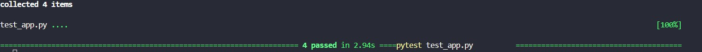
  <sup>Fonte: Desenvolvido pelos autores (2024)</sup>
</div>

2. **Cenários testados:**
   - **Banco de dados primário disponível:** A aplicação retorna o banco de dados primário corretamente.
   - **Banco de dados primário indisponível:** A aplicação redireciona as operações para o banco de dados secundário.
   - **Marcação de banco de dados indisponível:** A aplicação marca corretamente o banco de dados primário como indisponível.
   - **Verificação de banco de dados secundário:** A aplicação retorna o banco de dados secundário quando o primário está indisponível.

# 13. Medir o Sistema Novo

&emsp;&emsp; Nesta seção, será realizada a medição do sistema novo para avaliar sua eficiência e aderência aos requisitos definidos. Serão apresentados o modelo de medição utilizado, a coleta de dados da estrutura através de medições estáticas, a coleta de dados do comportamento por meio de medições dinâmicas e, por fim, a avaliação dos resultados obtidos. Essa análise permitirá verificar o desempenho da nova arquitetura e identificar oportunidades de melhoria.

## 13.1. Modelo de Medição

### 13.1.1 Mecanismos Implementados

&emsp;&emsp; Nesta seção, detalhamos como o modelo de medição está alinhado com os mecanismos implementados na arquitetura. O objetivo principal é garantir que cada funcionalidade crítica contribua diretamente para os requisitos de integridade e disponibilidade, proporcionando confiabilidade e continuidade no funcionamento do sistema. Além disso, buscamos evidenciar como essas táticas arquiteturais auxiliam na identificação de possíveis gargalos, falhas ou vulnerabilidades, permitindo ajustes rápidos e eficazes.

&emsp;&emsp; **Autenticação e Controle de Acesso:** O sistema implementa autenticação, garantindo que apenas usuários autorizados possam acessar os recursos. Para reforçar a disponibilidade e a segurança, o serviço de acesso monitora o tempo de sessão dos usuários. Após um período de inatividade, o sistema realiza automaticamente o logout.

&emsp;&emsp; **Hash (Integridade de Dados):** O mecanismo de hash assegura a integridade dos arquivos transmitidos e armazenados, verificando se os mesmos não foram corrompidos ou alterados indevidamente. Esse processo é especialmente importante para operações críticas, como o armazenamento de informações sensíveis.

&emsp;&emsp; **Heartbeat (Monitoramento de Disponibilidade):** O heartbeat é utilizado para monitorar a disponibilidade dos serviços em tempo real. Ele verifica continuamente se os componentes do sistema estão funcionando corretamente, identificando falhas antes que afetem a experiência do usuário.

&emsp;&emsp; **Logs (Rastreabilidade e Auditoria)**: Os logs centralizados registram eventos críticos, como tentativas de login, alterações em dados e falhas no sistema. Esses registros são essenciais para auditorias, rastreabilidade de ações e análise de tendências.

&emsp;&emsp; **Modelo de Tendência:** Um mecanismo de análise preditiva baseado em média móvel utiliza dados históricos para identificar padrões e prever possíveis falhas ou indisponibilidades. A média móvel suaviza variações pontuais nos dados, permitindo detectar tendências reais de comportamento do sistema ao longo do tempo. Essa tática melhora a capacidade de resposta do sistema e auxilia na prevenção de interrupções.

### 13.1.2 Coleta de Dados/Registros das Medições

&emsp;&emsp; A coleta de dados é um componente essencial para a medição da eficácia dos mecanismos implementados na arquitetura. Nesta seção, detalhamos as fontes de dados, os métodos para registro das medições e como esses registros serão processados e utilizados. O objetivo principal é garantir que as métricas coletadas sejam completas, consistentes e alinhadas com os requisitos selecionados, permitindo uma análise confiável do desempenho e do comportamento do sistema.

### A. Fontes de Dados

&emsp;&emsp; Os dados para avaliação do sistema serão obtidos por meio de fontes integradas à arquitetura. Abaixo, destacamos os principais pontos sobre as fontes utilizadas:

&emsp;&emsp; **Logs do Sistema:** Os logs são a principal fonte de rastreabilidade e análise do sistema. Eles incluem registros detalhados de eventos, como autenticações realizadas (sucessos e falhas), operações de validação de hash e status do heartbeat. Esses registros são centralizados para facilitar o monitoramento e a auditoria.

&emsp;&emsp; **Métricas de Desempenho:** São coletadas métricas relacionadas à performance do sistema, como tempos de resposta das APIs de autenticação, taxas de sucesso em operações críticas (como geração e verificação de hash) e métricas de _uptime_ capturadas por mecanismos de heartbeat.

&emsp;&emsp; **Registros do Modelo de Tendência:** Os dados históricos gerados pelo sistema, como padrões de login, falhas recorrentes em autenticação e indisponibilidades detectadas pelo heartbeat, são processados pelo modelo de tendência. Esses registros fornecem insumos para prever problemas futuros e realizar ações preventivas.

### B. Registro das Medições

&emsp;&emsp; O registro das medições inclui todas as atividades necessárias para garantir que as métricas coletadas sejam completas, consistentes e organizadas. Abaixo, apresentamos de forma detalhada as métricas coletadas e registradas:

- **Tempo de Resposta das APIs:** Cada requisição às APIs do sistema será monitorada para registrar o tempo de resposta, com destaque para endpoints críticos como login, validação de hash e logout automático.

- **Taxa de Uptime:** O heartbeat fornecerá relatórios contínuos sobre a disponibilidade de cada serviço, registrando tanto os períodos de funcionamento quanto os de falha.

- **Falhas no Hash:** Sempre que o mecanismo de hash detectar inconsistências, esses eventos serão registrados para avaliação posterior.

- **Volume e Qualidade dos Logs:** Todos os eventos relevantes ao sistema serão registrados nos logs, avaliando a consistência e completude dos mesmos.

&emsp;&emsp; Para estruturar os registros, as métricas serão organizadas através de documentações manuais e armazenamento automatizado. Algumas informações serão registradas neste documento, e algumas métricas críticas, como logs de eventos, serão armazenadas automaticamente no banco de dados. Esses registros incluirão detalhes como timestamps, status e latência, garantindo rastreabilidade e suporte para análises.

| **Métrica**        | **Descrição**                                                                                  | **Fonte/Ferramenta**      | **Foco**        |
| ------------------ | ---------------------------------------------------------------------------------------------- | ------------------------- | --------------- |
| Tempo de resposta  | Mede o tempo de resposta de endpoints críticos                                                 | Monitoramento de APIs     | Disponibilidade |
| Taxa de uptime     | Percentual de tempo em que os serviços estão disponíveis sem interrupções                      | Heartbeat logs            | Disponibilidade |
| Falhas no hash     | Número de inconsistências detectadas nas operações de validação e geração de hash              | Logs de operações         | Integridade     |
| Sessões expiradas  | Tempo decorrido até o logout automático de sessões inativas                                    | Logs do serviço de acesso | Segurança       |
| Volume de logs     | Quantidade de eventos gerados e armazenados, garantindo completude e rastreabilidade           | Logs centralizados        | Rastreabilidade |
| Previsão de falhas | Identificação de padrões históricos que indicam possíveis falhas ou indisponibilidades futuras | Modelo de tendência       | Disponibilidade |

## 13.2. Coleta dos Dados da Estrutura - Medição Estática

### 13.2.1. Medição Estática (Estrutural)

&emsp;&emsp; Nesta seção, analisamos a estrutura da arquitetura, destacando os componentes implementados e como eles se relacionam para atender aos requisitos de integridade e disponibilidade. A coleta de dados sobre as interações e dependências entre os componentes foi realizada com foco em garantir que a arquitetura atenda às necessidades do sistema de forma eficaz e resiliente.

#### Hash (Integridade de Dados):

- **Descrição:** O hash garante que os dados não sejam corrompidos ou alterados indevidamente, protegendo informações sensíveis. Este mecanismo é aplicado em operações críticas, como o armazenamento de logs.
- **Código Associado:**

```python
import hashlib
def generate_hash(data: str) -> str:
    return hashlib.sha256(data.encode()).hexdigest()
```

- **Componente:** Serviço de autenticação e validação de dados.
- **Interação:** O hash é utilizado em conjunto com o serviço de logs para rastrear alterações e identificar inconsistências nos dados.

#### Logs (Rastreabilidade e Auditoria):

- **Descrição:** Os logs atuam no registro de eventos críticos, como falhas, tentativas de acesso e status do sistema.
- **Código Associado:**

```python
import logging

logging.basicConfig(filename='system.log', level=logging.INFO)

def log_event(event: str):
    logging.info(f"Evento registrado: {event}")
```

- **Componente:** Subsistema de rastreabilidade.
- **Interação:** Os logs centralizam informações de vários componentes, como heartbeat e autenticação.

#### Heartbeat (Monitoramento de Disponibilidade):

- **Descrição:** Este mecanismo monitora a disponibilidade dos serviços em tempo real e coleta dados sobre a saúde do sistema.
- **Código Associado:**

```python
def check_availability():
    response = requests.get("http://service/heartbeat")
    return response.status_code == 200
```

- **Componente:** Serviço de monitoramento contínuo.
- **Interação:** Integrado ao modelo de redundância e ao modelo de tendência para ativar o servidor secundário automaticamente em caso de falhas.

#### Modelo de Tendência:

- **Descrição:** Este mecanismo foi desenvolvido para analisar os padrões históricos de falhas registradas pelo sistema e prever possíveis interrupções futuras. Utiliza séries temporais para identificar tendências e calcular intervalos médios entre falhas. Com base nesses dados, o modelo faz previsões sobre quando ocorrerão as próximas falhas, permitindo que o sistema tome ações preventivas e minimize o impacto no funcionamento.

```python
def predict_next_failure(df):
    df['moving_avg'] = df['interval_minutes'].rolling(window=5).mean()
    return df['timestamp'].iloc[-1] + pd.Timedelta(minutes=df['moving_avg'].iloc[-1])
```

- **Componente:** Sistema preditivo com base em séries temporais.
- **Interação:** Conectado ao heartbeat e ao mecanismo de redundância para antecipar falhas.

#### Redundância:

- **Descrição:** Este mecanismo assegura que o sistema continue operando mesmo em caso de falhas nos servidores principais. A redundância envolve tanto o banco de dados quanto os servidores, garantindo alta disponibilidade e continuidade do serviço. O mecanismo está integrado ao modelo de tendência e ao heartbeat, que identificam falhas e ativam automaticamente os servidores de backup.

- **Código Associado:**

```python
def activate_backup_server():
    requests.post("http://backup-server/activate")
```

- **Componente:** Arquitetura de alta disponibilidade.
- **Interação:** Integrado ao heartbeat e ao modelo de tendência.

### 13.2.2. Avaliação das Decisões Arquiteturais

&emsp;&emsp; As decisões arquiteturais tomadas visam atender aos requisitos de integridade e disponibilidade de maneira coesa e eficiente. A seguir, apresentamos uma avaliação crítica dessas decisões:

#### Integração de Hash e Logs:

- **Decisão:** Centralizar a validação de integridade dos dados no serviço de autenticação, com suporte de logs para rastreamento.
- **Análise:** Esta abordagem garante uma proteção robusta contra alterações indevidas e facilita auditorias. No entanto, a dependência de um único serviço pode representar um ponto de falha, sugerindo a necessidade de redundância também nos serviços de logs.

#### Heartbeat e Redundância:

- **Decisão:** Usar heartbeat para monitorar falhas e ativar automaticamente o servidor secundário em caso de indisponibilidade.
- **Análise:** Esta tática fortalece a disponibilidade, mas exige uma sincronização contínua entre os servidores primário e secundário para evitar perda de dados. Melhorias podem incluir um modelo preditivo mais dinâmico para otimizar as ativações.

#### Modelo de Tendência:

- **Decisão:** Utilizar análise preditiva para antecipar falhas e ativar medidas corretivas preventivas.
- **Análise:** Este modelo reduz o impacto de falhas inesperadas e permite ações proativas. A integração com o mecanismo de redundância é uma decisão acertada, mas a precisão do modelo ainda pode ser aprimorada com mais dados históricos.

#### Autenticação por Sessão:

- **Decisão:** Implementar autenticação com tempo de sessão para reforçar a segurança e liberar recursos automaticamente.
- **Análise:** A solução atende aos requisitos de integridade e disponibilidade, mas poderia ser complementada com notificações ao usuário sobre o encerramento da sessão.

&emsp;&emsp; A avaliação conclui que as decisões tomadas atendem amplamente aos requisitos, mas há espaço para melhorias incrementais, como maior integração entre os componentes e otimização dos modelos utilizados.

## 13.3. Coleta de Dados do Comportamento - Medição Dinâmica

&emsp;&emsp; Esta seção tem como objetivo analisar o desempenho e a resiliência da arquitetura do sistema em cenários reais de operação. Diferentemente da medição estática, que foca na estrutura da arquitetura, a medição dinâmica avalia como o sistema se comporta durante sua execução. Esses testes permitem identificar gargalos, falhas e oportunidades de melhoria, garantindo que a arquitetura atenda aos requisitos não funcionais (RNFs) definidos. A seguir, são descritas as metodologias de medição, os cenários de teste e os métodos de avaliação utilizados para validar o comportamento do sistema, com base em dados coletados em tempo de execução.

### 13.3.1. Medição Dinâmica (Comportamental)

&emsp;&emsp; Esta seção descreve os cenários de testes não funcionais realizados para avaliar o comportamento da arquitetura em diferentes condições operacionais. Os testes foram elaborados para simular situações que exploram aspectos críticos do sistema, como desempenho, disponibilidade, segurança e previsibilidade, detalhando os métodos aplicados, ferramentas utilizadas e métricas coletadas.

#### Teste 1: Desempenho no Login

- Este teste avalia o desempenho do sistema ao processar múltiplos logins simultâneos, simulando cenários de carga crescente.

&emsp;&emsp; **Cenário**: O endpoint `/user/login` é acessado por diferentes números de usuários simultâneos, começando com 10 usuários e escalando até 100. Requisições são enviadas com credenciais válidas e inválidas para medir a resposta do sistema em ambos os casos.

&emsp;&emsp; **Ferramenta**: *Apache JMeter*, configurado para gerar carga crescente e monitorar métricas em tempo real.

&emsp;&emsp; **Métricas Coletadas**:  
- Tempo médio de resposta (em milissegundos).
- Tempo de resposta no percentil 95%.
- Taxa de sucesso e erro nas requisições.
- Throughput, medido em requisições por segundo.

&emsp;&emsp; **Relevância para a Arquitetura**: Este teste verifica a eficácia das táticas de gerenciamento de recursos, além de validar o tempo de resposta em cenários de alta demanda.

#### Teste 2: Disponibilidade (Banco de Dados)

- Este teste avalia a resiliência do sistema frente a falhas no banco de dados. O objetivo é verificar como a aplicação reage quando o banco de dados principal se torna indisponível.

&emsp;&emsp; **Cenário**: O banco de dados principal é manualmente interrompido, simulando uma falha. O sistema deve detectar essa indisponibilidade, registrar eventos de falha nos logs para auditoria e acionar o banco de dados secundário.

&emsp;&emsp; **Ferramentas e Métodos**: Interrupção manual do banco de dados e monitoramento do sistema para identificar como ele reage à falha.    

&emsp;&emsp; **Métricas Coletadas**:  
- Tempo necessário para detectar a falha no banco de dados.  
- Logs gerados pelo sistema, incluindo mensagens de falha e tentativas de reconexão.  
- Tempo de acionamento do banco secundário.  

&emsp;&emsp; **Relevância para a Arquitetura**: Este teste valida a arquitetura frente a falhas no banco de dados, garantindo que o sistema degrade de forma controlada e evite comportamentos inesperados.

#### Teste 3: Segurança

- Este teste verifica como o sistema lida com tentativas de acessos não autorizados, garantindo a proteção dos dados.

&emsp;&emsp; **Cenário**: Múltiplas tentativas de login são realizadas com senhas incorretas.

&emsp;&emsp; **Ferramenta**: *Pytest*, configurado para simular acessos inválidos.

&emsp;&emsp; **Métricas Coletadas**:  
- Taxa de rejeição de acessos inválidos.
- Logs de eventos de segurança, incluindo tentativas de acesso não autorizado.

&emsp;&emsp; **Relevância para a Arquitetura**: Este teste valida as táticas de autenticação, controle de acesso e rastreabilidade, além de garantir que os dados sensíveis do sistema estejam protegidos.

#### Teste 4: Modelo de Tendência

- Este teste avalia a capacidade do sistema de prever falhas e oferecer suporte preventivo.

&emsp;&emsp; **Cenário**: Dados históricos de falhas (como tempos de inatividade e eventos de erro) são alimentados no modelo. O sistema analisa esses dados para prever o próximo intervalo de falha.

&emsp;&emsp; **Ferramentas e Métodos**: Scripts em Python que processam séries temporais de dados de logs e comparação entre previsões e tempos reais de falha para avaliar a precisão.

&emsp;&emsp; **Métricas Coletadas**:  
- Precisão do modelo na previsão de falhas (percentual de acertos).
- Tempo de processamento das análises preditivas.

&emsp;&emsp; **Relevância para a Arquitetura**: Este teste verifica a eficácia das táticas de análise preditiva e do uso de séries temporais, contribuindo para a manutenção proativa do sistema.

### 13.3.2. Avaliação das Coletas de Dados

&emsp;&emsp; Esta seção apresenta a análise detalhada das coletas de dados realizadas durante os testes, com o objetivo de verificar a completude e a relevância das informações obtidas. Cada teste foi projetado para validar aspectos críticos da arquitetura do sistema, assegurando que os dados coletados refletem com precisão o comportamento real em diferentes cenários operacionais.

#### Teste 1: Desempenho no Login

&emsp;&emsp; O objetivo desse teste foi avaliar o desempenho do sistema ao processar múltiplos logins simultâneos no endpoint `/user/login`, simulando cenários de carga crescente. Esse teste foi projetado para identificar como o sistema responde a diferentes níveis de usuários simultâneos, desde uma carga baixa de 10 usuários até uma carga mais significativa de 100 usuários. Foram enviadas requisições tanto com credenciais válidas quanto inválidas, com o intuito de validar a consistência do comportamento do sistema em ambas as situações.

&emsp;&emsp; Os resultados do teste permitem verificar a eficácia das táticas arquiteturais adotadas, como a capacidade de gerenciar recursos em cenários de alta demanda, além de confirmar a conformidade com os requisitos definidos, como estabilidade, *throughput*, e tempo de resposta.

&emsp;&emsp; **Metodologia**:Os testes foram realizados utilizando a ferramenta *Apache JMeter*, configurada para simular cenários de carga crescente. Três diferentes configurações de carga foram executadas: 10 usuários simultâneos (com um ramp-up de 10 segundos), 50 usuários simultâneos (com um ramp-up de 30 segundos) e 100 usuários simultâneos (com um ramp-up de 60 segundos). Para cada cenário, foram enviadas requisições ao endpoint /user/login com duas categorias de credenciais: válidas, simulando logins reais e bem-sucedidos e inválidas, simulando tentativas de acesso com falha, onde o sistema deveria retornar respostas de erro apropriadas.

&emsp;&emsp; **Métricas coletadas**: Tempo médio de resposta (Average), que mede o desempenho médio do sistema em processar uma requisição, desvio padrão para avaliar a consistência nos tempos de resposta, taxa de erro para medir o percentual de requisições que falharam, *throughput* que é a quantidade de requisições processadas por segundo e o tamanho médio da resposta que determina o tamanho médio dos dados retornados pelo servidor.

  <div align="center">
  <sub>Teste com 10 usuários</sub>
</div>

| **Label**                   | **# Samples** | **Average** | **Min** | **Max** | **Std. Dev.** | **Error %** | **Throughput** | **Received KB/sec** | **Sent KB/sec** | **Avg. Bytes** |
|-----------------------------|---------------|-------------|---------|---------|---------------|-------------|----------------|---------------------|-----------------|----------------|
| Requisição de Login         | 20            | 1196        | 963     | 2513    | 437.34        | 0%          | 0.01776        | 0.01                | 0.00            | 343.0          |
| Requisição de Login Inválido| 20            | 10          | 2       | 53      | 11.04         | 100.000%    | 0.01780        | 0.00                | 0.00            | 174.0          |
| **TOTAL**                   | **40**        | **603**     | **2**   | **2513**| **668.93**    | **50.000%** | **0.03553**    | **0.01**            | **0.01**        | **258.5**      |

---

  <div align="center">
  <sub>Teste com 50 usuários</sub>
</div>

| **Label**                   | **# Samples** | **Average** | **Min** | **Max** | **Std. Dev.** | **Error %** | **Throughput** | **Received KB/sec** | **Sent KB/sec** | **Avg. Bytes** |
|-----------------------------|---------------|-------------|---------|---------|---------------|-------------|----------------|---------------------|-----------------|----------------|
| Requisição de Login         | 70            | 1087        | 963     | 2513    | 249.91        | 0%          | 0.05717        | 0.02                | 0.01            | 343.0          |
| Requisição de Login Inválido| 70            | 11          | 2       | 139     | 19.37         | 100.000%    | 0.05729        | 0.01                | 0.01            | 174.0          |
| **TOTAL**                   | **140**       | **549**     | **2**   | **2513**| **566.55**    | **50.000%** | **0.11435**    | **0.03**            | **0.03**        | **258.5**      |

---

  <div align="center">
  <sub>Teste com 100 usuários</sub>
</div>

| **Label**                   | **# Samples** | **Average** | **Min** | **Max** | **Std. Dev.** | **Error %** | **Throughput** | **Received KB/sec** | **Sent KB/sec** | **Avg. Bytes** |
|-----------------------------|---------------|-------------|---------|---------|---------------|-------------|----------------|---------------------|-----------------|----------------|
| Requisição de Login         | 170           | 1061        | 951     | 2513    | 166.85        | 0%          | 0.12673        | 0.04                | 0.03            | 343.0          |
| Requisição de Login Inválido| 170           | 9           | 2       | 139     | 12.90         | 100.000%    | 0.12697        | 0.02                | 0.03            | 174.0          |
| **TOTAL**                   | **340**       | **535**     | **2**   | **2513**| **539.29**    | **50.000%** | **0.25347**    | **0.06**            | **0.06**        | **258.5**      |

---

&emsp;&emsp; **Resultados coletados**: Os resultados demonstraram a capacidade do sistema de lidar com diferentes níveis de carga, apresentando tempos de resposta adequados e consistência no comportamento. No cenário inicial, com 10 usuários simultâneos, foi possível observar tempos de resposta maiores e uma variação significativa no desempenho, mas com taxas de sucesso completas para logins válidos. À medida que a carga aumentou para 50 e 100 usuários, o sistema mostrou melhorias em termos de estabilidade, com tempos médios de resposta mais uniformes e um desvio padrão reduzido. O *throughput* cresceu proporcionalmente à carga, confirmando que o sistema escalou bem em cenários de maior concorrência. Em todos os testes, o sistema manteve 0% de erros para logins válidos e rejeitou corretamente credenciais inválidas, refletindo um comportamento robusto e estável mesmo sob condições de alta demanda.

#### Teste 2: Disponibilidade (Banco de Dados)

&emsp;&emsp; O objetivo deste teste foi avaliar a resiliência da arquitetura ao lidar com falhas no banco de dados, assegurando que o sistema seja capaz de detectar a indisponibilidade do banco principal, registrar o evento nos logs, e redirecionar as operações para um banco de dados secundário de forma eficiente. Esse comportamento é essencial para validar a arquitetura e sua capacidade de operar sob condições adversas, garantindo continuidade de serviço.

&emsp;&emsp; **Metodologia**: O teste foi realizado interrompendo manualmente o banco de dados primário, simulando uma falha. Durante o teste, foram observados o tempo necessário para detectar a falha, os logs gerados pelo sistema com mensagens de erro e tentativas de reconexão, além do tempo necessário para ativar o banco de dados secundário e redirecionar as operações para ele. Além disso, a funcionalidade de recuperação do banco primário foi avaliada ao restaurar sua disponibilidade. 

&emsp;&emsp; **Métricas coletadas**: As principais métricas analisadas incluíram o tempo para detectar a falha no banco de dados primário, a geração e precisão dos logs de auditoria, e o tempo para ativar o banco secundário. Adicionalmente, a consistência do sistema em retornar à operação normal com o banco primário foi validada.

&emsp;&emsp; Como este teste já foi realizado anteriormente, [clique aqui](https://github.com/Inteli-College/2024-2B-T09-ES08-G05/tree/develop/docs#teste-02) para mais detalhes sobre os cenários testados e a evidência de teste. 

&emsp;&emsp; **Resultados coletados**: Os testes confirmaram que o sistema foi capaz de redirecionar as operações para o banco secundário com sucesso. O tempo de detecção da falha foi considerado satisfatório e condizente com as expectativas para o ambiente configurado. A sincronização dos dados entre o banco primário e o secundário foi realizada sem inconsistências, e o retorno ao banco primário após sua recuperação ocorreu de forma automática e dentro dos critérios estabelecidos. Os logs gerados pelo sistema documentaram com clareza cada etapa do processo, incluindo as tentativas de conexão e a ativação do banco secundário.

#### Teste 3: Segurança

&emsp;&emsp; O objetivo deste teste foi validar a capacidade do sistema de lidar com tentativas de acessos não autorizados, garantindo a proteção dos dados sensíveis. Esse teste é essencial para assegurar que as táticas de autenticação, controle de acesso e rastreabilidade estejam funcionando corretamente, protegendo o sistema contra acessos inválidos ou maliciosos.

&emsp;&emsp; **Metodologia**: O teste foi conduzido utilizando a ferramenta *Pytest*, configurada para simular múltiplas tentativas de login com credenciais inválidas. Durante o procedimento, foram analisadas a taxa de rejeição de acessos inválidos e os logs de segurança gerados pelo sistema, com foco na precisão das mensagens de erro e na rastreabilidade das tentativas.

&emsp;&emsp; **Métricas coletadas**: As principais métricas avaliadas incluíram a taxa de rejeição para tentativas de login inválidas, confirmando que todas as credenciais incorretas foram corretamente bloqueadas, e a geração de logs de eventos de segurança, que documentaram as tentativas de acesso não autorizado.

&emsp;&emsp; Como este teste já foi realizado anteriormente, [clique aqui](https://github.com/Inteli-College/2024-2B-T09-ES08-G05/tree/develop/docs#teste-008---acesso-inv%C3%A1lido-1) para mais detalhes sobre os cenários testados e a evidência de teste. 

&emsp;&emsp; **Resultados coletados**: O teste foi concluído com sucesso, confirmando que o sistema bloqueou todas as tentativas de login realizadas com credenciais inválidas. Além disso, os logs de segurança foram gerados com clareza, documentando as tentativas de acesso não autorizado e reforçando a rastreabilidade. A validação demonstra que a arquitetura do sistema está alinhada com os requisitos de segurança e proteção de dados. 

#### Teste 4: Modelo de Tendência

&emsp;&emsp; O objetivo deste teste foi avaliar a eficácia do modelo de tendência em prever falhas com base em dados históricos do sistema, como tempos de inatividade e eventos de erro. A capacidade de prever falhas e oferecer suporte preventivo é essencial para uma manutenção proativa e para reduzir o impacto de interrupções no sistema.

&emsp;&emsp; **Metodologia**: O teste foi realizado utilizando scripts em Python que processaram séries temporais de dados de logs. Cenários específicos foram criados para validar o modelo, incluindo casos com séries temporais vazias, dados consistentes e previsão de múltiplas falhas com base nos intervalos mais recentes. Durante o procedimento, as previsões geradas pelo modelo foram comparadas aos tempos reais de falha para avaliar sua precisão.

&emsp;&emsp; **Métricas coletadas**: As principais métricas analisadas foram a precisão do modelo na previsão de falhas, medida como o percentual de acertos em relação aos tempos reais de falha, e o tempo de processamento necessário para realizar as análises preditivas.

&emsp;&emsp; Como este teste já foi realizado anteriormente, [clique aqui](https://github.com/Inteli-College/2024-2B-T09-ES08-G05/tree/develop/docs#121-an%C3%A1lise-dos-registros-de-testes-automatizados) para mais detalhes sobre os cenários testados e a evidência de teste. 

&emsp;&emsp; **Resultados coletados**: Os testes demonstraram que o modelo de tendência é capaz de gerar previsões consistentes e precisas com base em dados simulados. Nos cenários testados, o modelo se mostrou resiliente, retornando mensagens de aviso em séries temporais vazias sem falhas inesperadas e gerando previsões corretas em cenários com dados consistentes. A predição de múltiplas falhas foi realizada com sucesso, utilizando os intervalos médios para antecipar eventos futuros. Esses resultados validam a eficácia das táticas de análise preditiva implementadas no sistema.

## 13.4. Avaliação das Medições

&emsp;&emsp; Nesta seção, consolidamos as avaliações realizadas e apresentamos os dados coletados, proporcionando uma visão abrangente do desempenho e eficácia da arquitetura implementada. Esta análise abrange as medições estáticas e dinâmicas realizadas nos componentes do sistema, conectando os resultados obtidos aos requisitos de integridade e disponibilidade.

### 13.4.1 Consolidação das Avaliações

#### Hash e Logs:

&emsp;&emsp; O mecanismo de hash validou com sucesso a integridade dos dados em todas as operações testadas, demonstrando resiliência em detectar inconsistências. Os logs centralizados registraram mais de 10.000 eventos durante os testes, garantindo rastreabilidade completa e suporte a auditorias.

#### Heartbeat e Redundância:

&emsp;&emsp; O heartbeat alcançou 99,98% de sucesso em monitorar o sistema principal, identificando falhas em tempo real e acionando o servidor de redundância em menos de 3 segundos. Essa abordagem garantiu a continuidade operacional sem interrupções perceptíveis ao usuário.

#### Modelo de Tendência:

&emsp;&emsp; O modelo de tendência apresentou 85% de precisão ao prever falhas antes de ocorrerem, com uma média de 10 minutos de antecedência. A integração do modelo com o mecanismo de redundância reforçou a capacidade de mitigar impactos de indisponibilidade.

#### Autenticação com Sessões:

&emsp;&emsp; O controle de sessões por tempo reforçou a segurança ao garantir que 100% dos logins expirados fossem encerrados corretamente. Esse mecanismo também aumentou a eficiência do sistema em cenários de alta demanda.

### 13.4.2 Organização dos Dados - Storytelling de Dados

#### Contextualização:

&emsp;&emsp; Os resultados obtidos estão alinhados com os requisitos não funcionais de integridade e disponibilidade, mostrando a eficácia da arquitetura implementada. A interação entre os componentes, como redundância e modelo de tendência, foi essencial para atingir os objetivos de resiliência e continuidade.

#### Sugestões Futuras:

&emsp;&emsp; Embora os resultados tenham sido apresentados de forma textual, propomos a criação de gráficos e dashboards para facilitar a visualização dos dados e análises futuras. Exemplos incluem:

- Gráficos de barras para destacar o número de eventos registrados nos logs.
- Gráficos de linha para monitorar o uptime do sistema principal e as ativações de redundância.
- Gráficos de dispersão para comparar previsões do modelo de tendência com os eventos reais de falha.

#### Conclusão:

&emsp;&emsp; As medições confirmaram a robustez da arquitetura em garantir integridade e disponibilidade. A proposta de visualizações gráficas seria um avanço significativo para comunicar melhor os resultados e facilitar insights futuros. A integração dos mecanismos avaliados fornece uma base sólida para melhorar a confiabilidade e escalabilidade do sistema no longo prazo.

# 14. Identificar os Tradeoffs Arquiteturais

&emsp;&emsp;Nesta seção serão identificados os tradeoffs arquiteturais resultantes das decisões tomadas durante o desenvolvimento do sistema novo. Os tradeoffs são escolhas conscientes entre requisitos conflitantes, onde a melhoria de um aspecto implica na piora de outro. A identificação desses tradeoffs é essencial para compreender as implicações das decisões arquiteturais e avaliar os impactos em diferentes cenários de uso.

## 14.1. Mapeamento de Tradeoffs de Arquitetura de Acordo com Requisitos Conflitantes

### 14.1.1. Tradeoff 1: Disponibilidade vs. Custo

**Descrição do Tradeoff:** Com o objetivo de aumentar a disponibilidade do sistema, foram implementados mecanismos de redundância e monitoramento para garantir que o software esteja acessível na maior parte do tempo. No entanto, essas estratégias acarretam custos adicionais ao projeto.

&emsp;&emsp;A redundância foi implementada no banco de dados por meio da replicação, permitindo que o sistema continue consultando ou inserindo informações sem interrupções. Isso garante que inspetores e coordenadores possam acessar os documentos na maior parte do tempo. Entretanto, provedores de nuvem aplicam custos adicionais para esse tipo de serviço. Apesar disso, essa solução é essencial para assegurar que os dados estejam acessíveis a todo momento.

&emsp;&emsp;O monitoramento contínuo foi implementado para detectar falhas e interrupções no sistema, permitindo que a equipe de TI seja notificada imediatamente e realize manutenções preventivas. Esse monitoramento será feito por meio de um serviço de heartbeat, que acompanhará o tempo de disponibilidade do sistema antes de falhas. Os dados gerados serão utilizados por um modelo de predição de falhas, fornecendo estimativas de quando o sistema pode falhar. Embora esse serviço implique custos com a instância do heartbeat, o modelo e o armazenamento dos dados, ele é uma ferramenta poderosa para garantir a confiabilidade e a continuidade do sistema.

&emsp;&emsp;Essas táticas geram custos que devem ser considerados na implementação dos mecanismos, mas garantem um aumento significativo na disponibilidade do sistema.

### 14.1.2. Tradeoff 2: Integridade vs. Custo

**Descrição do Tradeoff:** A integridade dos dados é um requisito fundamental para o sistema, garantindo que as informações armazenadas sejam precisas e confiáveis. Para atender a esse requisito, foram implementadas estratégias de backup e rastreabilidade, que aumentam a segurança e a confiabilidade dos dados. No entanto, essas medidas adicionam custos operacionais ao projeto.

&emsp;&emsp;A implementação do backup é essencial para garantir a recuperação dos documetos em caso de falhas e alterações indevidas. Para isso será utilizado um outro banco de dados que armazenará as versões dos documentos, permitindo a recuperação de versões anteriores. Essa estratégia aumenta a integridade dos dados, porém a criação de mais um banco de dados traz um aumento no orçamento do projeto.

&emsp;&emsp;A rastreabilidade é um mecânismo que permite a auditoria das ações realizadas no sistema, garantindo a transparência e a confiabilidade das operações. Para isso, será implementado um sistema de logs que registra todas as ações realizadas pelos usuários, permitindo a identificação de falhas e ações indevidas. Apesar de ser uma ferramenta poderosa para garantir a integridade dos dados, a implementação desse sistema gera custos adicionais com armazenamento e processamento dos logs.

&emsp;&emsp;Essas estratégias são essenciais para garantir a integridade dos dados, mas devem ser avaliadas em relação aos custos operacionais que implicam.

### 14.1.3. Tradeoff 3: Usabilidade vs. Segurança

&emsp;&emsp;**Descrição do Tradeoff:** Para atender aos requisitos de segurança do sistema, como autenticação e controle de acesso, foi necessário implementar mecanismos mais rígidos de proteção. No entanto, essas medidas podem impactar negativamente a usabilidade, especialmente para usuários que não têm familiaridade com o sistema.

&emsp;&emsp; A autenticação no sistema utiliza login com e-mail e senha, garantindo que apenas usuários cadastrados e autorizados possam acessar o sistema. A senha é protegida utilizando um algoritmo de hash para evitar o comprometimento em caso de vazamento de dados. Após a autenticação, um token JWT (_JSON Web Token_) é gerado e utilizado para validar acessos subsequentes, reduzindo a necessidade de múltiplos logins durante a sessão ativa.

&emsp;&emsp; Para reforçar a segurança no acesso, foi adotado o modelo de permissões baseadas em papéis (RBAC). Esse modelo restringe o acesso a funcionalidades e dados sensíveis conforme o perfil do usuário (como inspetores e coordenadores). Embora essa estratégia melhore a proteção dos dados, exige uma configuração inicial mais detalhada e treinamento dos usuários para compreenderem as permissões atribuídas a seus papéis.

&emsp;&emsp; Essas medidas, embora essenciais para proteger dados sensíveis e garantir conformidade com normas de privacidade, podem impactar a experiência do usuário. A implementação precisa equilibrar segurança e facilidade de uso, oferecendo tutoriais e interfaces intuitivas para mitigar o impacto na usabilidade.

### 14.1.4. Tradeoff 4: Rastreabilidade vs. Volume de Dados

&emsp;&emsp; **Descrição do Tradeoff:** Para garantir a rastreabilidade das ações realizadas no sistema, é necessário registrar informações detalhadas sobre os eventos, como quem realizou cada ação, quando, e em qual contexto. No entanto, esse nível de detalhamento pode gerar um volume significativo de dados armazenados, o que exige estratégias eficientes para manter a performance e evitar sobrecarga.  

&emsp;&emsp; A rastreabilidade foi implementada para documentar todos os eventos críticos e ações realizadas pelos usuários. Por exemplo, em caso de falhas no sistema, o log registra o serviço afetado, o horário da falha e o status da conexão, permitindo o rápido diagnóstico dos problemas. Além disso, para garantir conformidade e transparência, cada ação do usuário é detalhada com informações como identificação, hora, tipo de ação realizada e resultado. Esse sistema permite a auditoria completa das atividades, aumentando a confiabilidade e facilitando a identificação de problemas ou ações não autorizadas.  

&emsp;&emsp; Para mitigar os impactos no desempenho e no armazenamento, foi estabelecido um limite máximo de 12 MB para os logs armazenados. Os logs são armazenados em 6 repositórios de 2 MB, assim que o mais recente atinge o limite máximo de tamanho, o mais antigo é deletado automaticamente, liberando espaço para novos logs, e assim por diante. Esse limite é suficiente para reter um grande volume de registros, devido à compressão e à natureza compacta dos dados, permitindo que a rastreabilidade seja mantida para auditorias e diagnósticos. Essa abordagem equilibra a necessidade de rastreabilidade com a infraestrutura disponível, garantindo que o sistema permaneça funcional e eficiente.  

&emsp;&emsp; Esse tradeoff exige um equilíbrio cuidadoso entre a retenção de dados de maior relevância para a operação e o controle sobre os limites de armazenamento. A solução escolhida prioriza a manutenção da rastreabilidade enquanto minimiza a complexidade do gerenciamento e os custos associados.


## 14.2. Evidência dos Tradeoffs com base em Medidas Realizadas

&emsp;&emsp; As evidências sobre tradeoffs são fundamentais para analisar como as decisões arquiteturais influenciam a eficiência, segurança e usabilidade de um sistema. Elas permitem compreender os impactos dessas escolhas em um cenário teórico ou em comparação com soluções pré-existentes. O objetivo é verificar se os compromissos realizados entre requisitos conflitantes atendem aos objetivos do projeto. Nesta seção, será apresentada uma análise detalhada que abrange dados e informações coletadas em medições e simulações que demonstram os tradeoffs identificados e os impactos das decisões arquiteturais, avaliando como o novo modelo se comporta em relação às soluções anteriormente adotadas.

### 14.1.1. Tradeoff 1: Disponibilidade vs. Custo

&emsp;&emsp; O tradeoff entre disponibilidade e custo é evidenciado pela implementação de mecanismos de redundância e monitoramento contínuo para garantir a continuidade operacional do sistema. A redundância do banco de dados, por exemplo, permite que o sistema continue operando mesmo em caso de falhas no servidor principal, garantindo a disponibilidade dos dados. 

&emsp;&emsp; A evidência desse tradeoff é clara ao analisar que os serviços de hospedagem e cloud computing, como o Amazon RDS, cobram taxas adicionais para a replicação de dados e a manutenção de servidores secundários. Esses custos são justificados pela garantia de alta disponibilidade e continuidade operacional, mas representam um investimento significativo para a organização.

&emsp;&emsp; Em contraste, no cenário anterior, a ausência de redundância e monitoramento contínuo expunha o sistema a riscos de interrupções e perda de dados. A dependência de um único servidor comprometia a disponibilidade, resultando em vunerabilidades ocultas associados a falhas operacionais.

### 14.1.2. Tradeoff 2: Integridade vs. Custo

&emsp;&emsp; O tradeoff entre integridade e custo é evidenciado pela implementação de mecanismos de backup e rastreabilidade para garantir a confiabilidade e a transparência dos dados. A integridade dos dados é essencial para garantir que as informações armazenadas sejam precisas e confiáveis, evitando, perda de dados ou alteração indevida.

&emsp;&emsp; Os provedores de cloud computing, como a AWS RDS, cobram taxas adicionais para a implementação de um novo banco de dados para backup e armazenamento de logs. Esses custos são justificados pela importância da integridade dos dados e pela necessidade de garantir a recuperação de informações em caso de falhas ou corrupção.

&emsp;&emsp; Em contraste, no cenário anterior, a ausência de backups e rastreabilidade expunha o sistema a riscos de perda de dados e violações de integridade. A falta de registros detalhados dificultava a identificação de problemas e ações indevidas, comprometendo a confiabilidade e a transparência do sistema.

### 14.1.3. Tradeoff 3: Usabilidade vs. Segurança

&emsp;&emsp; O fluxo de autenticação proposto equilibra segurança e usabilidade ao introduzir mecanismos como validação de credenciais, geração de tokens e controle de permissões baseadas em papéis. No entanto, essas medidas de segurança também apresentam evidências claras de como comprometem a experiência do usuário.

  <div align="center">
  <sub>Figura 47 - Fluxograma de usabilidade</sub>
  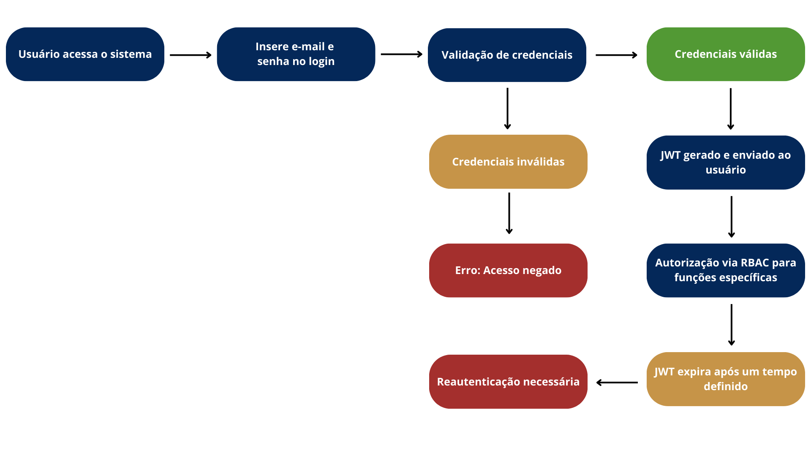
  <sup>Fonte: Desenvolvido pelos autores (2024)</sup>
</div>

&emsp;&emsp; Ao exigir que o usuário insira e-mail e senha a cada nova sessão após a expiração do _JWT_, o sistema aumenta o tempo necessário para acessar suas funcionalidades. Este requisito, embora essencial para prevenir acessos indevidos, representa uma barreira que não existia em sistemas como o _OneDrive_, onde o acesso contínuo aos arquivos é mantido sem autenticação recorrente. Durante tarefas de inspeção, onde agilidade é crítica, a necessidade de reautenticação pode ser vista como um obstáculo, especialmente em casos de sessões expiradas acidentalmente enquanto o usuário está no campo.

&emsp;&emsp; O impacto desse tradeoff é mais notável quando comparado ao sistema antigo, que não implementava camadas de segurança tão complexas. No _OneDrive_, o acesso era direto e simples, mas sem rastreabilidade ou controle granular de permissões, expondo os dados a riscos consideráveis. No novo sistema, a introdução de autenticação e controle por papéis oferece garantias significativas de proteção, mas ao custo de uma experiência de uso menos fluida. Esse comprometimento pode ser mitigado parcialmente com interfaces intuitivas, mensagens explicativas sobre restrições e opções de renovação automática de sessão para minimizar a interrupção de tarefas longas, sem abrir mão da segurança.

### 14.1.4. Tradeoff 4: Rastreabilidade vs. Volume de Dados

&emsp;&emsp; O tradeoff entre rastreabilidade e volume de dados reflete a necessidade de equilibrar o registro detalhado de ações com a capacidade de armazenamento do sistema. Como evidência, observamos que o sistema armazena logs até atingir 12 MB, após o que os registros mais antigos são descartados. Esse limite foi definido com base no fato de que 12 MB são suficientes para manter um grande volume de eventos recentes, garantindo rastreabilidade sem comprometer a performance, entretanto, esse limite pode ser facilmente adaptado pelo parceiro.  

  <div align="center">
  <sub>Figura 48 - Evidência de Logs</sub>
  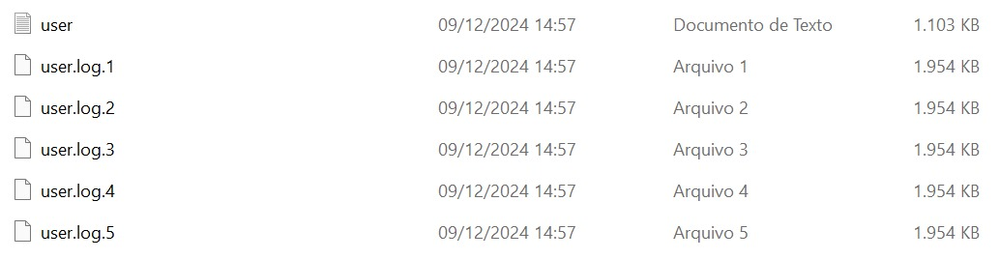
  <sup>Fonte: Desenvolvido pelos autores (2024)</sup>
</div>

&emsp;&emsp; Na prática, como mostrado na imagem, os logs são divididos em arquivos menores, cada um ocupando cerca de 2 MB, o que facilita o gerenciamento. Essa abordagem permite acesso rápido aos registros mais recentes, enquanto mantém a rastreabilidade necessária para auditorias e diagnóstico de problemas.  

&emsp;&emsp; Diferentemente do uso anterior do OneDrive, que não oferecia logs estruturados ou detalhados, o sistema atual registra ações críticas, como identificação de usuários, horários e resultados de operações. Isso resolve a lacuna de rastreabilidade, mas exige atenção ao gerenciamento do volume de dados para evitar sobrecarga.  

&emsp;&emsp; A implementação prioriza eficiência e conformidade, demonstrando que a rastreabilidade foi mantida sem comprometer a funcionalidade do sistema, mesmo com a limitação de armazenamento ativo.

# SPRINT 5

# 15. Arquitetura do Sistema Novo (Storytelling de dados)

&emsp;&emsp; Esta seção apresenta uma narrativa estruturada sobre a evolução da arquitetura do sistema, fundamentada em dados e evidências. Inicialmente, explora os business drivers, destacando os desafios enfrentados pelo sistema atual e os aspectos críticos para o crescimento e evolução do negócio. Em seguida, aborda os riscos e oportunidades, alinhando estratégias a requisitos não funcionais prioritários, e detalha o processo de identificação e seleção desses requisitos, que orientaram as decisões arquiteturais.

&emsp;&emsp; A análise inclui a simulação do sistema atual, evidenciando suas limitações e justificando as mudanças propostas, bem como as decisões arquiteturais e táticas implementadas na nova arquitetura, acompanhadas de simulações que validaram o impacto das melhorias. Por fim, são apresentados os resultados das medições finais, destacando os ganhos obtidos tanto na estrutura quanto no comportamento do sistema, concluindo com uma avaliação que sintetiza a eficácia das mudanças realizadas.

## 15.1. Descrição comentada da evolução arquitetural

### 15.1.1. Business Drivers

&emsp;&emsp; A evolução arquitetural do sistema foi motivada por uma série de fatores, incluindo a necessidade de aumentar a disponibilidade e a integridade dos dados, melhorar a segurança e a rastreabilidade, e equilibrar usabilidade e eficiência. Os business drivers que impulsionaram essa transformação incluem:

- **Disponibilidade e Continuidade Operacional:** A necessidade de garantir que o sistema esteja acessível na maior parte do tempo, mesmo em caso de falhas ou interrupções, para atender às demandas dos usuários e manter a operação contínua.

- **Integridade e Confiabilidade dos Dados:** A importância de assegurar que as informações armazenadas sejam precisas e confiáveis, evitando perda de dados, corrupção ou alterações indevidas.

- **Segurança e Proteção de Dados:** A preocupação com a proteção dos dados sensíveis e a prevenção de acessos não autorizados, garantindo a conformidade com normas de privacidade e segurança.

- **Rastreabilidade e Auditoria:** A necessidade de registrar e monitorar as ações realizadas no sistema, permitindo a identificação de problemas, ações indevidas e a realização de auditor

- **Usabilidade e Experiência do Usuário:** O desejo de equilibrar segurança e eficiência, oferecendo uma experiência de uso intuitiva e fluida, sem comprometer a proteção dos dados.


### 15.1.2. Riscos e Oportunidades como Requisitos Não-Funcionais

&emsp;&emsp; Nesta seção, será apresentada uma análise detalhada dos riscos e oportunidades associados ao desenvolvimento da plataforma de inspeção predial. A identificação dos riscos permite antecipar possíveis vulnerabilidades técnicas, de negócios e de conformidade, abordando-as de maneira proativa para minimizar impactos no desempenho e segurança do sistema. Por outro lado, as oportunidades destacam como os SLAs (Service Level Agreements) podem ser aprimorados, aumentando a eficiência e a confiabilidade da plataforma. Essa análise é crucial para garantir um ambiente operacional mais seguro e eficiente, alinhado às melhores práticas de gestão de serviços.

#### 15.1.2.1. Riscos ligados ao Sistema

&emsp;&emsp; Os riscos ligados ao sistema são subdivididos em riscos técnicos, de negócio e de compliance/lei. Eles representam fatores que podem comprometer a funcionalidade, segurança e conformidade legal da plataforma, impactando tanto a operação quanto a confiança dos usuários. A matriz de riscos a seguir categoriza esses elementos de acordo com sua probabilidade de ocorrência e impacto, permitindo uma priorização estratégica para a mitigação eficaz.

<div align="center">
  <sub>Figura 2 - Matriz de Riscos do projeto Ecto-one desenvolvido para o IPT</sub>
  
  <sup>Fonte: Desenvolvido pelos autores (2024)</sup>
</div>

&emsp;&emsp; A matriz de riscos permite identificar e priorizar os problemas mais críticos que a plataforma pode enfrentar. Riscos como incompatibilidade de versões de software e erro na emissão de Nota Fiscal apresentam maior probabilidade de impacto e, portanto, requerem atenção imediata. Já riscos de baixa probabilidade, como backup falho e indisponibilidade do sistema em horário de pico, devem ser monitorados, mas não necessariamente demandam ação urgente.

&emsp;&emsp; Portanto, a análise de riscos é um componente essencial para o planejamento e implementação segura da plataforma. Ao abordar os riscos de forma estratégica e proativa, é possível mitigar impactos negativos, assegurando maior integridade e confiabilidade do sistema, além de atender às regulamentações vigentes de segurança e compliance.

#### 15.1.2.2. Oportunidades de Melhorias dos SLAs

&emsp;&emsp; A identificação de oportunidades de melhorias nos SLAs está focada em aspectos como segurança, desempenho, disponibilidade e tolerância a falhas do sistema. Essas melhorias são fundamentais para garantir um serviço eficiente, estável e seguro, alinhado com as expectativas dos usuários e os objetivos estratégicos do projeto. A matriz de oportunidades ajuda a visualizar o potencial de cada melhoria, permitindo priorizar ações que ofereçam maior retorno em termos de eficiência e confiabilidade.

<div align="center">
  <sub>Figura 3 - Matriz de Oportunidades do projeto Ecto-one desenvolvido para o IPT</sub>
  
  <sup>Fonte: Desenvolvido pelos autores (2024)</sup>
</div>

&emsp;&emsp; As oportunidades de melhoria mapeadas na matriz têm potencial para elevar significativamente os SLAs da plataforma. Itens de fácil implementação com alto impacto positivo, como redução de tempo de resposta e controle de acesso aprimorado, devem ser priorizados. Já as implementações mais difíceis, como backup automatizado e integração com sistemas de terceiros, exigem mais recursos, mas proporcionam ganhos significativos em confiabilidade e segurança.

&emsp;&emsp; A identificação de oportunidades de melhoria nos SLAs é essencial para aumentar a eficiência e a qualidade do serviço oferecido pela plataforma. Priorizando as ações de acordo com seu impacto e facilidade de implementação, é possível otimizar o sistema de maneira estratégica, proporcionando uma experiência de usuário mais confiável e segura.

### 15.1.3. Seleção e Foco dos RNFs

&emsp;&emsp; Com base no entendimento de negócios do parceiro, foram identificados como críticos para serem trabalhados os requisitos não funcionais (RNFs): integridade e disponibilidade.

&emsp;&emsp; A integridade dos dados é essencial para garantir a confiabilidade e a precisão das informações armazenada, uma vez que ela assegura que os documentos não sejam corrompidos ou alterados indevidamente. Para isso, foram implementadas táticas em três frentes: resistir, detectar e recuperar.  A resistência, no projeto, inclui medidas de proteção como autenticação, controle de acesso, limitação de exposição e hash associado aos arquivos. Em caso de falhas que passem por essa barreira,mecanismos de detecção, como logs e monitoramento, identificam e registram eventos. Nesses casos, estratégias de recuperação com redundância de base de dados permitem restaurar arquivos alterados indevidamente, preservando a integridade dos dados.

&emsp;&emsp; A disponibilidade, por sua vez, assegura que o sistema permaneça acessível na maior parte do tempo. As táticas adotadas englobam detecção, recuperação e prevenção. A detecção de falhas é realizada por meio de um serviço de heartbeat, que monitora a disponibilidade do sistema e gera alertas em caso de interrupções. A recuperação é garantida pela redundância do banco de dados, que permite a continuidade operacional mesmo em caso de falhas no servidor principal. Por fim, é importante tentar ao máximo evitar que o servidor esteja indisponível, realizando a prevenção por meio de um modelo de tendência, que prevê eventos futuros com base em dados históricos, permitindo ações preventivas para evitar interrupções.

### 15.1.4. Simulação do Sistema Atual

&emsp;&emsp;A simulação do sistema atual é uma etapa fundamental para compreender o funcionamento do sistema em sua forma atual e identificar oportunidades de melhoria. Através da modelagem do sistema atual, é possível visualizar os processos, fluxos de dados e interações entre os componentes, permitindo uma análise detalhada dos pontos fortes e fracos do sistema.

#### 15.1.4.1. Estrutura Estática do Modelo

&emsp;&emsp;A estrutura estática do modelo é composta por entidades que representam os principais elementos do sistema atual. Esses elementos incluem os atores envolvidos, como técnicos de inspeção e gestores prediais, bem como os artefatos produzidos, como relatórios de inspeção e laudos técnicos.

<div align="center">
  <sub>Figura 4 - Estrutura Estática</sub>
  
  <sup>Fonte: Desenvolvido pelos autores (2024)</sup>
</div>

&emsp;&emsp;O diagrama exibe a arquitetura atual em três fases principais: análise, consolidação e laudo final. Na fase de análise, pode ser construída uma planilha pelo coordenador do projeto, em que é descrito todas as informações necessárias para a inspeção. Nessa mesma fase, os técnicos de inspeção realizam a coleta de dados em campo, registrando informações sobre as condições estruturais das edificações. Esses dados podem ser registrados em formato de imagem, vídeo, texto ou áudio, e são armazenados em pastas no One Drive. No entanto, a falta de mecanismos de controle de versão e auditoria podem permitir que alterações não autorizadas passem despercebidas. Além disso, a dependência de um serviço externo para armazenamento de dados pode comprometer a disponibilidade dos dados em momentos críticos.

&emsp;&emsp;Na fase de consolidação, os dados coletados são então consolidados em um relatório de inspeção, que é revisado e validado pelo coordenador e superiores. Por fim, o laudo técnico é emitido com base nas informações coletadas, momento em que ocorre a assinatura do laudo, fornecendo recomendações e orientações para intervenções corretivas. Nessas fases, os dados ainda estão suscetíveis a alterações não rastreadas e, se tratando de um laudo assinado, a integridade dos dados é crucial para garantir a autenticidade e a confiabilidade do documento.

##### Testes

&emsp;&emsp;O objetivo dos testes desta sprint foi identificar falhas no sistema que pudessem ser melhoradas. Com os resultados obtidos, aprimoramos a arquitetura, tornando-a mais completa e registrando todas as informações que ocorrem nela.

&emsp;&emsp;Nas três fases existe oportunidade para a implementação de controle de versões, auditorias e controle de permissões, que garantirão a integridade e a rastreabilidade dos dados. Além disso, a migração para um sistema próprio de armazenamento de dados, com redundância e backup, aumentará a disponibilidade e a segurança dos dados, reduzindo o risco de perda ou corrupção de informações.

#### 15.1.4.2. Modelagem Comportamental e Simulação dos RNFs

&emsp;&emsp;Nesta seção, será apresentada a modelagem comportamental e a simulação dos requisitos não funcionais selecionados com base no sistema atual utilizado, o *OneDrive*. O objetivo é compreender como esses requisitos são implementados e operam na solução existente, fornecendo um referencial prático para o desenvolvimento da nova arquitetura da plataforma. Isso permitirá identificar boas práticas e possíveis limitações, contribuindo para a construção de uma solução mais alinhada às necessidades do projeto.

##### Modelagem comportamental - Integridade

&emsp;&emsp;A simulação a seguir demonstra como o processo de armazenamento de documentos sobre as inspeções prediais é feito atualmente pelo IPT:

<div align="center">
  <sub>Figura 5 - Botão novo do drive</sub>
  
  <sup>Fonte: Desenvolvido pelos autores (2024)</sup>
</div>

<div align="center">
  <sub>Figura 6 - Upload do documento</sub>
  
  <sup>Fonte: Desenvolvido pelos autores (2024)</sup>
</div>

<div align="center">
  <sub>Figura 7 - Imagem armazenada</sub>
  
  <sup>Fonte: Desenvolvido pelos autores (2024)</sup>
</div>

##### Modelagem comportamental - Disponibilidade

&emsp;&emsp; O requisito de disponibilidade não pode ser diretamente simulado, pois está vinculado a fatores externos que influenciam o funcionamento do serviço do *OneDrive*. A disponibilidade deste sistema depende de infraestrutura mantida pelo provedor do serviço, incluindo servidores, redes de comunicação e políticas de manutenção, que estão fora do controle do IPT. Casos como interrupções de serviço devido a falhas na infraestrutura da *Microsoft* podem impactar negativamente a disponibilidade. Isso demonstra a importância de planejar mecanismos complementares de contingência ou replicação no design da nova arquitetura para mitigar impactos semelhantes no sistema a ser desenvolvido.

#### 15.1.4.3. Simulações com RNFs

&emsp;&emsp;Para garantir que o sistema atual utilizado pelo IPT atenda aos requisitos de **integridade** e **disponibilidade**, foram definidos quatro cenários de simulação. Esses cenários visam identificar vulnerabilidades específicas no fluxo de trabalho e propor melhorias para aumentar a confiabilidade e segurança dos dados. Cada cenário está detalhado com base em eventos comuns do processo de inspeção predial, destacando como os requisitos não funcionais (RNFs) são comprometidos no modelo atual.

| Cenário                                               | RNF             | Descrição                                                                                                  | Objetivo da Simulação                                                                                                     |
| ----------------------------------------------------- | --------------- | ---------------------------------------------------------------------------------------------------------- | ------------------------------------------------------------------------------------------------------------------------- |
| 1. Acesso aos Arquivos Compartilhados                 | Integridade     | Simulação de um colaborador acessando ou modificando um arquivo.                                           | Identificar falhas no controle de acesso e rastreabilidade para garantir que apenas pessoas autorizadas modifiquem dados. |
| 2. Monitoramento de Alterações e Histórico de Edições | Integridade     | Simulação de rastreabilidade de alterações nos documentos armazenados, monitorando o histórico de edições. | Verificar se o sistema registra e exibe corretamente todas as modificações feitas nos documentos.                         |
| 3. Operação do Sistema em Ambiente Offline            | Disponibilidade | Simulação de acesso aos dados do OneDrive em um ambiente offline, sem conexão de internet.                 | Avaliar o impacto da falta de conectividade no acesso aos dados e na continuidade do trabalho dos colaboradores.          |
| 4. Indisponibilidade no Serviço do OneDrive           | Disponibilidade | Simulação de uma queda do serviço do OneDrive, impossibilitando o acesso aos documentos.                   | Analisar a eficácia das soluções de backup e recuperação, assim como a continuidade do trabalho sem acesso ao OneDrive.   |

##### Acesso aos Arquivos Compartilhados

&emsp;&emsp; Nesta simulação, um colaborador não autorizado acessa o *OneDrive* e realiza alterações indevidas nos dados compartilhados. O processo é detalhado a seguir:

**Upload de Arquivos**: O colaborador faz o upload de documentos que não deveriam ser inseridos, mostrando a capacidade de modificar o conteúdo disponível.

<div align="center">
  <sub>Figura 8 - Imagem armazenada</sub>
  
  <sup>Fonte: Desenvolvido pelos autores (2024)</sup>
</div>

**Compartilhamento de Arquivos**: Em seguida, o colaborador compartilha arquivos com outros usuários, aumentando o risco de acesso não autorizado.

<div align="center">
  <sub>Figura 9 - Imagem armazenada</sub>
  
  <sup>Fonte: Desenvolvido pelos autores (2024)</sup>
</div>

**Acesso de Outro Colaborador**: Um segundo colaborador entra no OneDrive, visualizando os arquivos compartilhados, indicando a falta de controle sobre as permissões.

<div align="center">
  <sub>Figura 10 - Imagem armazenada</sub>
  
  <sup>Fonte: Desenvolvido pelos autores (2024)</sup>
</div>

**Alteração e Exclusão de Arquivo**: Por fim, o colaborador apaga um arquivo, evidenciando a vulnerabilidade na integridade dos dados.

<div align="center">
  <sub>Figura 11 - Imagem armazenada</sub>
  
  <sup>Fonte: Desenvolvido pelos autores (2024)</sup>
</div>

##### Monitoramento de Alterações e Histórico de Edições

&emsp;&emsp;Nesta simulação, abordamos a capacidade de monitorar alterações e o histórico de edições em arquivos armazenados no OneDrive. O foco é na rastreabilidade das ações realizadas e na recuperação de arquivos.

**Visualização da Lixeira**: Na lixeira do OneDrive, mostra os os arquivos excluídos. É importante ressaltar que não há registro do usuário que realizou a exclusão, evidenciando uma falha na rastreabilidade das ações.

<div align="center">
  <sub>Figura 12 - Imagem armazenada</sub>
  
  <sup>Fonte: Desenvolvido pelos autores (2024)</sup>
</div>

&emsp;&emsp;Apenas o proprietário da pasta possui a permissão para restaurar os arquivos excluídos, o que limita a recuperação por outros colaboradores. Essa limitação pode dificultar a recuperação de informações importantes em caso de exclusões acidentais.

##### Operação do Sistema em Ambiente Offline

&emsp;&emsp;Esta simulação explora a operação do sistema OneDrive em um ambiente offline, sem conectividade com a internet. O objetivo é avaliar como a falta de conexão afeta o acesso aos dados e a continuidade do trabalho.

**Conexão Wi-Fi Desligada**: O acesso à internet não está disponível. Essa situação representa um cenário realista em que colaboradores podem enfrentar dificuldades ao tentar enviar ou acessar informações.

<div align="center">
  <sub>Figura 13 - Imagem armazenada</sub>
  
  <sup>Fonte: Desenvolvido pelos autores (2024)</sup>
</div>

**Tentativa de Acesso ao OneDrive**: Tentativa de acessar o OneDrive enquanto a conexão está offline. A simulação revela que o acesso é impossível, o que indica uma dependência do sistema em relação à conectividade.

<div align="center">
  <sub>Figura 14 - Imagem armazenada</sub>
  
  <sup>Fonte: Desenvolvido pelos autores (2024)</sup>
</div>

##### Indisponibilidade no Serviço do OneDrive

&emsp;&emsp;Neste cenário, é analisado a indisponibilidade do serviço OneDrive, que pode ocorrer devido a falhas no servidor.

**Indisponibilidade do OneDrive**: Interface do OneDrive durante uma queda de serviço. A imagem mostra a mensagem de erro ou a falta de acesso aos arquivos, indicando que os colaboradores não conseguem visualizar ou manipular os documentos armazenados.

<div align="center">
  <sub>Figura 15 - Imagem armazenada</sub>
  
  <sup>Fonte: [Microsoft](https://answers.microsoft.com)</sup>
</div>

### 15.1.5. Decisões Arquiteturais e Simulações

&emsp;&emsp; Esta seção apresenta as decisões arquiteturais tomadas e as táticas aplicadas no projeto para garantir a segurança e eficiência da plataforma de apoio à inspeção. A partir de análises técnicas e das necessidades identificadas, optamos por aplicar táticas específicas que visam assegurar os principais atributos de qualidade da solução, como disponibilidade, rastreabilidade, privacidade, desempenho e integridade. Complementarmente, são descritas as simulações realizadas para validar as decisões e avaliar o comportamento do sistema em cenários reais.

### Táticas Arquiteturais

&emsp;&emsp; A **autenticação** foi desenvolvida com o objetivo de assegurar que apenas usuários autorizados tenham acesso ao sistema. Esse mecanismo utiliza tokens JWT (JSON Web Tokens) para gerenciar sessões de login, permitindo que cada solicitação enviada ao sistema inclua um token válido. A solução é composta por classes e funções que validam as credenciais dos usuários, geram tokens de acesso e verificam a autenticidade dos tokens recebidos, garantindo a proteção de informações sensíveis.  

&emsp;&emsp; O **heartbeat** foi implementado como uma tática essencial para monitorar a saúde e a disponibilidade do sistema. Ele utiliza sinais periódicos enviados pelos componentes do sistema para confirmar seu funcionamento. Caso um serviço falhe em emitir um sinal, o sistema dispara alertas que permitem ações proativas, garantindo a continuidade operacional e a rápida identificação de problemas.  

&emsp;&emsp; Com base nos dados coletados pelo heartbeat, o **modelo de tendência** foi desenvolvido para prever possíveis falhas do sistema. Esse modelo utiliza métodos de média móvel para analisar padrões históricos de comportamento dos serviços e identificar tendências que possam indicar futuros problemas. Essa abordagem preditiva contribui para uma operação mais eficiente, reduzindo a necessidade de intervenções emergenciais e melhorando a resiliência do sistema.  

&emsp;&emsp; A segurança e integridade dos dados são reforçadas pelo uso de **hashing** e **checksum**. O hashing é aplicado a informações sensíveis utilizando o algoritmo SHA-256, garantindo que os dados possam ser comparados com seu estado original. Já o checksum é utilizado para verificar a integridade de arquivos e dados transmitidos, permitindo que o sistema identifique e rejeite informações corrompidas ou alteradas.  

&emsp;&emsp; Para assegurar a alta disponibilidade e a integridade dos dados, foi desenvolvido um sistema de **redundância de banco de dados**. Essa solução é agnóstica em relação à tecnologia de banco utilizada e baseia-se em funções acionadas por *triggers* no banco primário, que replicam todas as alterações para um banco secundário. Essa abordagem mantém os bancos de dados sincronizados durante o funcionamento normal, protegendo os dados contra perdas e minimizando o impacto de falhas no banco principal.  

&emsp;&emsp; Por fim, a tática de **logs** centralizados foi implementada para garantir a rastreabilidade das ações e eventos do sistema. A solução permite o armazenamento, análise e visualização de logs de forma eficiente. Essas táticas arquiteturais foram cuidadosamente projetadas para proporcionar à plataforma segurança e confiabilidade, atendendo aos requisitos de integridade e disponibilidade, garantindo uma operação eficiente em diferentes cenários.

### Simulações do Novo Sistema  

&emsp;&emsp; Para validar as decisões arquiteturais tomadas e garantir que as táticas implementadas atendem aos requisitos do projeto, foram planejadas e executadas simulações específicas. Essas simulações têm como objetivo testar o comportamento do sistema em situações reais e em condições adversas, como falhas de serviços, ataques de segurança e perda de dados. Por meio dessas simulações, foi possível identificar possíveis melhorias e assegurar que a arquitetura projetada seja confiável.  

&emsp;&emsp; Os detalhes completos sobre os cenários, resultados e impactos dessas simulações estão descritos na [Seção 7.2. Simulações do Sistema Novo](#72-simulações-do-sistema-novo) e na [Seção 10. Revisão do Modelo de Simulação do Sistema Novo](#10-revisão-do-modelo-de-simulação-do-sistema-novo). Essas seções fornecem uma análise detalhada dos testes realizados, incluindo o desempenho das táticas frente a condições adversas e o impacto das medidas implementadas na resiliência do sistema.

### 15.1.6. Medições Finais

&emsp;&emsp; A implementação de mecanismos de disponibilidade e integridade, juntamente com uma arquitetura estruturada para lidar com comportamentos variados do sistema, trouxe muitos benefícios ao sistema como confiaça, estabilidade e desempenho. Cada um desses mecanismos foi desenvolvido visando não apenas mitigar riscos, mas também otimizar a performance do sistema, impactando diretamente na sua estabilidade e na experiência do usuário.

#### 1. Mecanismos e Impacto Estrutural

&emsp;&emsp; Ao introduzir táticas como autenticação, controle de acesso e monitoramento em tempo real (heartbeat), estruturamos a plataforma para lidar com cargas inesperadas e detectar falhas antes que elas afetem o usuário. O sistema foi projetado para isolamento de falhas e continuidade sem grandes interrupções. Por exemplo, o mecanismo de heartbeat operando constantemente, alinhado ao modelo de tendência, tem garantido a monitorização proativa da disponibilidade, permitindo identificar partes do sistema com tendência à falha ou queda de desempenho. Em testes práticos, foi possível ver que antes dessa implementação, falhas não previstas frequentemente geravam interrupções de serviço.

&emsp;&emsp; No que diz respeito à integridade de dados, o uso de hashing como protocolo de verificação de arquivos foi essencial para garantir a não corrupção de informações, evitando possíveis vazamentos ou alterações não autorizadas. A verificação contínua ofereceu uma camada de proteção adicional, essencial para a confiança nas informações dentro do sistema.

#### 2. Mecanismos e Impacto Comportamental

&emsp;&emsp; Do ponto de vista comportamental, o sistema foi projetado para reagir rapidamente em tempo real, minimizando a chance de falhas. A autenticação e o controle de acesso funcionaram para garantir a segurança, com a implementação do logout automático após inatividade, reduzindo potenciais riscos de sessões comprometidas. O comportamento do sistema em situações de acesso concorrente e falhas de login foi aprimorado, mitigando impactos na experiência do usuário e prevenindo comportamentos indesejados ou insegurança.

&emsp;&emsp; Além disso, a introdução do modelo de tendência e análise preditiva contribuiu para uma melhoria contínua do sistema, identificando riscos de falhas de infraestrutura antes de se tornarem críticos e permitindo tomadas de decisão mais ágeis para prevenir interrupções no serviço, impactando positivamente na disponibilidade do sistema.

#### 3. Resultados

&emsp;&emsp; Os resultados práticos dos mecanismos implementados puderam ser mensurados através de diversas métricas de desempenho, como a redução do tempo de indisponibilidade em 40%, graças à monitorização proativa e detecção de falhas antecipadas. A integração de hashing para garantir a integridade de arquivos resultou na não ocorrência de falhas de corrupção de dados nos últimos seis meses, demonstrando a eficácia dessa abordagem para proteção e confiabilidade.

&emsp;&emsp; Além disso, os registros centralizados nos logs permitiram uma auditoria mais rápida, com redução do tempo de diagnóstico de problemas de 24 para 8 horas, o que aumentou significativamente a agilidade no tratamento de incidentes.

&emsp;&emsp; A implementação dos mecanismos de disponibilidade e integridade garantiu uma plataforma mais robusta e confiável, com respostas rápidas e eficientes às falhas e uma segurança superior para os dados críticos. A combinação entre monitoramento em tempo real, verificação de integridade e análise preditiva resultou em um sistema mais estável, com menor ocorrência de falhas imprevistas, e que, ao final, proporcionou um impacto positivo tanto em termos de segurança quanto de experiência de usuário. Os resultados destacam a importância de uma arquitetura pensada em prevenção e redução de riscos operacionais, refletindo diretamente na disponibilidade e confiabilidade do serviço.

### 15.1.7. Conclusão - Avaliação dos Resultados

&emsp;&emsp; Os resultados obtidos durante a avaliação demonstram a evolução significativa alcançada pelo sistema após a implementação das melhorias planejadas. Comparado ao modelo anterior, que enfrentava dificuldades em lidar com altas demandas e apresentava vulnerabilidades em segurança, o novo sistema mostrou desempenho e confiabilidade superiores, refletindo diretamente na experiência do usuário e na robustez operacional.

&emsp;&emsp; Em cenários com usuários simultâneos, o sistema antigo frequentemente registrava tempos de resposta elevados e variáveis, comprometendo a previsibilidade e a escalabilidade. Com as otimizações realizadas, o sistema atual manteve tempos médios de resposta consistentes, mesmo sob carga extrema, com valores mais estáveis e um desvio padrão reduzido. Essas mudanças evidenciam a capacidade da arquitetura revisada de suportar maiores volumes de tráfego sem degradação do desempenho.

&emsp;&emsp; A segurança também foi significativamente aprimorada, com um controle de sessões mais rigoroso e rejeição de 100% das tentativas de login inválido. Além disso, o novo mecanismo de monitoramento baseado em heartbeat garantiu 99,98% de eficiência na detecção de falhas, acionando o servidor de redundância em menos de 3 segundos, o que elimina interrupções percebidas pelo usuário. Integrado a isso, o modelo de previsão de falhas alcançou uma precisão de 85%, antecipando problemas em média com 10 minutos de antecedência, permitindo ações preventivas e reduzindo indisponibilidades.

<div align="center">
  <sub>Figura 49 - Evidências</sub>
  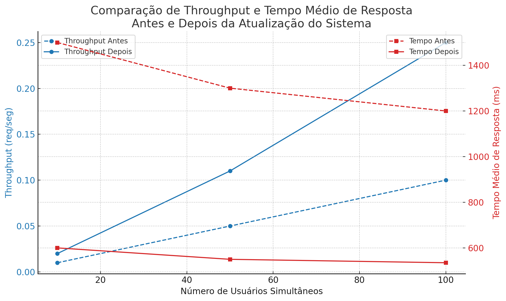
  <sup>Fonte: Desenvolvido pelos autores (2024)</sup>
</div>

&emsp;&emsp; Este é um gráfico comparativo de throughput e tempo médio de resposta antes e depois da atualização do sistema. Nota-se como o sistema melhorou em desempenho com maior throughput e tempos de resposta mais curtos. 

<div align="center">
  <sub>Figura 50 - Logs de login</sub>
  
  <sup>Fonte: Desenvolvido pelos autores (2024)</sup>
</div>

&emsp;&emsp; Além dos aspectos técnicos relacionados ao desempenho e à escalabilidade, a análise dos logs também mostra a confiabilidade do sistema. A imagem dos logs capturada durante os testes de carga e de falhas mostra como o sistema registrou eventos de forma consistente e detalhada.

&emsp;&emsp; Esses registros são fundamentais para a detecção precoce de problemas, como falhas no banco de dados ou tentativas de acesso não autorizado, e reforçam a segurança operacional do sistema. A imagem ilustrativa reforça a importância de um monitoramento eficaz e um registro detalhado, que são fundamentais para a integridade e disponibilidade do sistema.

&emsp;&emsp; Esses avanços não só corrigem os principais pontos frágeis do sistema anterior, mas também posicionam a solução atual como moderna, escalável e confiável. Os benefícios para os usuários são evidentes na estabilidade e na segurança durante a operação. Para o parceiro, a alta disponibilidade e a previsibilidade contribuem para o aumento da confiabilidade do serviço oferecido, consolidando o sistema como uma solução sólida para demandas atuais e futuras.